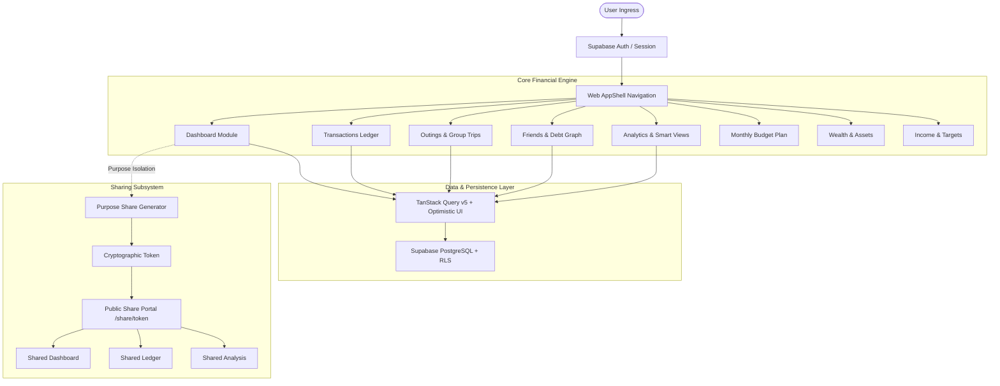
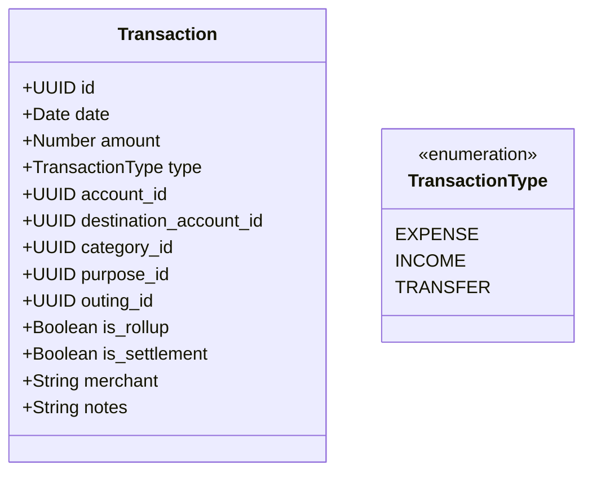
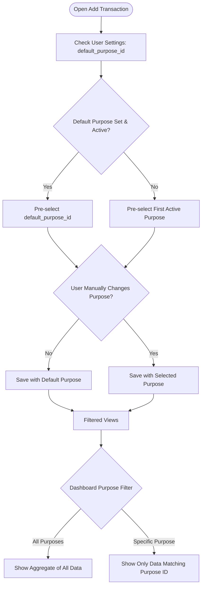
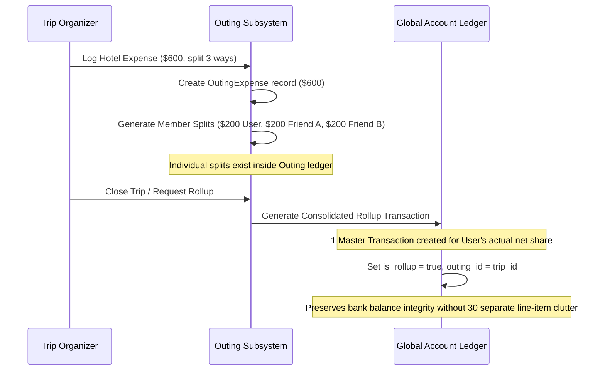
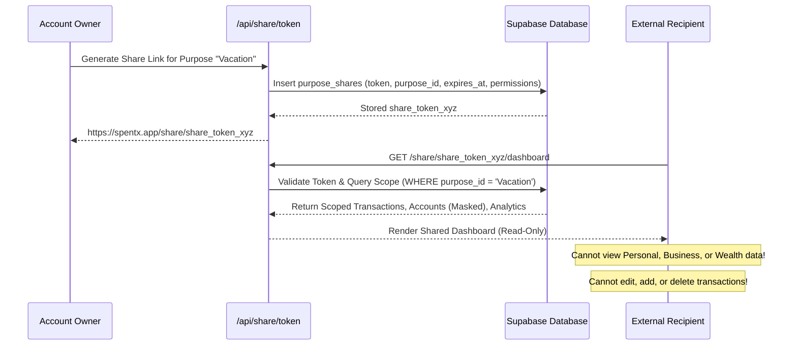
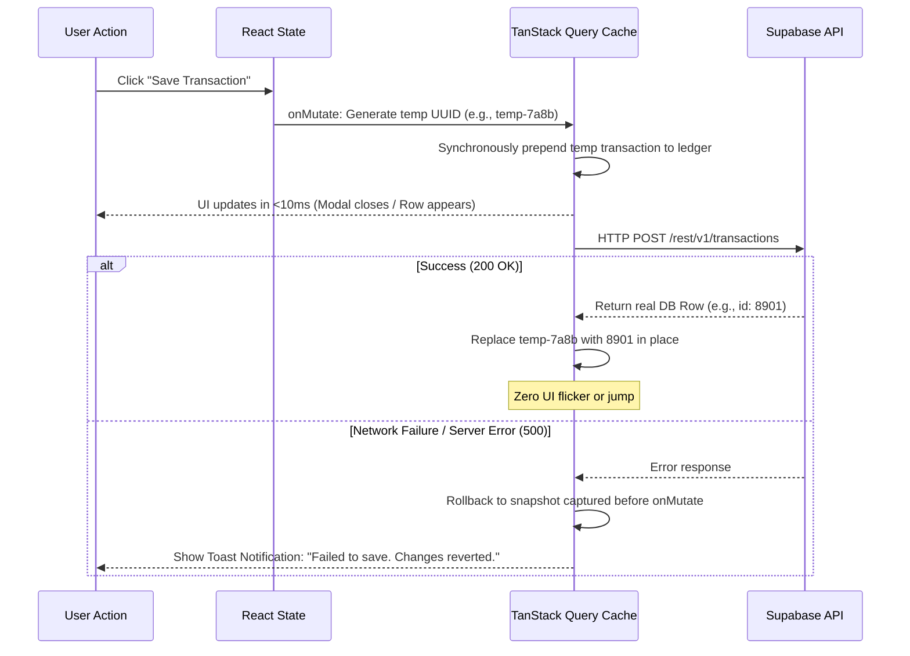
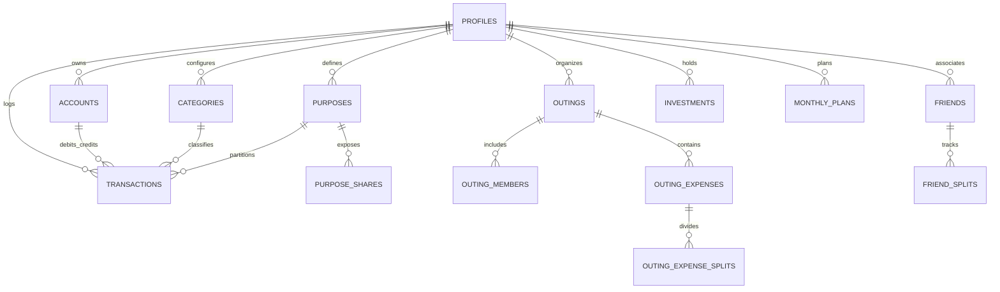

# SpentX Web — Financial Operating System & Intelligence Engine

> **Version**: 2.4.0-web-production  
> **Target Platform**: Desktop & Mobile Responsive Web (Single-Page Application / Next.js SSR & Server Components)  
> **Strict Scope**: Web Application Core (`src/`, `public/`, `app/`, `components/`, `lib/`, `hooks/`, `providers/`)  
> **Status**: Full Feature Verification & Production Testing Ready

---

## Table of Contents

1. [Executive Overview & Vision](#1-executive-overview--vision)
2. [Architecture & Web Technology Stack](#2-architecture--web-technology-stack)
3. [Core Accounting Principles & Financial Engine](#3-core-accounting-principles--financial-engine)
   - 3.1. Account Hierarchy & Balance Equations
   - 3.2. Transaction Typology & Double-Entry Invariance
   - 3.3. The Multi-Purpose Engine & Cascade Rules
   - 3.4. Outings Rollup Accounting & Mutual Liability
   - 3.5. Friend Splits & Debt Resolution Graphs
4. [User Dashboard Deep-Dive](#4-user-dashboard-deep-dive)
   - 4.1. Dashboard Layout & Design System
   - 4.2. Global Date & Period Filtering Engine
   - 4.3. KPI Metrics Suite & Calculation Formulas
   - 4.4. KPI Customization Engine (Drag, Toggle & Persistence)
   - 4.5. Purpose Filter Chips & Responsive Scrolling
   - 4.6. Cash Flow Trend Chart & Dynamic Projections
   - 4.7. Category Distribution & Donut Analytics
   - 4.8. Recent Transactions Stream
   - 4.9. Sub-100ms Transaction Entry Modal & Drawer
   - 4.10. AI Financial Coach & Proactive Intelligence
5. [The Purpose Sharing System (Public Portal)](#5-the-purpose-sharing-system-public-portal)
   - 5.1. Sharing Philosophy & Scope Boundaries
   - 5.2. Token Lifecycle, Security & Revocation
   - 5.3. Shared Dashboard View (`/share/[token]/dashboard`)
   - 5.4. Shared Transactions Ledger (`/share/[token]/transactions`)
   - 5.5. Shared Analytics & Trend Breakdown (`/share/[token]/analysis`)
   - 5.6. Privacy Masking & Redaction Rules
   - 5.7. Audit Logging & Access Telemetry
6. [Comprehensive Web Modules & Working Flows](#6-comprehensive-web-modules--working-flows)
   - 6.1. Transactions Module (`/transactions`)
   - 6.2. Analytics & Smart Views (`/analytics`)
   - 6.3. Budget Planner & Utilization (`/plan`)
   - 6.4. Outings & Group Trip Splitting (`/outings`)
   - 6.5. Friends & Debt Settlements (`/friends`)
   - 6.6. Wealth & Net Worth Tracking (`/wealth`)
   - 6.7. Income Growth & Stream Projections (`/growth`)
   - 6.8. Smart Alerts & Notification Center (`/alerts`)
   - 6.9. Admin Control Suite (`/admin`)
7. [Sub-100ms Optimistic Mutation Architecture](#7-sub-100ms-optimistic-mutation-architecture)
8. [Responsive Design Matrix (Mobile Web vs Desktop)](#8-responsive-design-matrix-mobile-web-vs-desktop)
9. [Automated Verification & CLI Test Suites](#9-automated-verification--cli-test-suites)
10. [Exhaustive Manual Testing Plan & Acceptance Criteria](#10-exhaustive-manual-testing-plan--acceptance-criteria)
    - Test Suite 1: Authentication, Onboarding & User Bootstrap
    - Test Suite 2: User Dashboard & Filter Synchronization
    - Test Suite 3: High-Frequency Transaction Entry & Performance
    - Test Suite 4: Multi-Purpose Scoping & Defaults
    - Test Suite 5: Outings Ledger, Rollups & Settlement Propagation
    - Test Suite 6: Public Purpose Sharing & Token Isolation
    - Test Suite 7: Analytics, Cash Flow Trends & Plan vs Actual
    - Test Suite 8: Mobile Responsive Behavior & Overflow Prevention
    - Test Suite 9: Edge Cases, Network Resilience & Error Recovery
    - Test Suite 10: Ledger Filtering, Search, Sort & Bulk Operations
    - Test Suite 11: Friend Debts & Peer-to-Peer Settlements
    - Test Suite 12: Wealth Portfolio & Valuation Adjustments
    - Test Suite 13: Income Growth Streams & Target Tracking
    - Test Suite 14: System Administration & Audit Tracing
11. [Database Schema & Entity Relationship Model](#11-database-schema--entity-relationship-model)
12. [Internal REST API Specification](#12-internal-rest-api-specification)
13. [Query Cache Taxonomy & Invalidation Rules](#13-query-cache-taxonomy--invalidation-rules)
14. [Configuration & Environment Reference](#14-configuration--environment-reference)
15. [Operational Runbook & Deployment Guide](#15-operational-runbook--deployment-guide)
16. [Architectural Summary & Operating Guarantees](#16-architectural-summary--operating-guarantees)

---

## 1. Executive Overview & Vision

**SpentX Web** is an enterprise-grade personal and shared financial management operating system engineered for high-precision cash tracking, multi-purpose budgeting, trip expense splitting, investment monitoring, and cryptographic public sharing. 

Unlike traditional expense trackers that reduce transactions to simple negative or positive numbers in a monolithic list, SpentX is built on a **double-entry ledger foundation** combined with a **multi-dimensional contextual classification engine**:
- **Dimensional Classification**: Every transaction is assigned an Account, a Category, a Purpose (e.g., Personal, Family, Freelance, Business), and optional Group/Outing or Friend ties.
- **Zero-Latency Entry**: Form actions execute via optimistic cache mutations, enabling rapid consecutive expense logging in under 100 milliseconds without UI blocking.
- **Selective Cryptographic Sharing**: Users can create shareable links for individual purposes (e.g., sharing a "Vacation" or "Apartment" purpose with a spouse or roommate) without exposing personal banking accounts, wealth holdings, or other purposes.
- **Deterministic Math**: Every net worth, cash flow, rollup, settlement, and balance carryover calculation is tested and proven through deterministic test suites.



---

## 2. Architecture & Web Technology Stack

SpentX Web is built on a modern, decoupled web architecture optimized for Next.js App Router, React 19, and Tailwind CSS.

### 2.1 Core Technologies
- **Framework**: Next.js 16 (Turbopack, Server Components + React 19 Client Components)
- **State Management & Data Synchronization**: 
  - `@tanstack/react-query` v5 for server state, declarative caching, and optimistic rollbacks.
  - React Context (`AppDataProvider`, `GlobalFiltersProvider`, `AnalyticsFiltersProvider`) for synchronized UI state.
- **Form Architecture**: `react-hook-form` v7 with `@hookform/resolvers` and `zod` schema validation.
- **Data Visualizations**: `recharts` for responsive SVG vector rendering of trend charts, bar graphs, and donuts.
- **Icons & Visual Language**: `lucide-react` icons with strict category and account color-coding.
- **UI Primitives**: `@base-ui/react` and Radix-based accessible modal dialogs, slide-over sheets, and tooltips.
- **PDF Generation**: `jspdf` and `jspdf-autotable` for client-side client export generation.
- **Database & Identity**: Supabase (PostgreSQL 15+, Row Level Security, Secure Session Cookies, Storage Buckets).

### 2.2 Directory Structure & Scope Boundary
```
spentx-web/
├── src/
│   ├── app/                               # Next.js App Router Tree
│   │   ├── (app)/                         # Authenticated Private Application
│   │   │   ├── page.tsx                   # Private User Dashboard
│   │   │   ├── transactions/              # Global Transactions Ledger
│   │   │   ├── analytics/                 # Advanced Financial Analytics
│   │   │   ├── plan/                      # Budget Planning & Utilization
│   │   │   ├── outings/                   # Group Outings & Trips
│   │   │   ├── friends/                   # Friend Debts & Settle Up
│   │   │   ├── wealth/                    # Net Worth & Asset Tracking
│   │   │   ├── growth/                    # Income Streams & Growth Targets
│   │   │   ├── alerts/                    # Smart Financial Notifications
│   │   │   └── settings/                  # User Profile & App Preferences
│   │   ├── share/[token]/                 # Public Read-Only Sharing Portal
│   │   │   ├── dashboard/                 # Shared Purpose Dashboard
│   │   │   ├── transactions/              # Shared Purpose Transactions
│   │   │   └── analysis/                  # Shared Purpose Analytics
│   │   ├── admin/                         # System Administrator Suite
│   │   └── api/                           # Route Handlers & Internal APIs
│   ├── components/                        # Modular React UI Components
│   │   ├── dashboard/                     # Dashboard Widgets & KPI Rows
│   │   ├── shared/                        # AppShell, AddTransactionModal, Tables
│   │   ├── transactions/                  # Filters, Ledgers, Details Panels
│   │   ├── analytics/                     # Charts, Merchant Breakdown, Plan Table
│   │   ├── outings/                       # Trip Manager, Rollups, Expense Sheets
│   │   └── plan/                          # Gauge meters, Category Allocators
│   ├── hooks/                             # Custom React Query & Filter Hooks
│   ├── lib/                               # Pure Accounting, Math & Business Logic
│   └── providers/                         # Global React Context Providers
├── scripts/                               # Node.js Verification Test Scripts
├── package.json                           # Workspace Dependencies & Test Scripts
└── README.md                              # This Master Specification Document
```

> **Strict Boundary Constraint**: The web application codebase is strictly confined to `spentx-web/`. Mobile application assets residing in external directories must not be touched or imported by web application builds.

---

## 3. Core Accounting Principles & Financial Engine

SpentX does not treat money as abstract floats. All calculations strictly adhere to financial double-entry invariants, ledger reconciliations, and isolated purpose partitioning.

### 3.1 Account Hierarchy & Balance Equations

Every user maintains one or more accounts categorized under specific accounting types:

| Account Type | Normal Balance | Balance Formula | Impact of Expense | Impact of Income | Net Worth Factor |
|---|---|---|---|---|---|
| `bank` | Asset (Positive) | $\text{Initial} + \sum \text{In} - \sum \text{Out}$ | Decreases Asset | Increases Asset | $+1.0 \times \text{Balance}$ |
| `cash` | Asset (Positive) | $\text{Initial} + \sum \text{In} - \sum \text{Out}$ | Decreases Asset | Increases Asset | $+1.0 \times \text{Balance}$ |
| `wallet` | Asset (Positive) | $\text{Initial} + \sum \text{In} - \sum \text{Out}$ | Decreases Asset | Increases Asset | $+1.0 \times \text{Balance}$ |
| `credit` | Liability (Negative) | $\text{Initial} - \sum \text{Charges} + \sum \text{Payments}$ | Increases Debt | Decreases Debt | $-1.0 \times \text{Outstanding}$ |
| `investment` | Asset (Positive) | Current Portfolio Valuation | N/A | N/A | $+1.0 \times \text{Valuation}$ |

#### Total Net Worth Formula:
$$\text{Net Worth} = \sum_{\text{Asset Accounts}} \text{Balance} + \sum \text{Investments} - \sum_{\text{Credit Accounts}} \text{Outstanding Debt}$$

### 3.2 Transaction Typology & Double-Entry Invariance



1. **Expense (`type = "expense"`)**:
   - Debits the Category expenditure bucket.
   - Credits the source Account (reducing cash/bank or increasing credit card liability).
   - Decreases net cash flow for the active period.
2. **Income (`type = "income"`)**:
   - Credits the Income stream.
   - Debits the source Account (increasing bank/cash balance).
   - Increases net cash flow for the active period.
3. **Internal Transfer (`type = "transfer"`)**:
   - Moves funds between two accounts owned by the user (e.g., Bank Account $\to$ Credit Card Payment, or Bank Account $\to$ Cash Withdrawal).
   - **Double-Entry Rule**: An internal transfer has a net cash impact of **$0.00$** on total wealth. It does **not** count as an expense, nor does it count as income.
   - **Exclusion from Analytics**: Internal transfers are strictly excluded from monthly expense aggregations and category spend charts to prevent artificial inflation of spending metrics.

### 3.3 The Multi-Purpose Engine & Cascade Rules

A **Purpose** represents an isolated accounting realm (e.g., `Personal`, `Family`, `Business`, `Project X`).



#### Purpose Invariants:
1. **Default Purpose Cascade**:
   - The user selects a default purpose in **Settings $\to$ Preferences**.
   - Whenever any transaction creation interface (Slide-over drawer, modal dialog, quick action) mounts, it automatically resolves and pre-selects this default purpose.
   - Even if the purposes list loads asynchronously after initial mount, a reactive synchronization hook ensures the default purpose is populated without overwriting deliberate manual user selections.
2. **Strict Purpose Partitioning**:
   - When a Purpose is active on the Dashboard or Analytics filter, only transactions carrying that `purpose_id` are included in the KPI calculations, charts, and recent transaction lists.
   - Outing rollups inherit the purpose defined on the parent Outing.
3. **Sharing Boundary**:
   - When a Purpose is shared via a public token, the recipient can **only** query and view records stamped with that exact `purpose_id`.

### 3.4 Outings Rollup Accounting & Mutual Liability

Group trips and shared activities (e.g., "Goa Weekend", "Apartment Utilities") generate individual split line items among participants. To prevent group split items from contaminating the user's personal banking ledger with duplicate charges, SpentX implements **Outing Rollup Synthesis**:



#### Rollup Accounting Rules:
- **`is_rollup = true`**: Indicates a consolidated synthetic transaction representing the user's net personal out-of-pocket obligation for an entire trip or bill.
- **Rollup Exemption from Double Counting**: When viewing raw transactions alongside an outing, child split transactions are hidden from global accounting calculations when a rollup transaction is present.
- **Rollup Unlinking & Regeneration**: If an outing's expense entries are modified or unlinked, the corresponding rollup transaction is automatically recalculated or purged via `unlinkOutingTransactions()`.

### 3.5 Friend Splits & Debt Resolution Graphs

When expenses are shared with friends outside a formalized outing, SpentX maintains a directed debt graph:
- A node represents an individual (User or Friend).
- A directed edge $A \xrightarrow{\text{amount}} B$ represents that $A$ owes $B$ money.
- **Settlement Logic**: When a user clicks "Settle Up" with a friend:
  1. A settlement transaction of type `EXPENSE` (if paying) or `INCOME` (if receiving) is created.
  2. The transaction is flagged with `is_settlement = true` and linked to `friend_id`.
  3. The friend's outstanding balance drops to $0.00$.

---

## 4. User Dashboard Deep-Dive

The User Dashboard (`src/app/(app)/page.tsx` & `src/components/dashboard/DashboardPage.tsx`) is the primary mission control center of SpentX Web.

```
+-----------------------------------------------------------------------------------------+
| [Overview]   Time: [ Current Month v ]   Purpose: [ All | Personal | Vacation ]   [+ Add] |
+-----------------------------------------------------------------------------------------+
|  +--------------------+  +--------------------+  +--------------------+  +-----------+  |
|  | Net Worth          |  | Total Income       |  | Total Expenses     |  | Cash Flow |  |
|  | $124,500.00        |  | $8,200.00          |  | $3,450.00          |  | +$4,750   |  |
|  +--------------------+  +--------------------+  +--------------------+  +-----------+  |
+-----------------------------------------------------------------------------------------+
|  +------------------------------------------------+  +--------------------------------+  |
|  | Cash Flow Trend (Daily Running Cumulative)     |  | Expense Distribution by Cat    |  |
|  | [Line Chart: Income vs Expense vs Projection]  |  | [Donut Chart: Food, Rent, ...] |  |
|  +------------------------------------------------+  +--------------------------------+  |
+-----------------------------------------------------------------------------------------+
|  Recent Transactions Stream                                    [View All in Ledger ->]  |
|  * 29 Sep   Starbucks Coffee        Food & Dining    -$4.50     Personal   [Card: Chase]|
|  * 28 Sep   Direct Deposit Salary   Income         +$4,100.00   Work       [Bank: BoA]  |
+-----------------------------------------------------------------------------------------+
```

### 4.1 Dashboard Layout & Design System
- **CSS Grid Architecture**: Utilizes auto-fitting CSS grids with `min-w-0 max-w-full overflow-x-clip` to guarantee that high-density charting components never push the viewport into horizontal scrolling on small screens.
- **Glassmorphism & Surface Tokens**: Features sleek dark-mode surfaces with 1px border highlights (`border-border/60`), muted background fills (`bg-card/80 backdrop-blur-md`), and ambient lighting accents (`DarkAmbientRays`).
- **Typography & Numerical Legibility**: Financial figures utilize tabular numerals (`tabular-nums font-semibold tracking-tight`) to prevent visual jitter when numbers animate or update optimistically.

### 4.2 Global Date & Period Filtering Engine

The dashboard offers seamless temporal slicing via `DashboardDateFilter.tsx`:

| Filter Mode | Start Date ($t_0$) | End Date ($t_1$) | Rollover Behavior |
|---|---|---|---|
| **Current Month** (Default) | First day of current calendar month, 00:00:00 | Last day of current calendar month, 23:59:59 | Compares against prior month for delta percentages |
| **Last Month** | First day of previous month, 00:00:00 | Last day of previous month, 23:59:59 | Fixed historical reference |
| **Year to Date (YTD)** | January 1st of current year, 00:00:00 | Current timestamp | Tracks annual financial velocity |
| **All Time** | Earliest recorded transaction timestamp | Current timestamp | Complete lifetime financial summary |
| **Custom Range** | User-selected Start Date | User-selected End Date | Arbitrary date window querying |

### 4.3 KPI Metrics Suite & Calculation Formulas

The top KPI row (`DashboardKpiRow.tsx`) computes financial vital signs in real time:

#### 1. Net Worth Card
- **Value**: $\text{Total Assets} - \text{Total Liabilities}$ across all active accounts plus investments.
- **Delta Indicator**: Comparison against starting balance snapshot at the beginning of the selected period.
- **Contextual Badge**: Green for positive equity growth; Red for debt expansion.

#### 2. Total Period Income Card
- **Value**: $\sum \text{amount}$ for all transactions where `type = 'income'` within $[t_0, t_1]$ matching active purpose filters.
- **Exclusions**: Internal account transfers and self-reimbursements.

#### 3. Total Period Expenses Card
- **Value**: $\sum \text{amount}$ for all transactions where `type = 'expense'` within $[t_0, t_1]$ matching active purpose filters.
- **Exclusions**: Internal transfers, credit card debt payoff transactions, and child outing splits superseded by an active rollup.

#### 4. Net Cash Flow Card
- **Value**: $\text{Total Income} - \text{Total Expenses}$.
- **Status Flag**: 
  - If $\ge 0$: "Surplus" (Cash positive, increasing liquidity).
  - If $< 0$: "Deficit" (Burn rate exceeds ingress).

#### 5. Savings Rate Card
- **Formula**:
  $$\text{Savings Rate} = \begin{cases} \left( \frac{\text{Income} - \text{Expenses}}{\text{Income}} \right) \times 100\% & \text{if Income} > 0 \\ 0\% & \text{if Income} \le 0 \end{cases}$$
- **Benchmark Guide**: Displayed with color-tiered indicators ($>20\%$ optimal green, $0-20\%$ moderate yellow, $<0\%$ alert red).

### 4.4 KPI Customization Engine (Drag, Toggle & Persistence)

Users have full autonomy over their dashboard layout via `KpiConfigModal.tsx`:
- **Toggle Visibility**: Users can hide metrics they do not wish to view (e.g., hiding Net Worth in public settings).
- **Custom Ordering**: Rearrange the sequence of KPI cards to prioritize specific goals.
- **Persistence**: Layout preferences are saved directly to `localStorage` under `spentx_kpi_config_v2` and synchronized with user account profile metadata in Supabase.

### 4.5 Purpose Filter Chips & Responsive Scrolling

The purpose filter bar (`PurposeFilterChips.tsx`) allows instant context switching:
- **Pill Actions**: "All Purposes" pill followed by dynamic pills for each user-defined purpose (`Personal`, `Travel`, `Business`, etc.).
- **Visual State**: Active purposes illuminate with brand-colored glowing borders and badges.
- **Mobile Responsive Scroll**: Wrapped in a container with `overflow-x-auto no-scrollbar py-1 flex items-center gap-2 shrink-0`, allowing smooth horizontal swiping on touch devices without vertical line breaking.

### 4.6 Cash Flow Trend Chart & Dynamic Projections

The interactive `TrendChart.tsx` component visualizes cash trajectory:
- **Dual Area & Line Layers**:
  - Emerald Green gradient area represents cumulative cash inflows.
  - Rose Red gradient area represents cumulative expenses.
  - Dashed projection vector displays estimated end-of-month balance based on current daily burn rate:
    $$\text{Projected Spend} = \text{Current Spend} + \left( \frac{\text{Current Spend}}{\text{Days Elapsed}} \times \text{Days Remaining} \right)$$
- **Hover Crosshair Tooltip**: Displays date, daily total, cumulative total, and transactions logged on that calendar day.

### 4.7 Category Distribution & Donut Analytics

The `CategoryChart.tsx` delivers spending concentration analysis:
- **Dynamic Donut**: Segments expenses by parent category with high-contrast color ramps.
- **Interactive Legend**: Clicking any category in the legend isolates that category's contribution.
- **Center Metric**: Displays total period spend and top category percentage contribution.

### 4.8 Recent Transactions Stream

The `DashboardRecentTransactions.tsx` component surfaces the latest financial activity:
- Displays date, merchant name, category icon, purpose tag, account badge, and formatted amount.
- **Click to Inspect**: Clicking any row slides open the detailed `TransactionDetailPanel.tsx` with edit, duplicate, and delete actions.
- **Quick Pagination / View All**: Immediate routing link to `/transactions` with active filters preserved.

### 4.9 Sub-100ms Transaction Entry Modal & Drawer

The transaction creation system (`AddTransactionSlideOver.tsx`) provides high-velocity data entry:
- **Responsive Form Presentation**:
  - **Laptop / Desktop View ($\ge 640\text{px}$)**: Smooth slide-over sheet anchored to the right side of the screen (`sm:inset-y-0 sm:right-0 sm:max-w-xl`).
  - **Mobile Touch View ($< 640\text{px}$)**: Centered floating modal dialog (`max-sm:!fixed max-sm:!top-1/2 max-sm:!left-1/2 max-sm:!-translate-x-1/2 max-sm:!-translate-y-1/2 max-sm:!w-[calc(100%-2rem)] max-sm:!max-h-[88vh] max-sm:!rounded-2xl`).
- **High-Speed Input Fields**:
  1. **Amount Input**: Formatted currency input with large type size; auto-focuses on open.
  2. **Type Selector**: Toggle between Expense, Income, and Transfer.
  3. **Account Dropdown**: Selects source asset or credit account.
  4. **Category Picker**: Icon-tagged categories with automatic recent-merchant matching.
  5. **Purpose Selector**: Pre-populated with user's default purpose.
  6. **Date & Time Picker**: Defaults to current timestamp with quick "Today" / "Yesterday" buttons.
  7. **Merchant & Notes**: Autocomplete suggestions based on historical transaction frequency.
- **"Save & Add Another" Workflow**:
  - Users logging physical receipts or batching paper statements can click **"Save & Add Another"** (`Cmd/Ctrl + Enter`).
  - The transaction is instantly dispatched to the optimistic cache in $<1\text{ms}$.
  - The form clears the `amount`, `merchant`, and `note` fields while **preserving** the selected `account`, `category`, `purpose`, and `date`.
  - Focus is immediately returned to the `amount` input, allowing 10+ transactions to be entered in under 30 seconds.

### 4.10 AI Financial Coach & Proactive Intelligence

Integrated into the dashboard header, the AI Financial Coach (`AiCoachDrawer.tsx`) analyzes the user's spending patterns:
- Detects unusual category surges (e.g., "Dining spend is 42% higher than your 3-month baseline").
- Identifies recurring subscription creep.
- Recommends daily safe-to-spend limits for the remaining days of the month.

---

## 5. The Purpose Sharing System (Public Portal)

The Purpose Sharing Subsystem (`src/app/share/[token]/...`) enables users to securely share selected financial realms with external parties (spouses, business partners, roommates, accountants) without granting access to their master account.



### 5.1 Sharing Philosophy & Scope Boundaries

Traditional financial apps are all-or-nothing: either you give someone your login credentials, or you share nothing. SpentX solves this with **Purpose-Scoped Cryptographic Tokens**:
- Sharing is granted strictly per **Purpose ID**.
- A shared token grants read-only access to transactions, categories, and analytics matching that purpose.
- **Zero Account Exposure**: Account numbers, bank names, and personal account balances outside the shared purpose are pseudonymized or withheld.
- **No Master Net Worth Leakage**: Overall personal wealth, investment portfolios, and unshared purposes remain completely invisible.

### 5.2 Token Lifecycle, Security & Revocation

1. **Token Generation**:
   - Built using cryptographically secure random values (UUIDv4 + HMAC SHA-256 seed).
   - Stored in the `purpose_shares` database table with foreign key reference to `purposes.id`.
2. **Access Control Parameters**:
   - `can_view_analytics`: Boolean flag governing access to trend and breakdown reports.
   - `can_view_transactions`: Boolean flag governing access to the raw transaction ledger.
   - `expires_at`: Optional timestamp after which the link becomes instantly invalid.
3. **Instant Revocation**:
   - The account owner can revoke a share token at any moment in **Settings $\to$ Purpose Shares**.
   - Upon revocation, any guest session loading the URL receives an immediate `404 Not Found` or `Access Denied` state.

### 5.3 Shared Dashboard View (`/share/[token]/dashboard`)

The shared dashboard mirrors the visual elegance of the master dashboard while enforcing strict safety boundaries:
- **Scoped KPI Row**:
  - **Total Shared Spend**: Aggregates all expenses logged under this shared purpose.
  - **Total Shared Ingress**: Displays contributions or reimbursements logged to this purpose.
  - **Shared Net Balance**: Income minus Expenses for the purpose.
- **Date Filter Synchronization**: Guests can toggle between "Current Month", "Last Month", and "All Time" to view historical spending for that specific shared project.
- **Read-Only Guards**: Add, Edit, Delete, and Customise buttons are cleanly removed from the DOM.

### 5.4 Shared Transactions Ledger (`/share/[token]/transactions`)

A dedicated read-only transaction ledger (`src/app/share/[token]/transactions/page.tsx`):
- Displays date, merchant, category icon, amount, and notes.
- Includes category search and date range filtering.
- Clicking a transaction opens a read-only detail inspector showing split items and receipts.

### 5.5 Shared Analytics & Trend Breakdown (`/share/[token]/analysis`)

Presents visual analytics for the shared purpose:
- **Cash Flow History**: Cumulative burn rate for the project or trip.
- **Category Allocation**: Donut and bar charts detailing where funds were spent.
- **Top Merchants Table**: Identifies highest-cost vendors.

### 5.6 Privacy Masking & Redaction Rules

When serving requests through `/api/share/*`:
1. **Account Name Masking**: Account names are converted to generic tags (e.g., "Shared Account A", "Card Ending in 1042") to prevent revealing proprietary banking affiliations.
2. **Exclusion of Personal Notes**: If a note is marked with private flags or contains personal tags, it is sanitized prior to JSON serialization.
3. **Identity Protection**: Other users associated with the master account are masked to initials or display aliases.

### 5.7 Audit Logging & Access Telemetry

Every interaction with a shared token is tracked via `useShareViewLogger.ts`:
- Logs viewing timestamp, IP hash, user agent (browser and operating system), and route visited (`dashboard`, `transactions`, or `analysis`).
- The account owner can view the **Share Access Log** in their settings panel to see when a shared link was inspected by the recipient.

---

## 6. Comprehensive Web Modules & Working Flows

### 6.1 Transactions Module (`/transactions`)

The Transactions Ledger (`TransactionsPage.tsx` & `TransactionsLedgerTable.tsx`) is the central audit hub:
- **Advanced Filtering Bar**:
  - Filter by Account (Multi-select).
  - Filter by Category (Multi-select with hierarchical subcategory support).
  - Filter by Purpose (`All`, or specific purpose).
  - Filter by Type (`Expense`, `Income`, `Transfer`).
  - Search by Merchant, Note, or Amount range.
- **Bulk Actions**: Multi-select transactions for bulk deletion, bulk purpose reassignment, or bulk category updates.
- **Summary Strip**: Dynamic sticky strip displaying Total Income, Total Expenses, and Net Balance for the currently filtered set of rows.
- **Export Engine**: Export filtered ledger records to CSV or formatted PDF with 1-click.

### 6.2 Analytics & Smart Views (`/analytics`)

The Analytics suite (`AnalysisPage.tsx`) offers deep intelligence:
- **Smart Views**: Preset analytical lenses (`Subscription Audit`, `Weekend vs Weekday Spend`, `High-Value Discretionary`, `Dining Out Trends`).
- **Plan vs. Actual Table**: Compares allocated budget limits against actual spending per category, highlighting variances with progress bars.
- **Top Merchants Ranking**: Table ranking vendors by total expenditure and transaction count.
- **Monthly Comparison Timeline**: Multi-month side-by-side grouped bar chart illustrating financial progression across the past 6 to 12 months.

### 6.3 Budget Planner & Utilization (`/plan`)

The Monthly Budget Planner (`PlanPage.tsx`) prevents budget overruns:
- **Target Setting**: Set spending caps per category for the calendar month.
- **Utilization Gauges**: Visual circular meters (`UtilizationGauge.tsx`) showing green ($<75\%$), yellow ($75-95\%$), and red danger ($>95\%$ or over budget).
- **Auto-Roll Forward**: Ability to duplicate the previous month's budget plan to the current month in one click.

### 6.4 Outings & Group Trip Splitting (`/outings`)

The Outings module (`OutingsPage.tsx` & `TripDetailPage.tsx`) handles complex group logistics:
- **Expense Logging**: Add group bills with flexible split methods:
  - Equal Split (divided evenly across all members).
  - Exact Amounts (custom currency allocated per member).
  - Percentage Split (custom % share allocated per member).
  - Shares Split (e.g., Member A has 2 shares, Member B has 1 share).
- **Settlement Matrix**: Calculates the minimal number of debt-settling transactions required to balance the entire group (using greedy debt-minimization algorithms).
- **Settlement Recording**: Record settlements when members pay back cash or bank transfers.

### 6.5 Friends & Debt Settlements (`/friends`)

The Friends module (`FriendsPage.tsx` & `FriendDetailPage.tsx`):
- Directory of individuals with whom you share expenses.
- Real-time balance tally: "Owes you $150.00" or "You owe $45.00".
- Historical ledger of all mutual transactions, splits, and settlements.

### 6.6 Wealth & Net Worth Tracking (`/wealth`)

The Wealth module (`src/app/(app)/wealth/page.tsx`):
- Asset valuation breakdown: Real Estate, Stocks, Cryptocurrencies, Gold, Cash, Vehicles.
- Historical Net Worth timeline chart.
- Debt-to-Asset ratio calculation.

### 6.7 Income Growth & Stream Projections (`/growth`)

The Growth module (`GrowthPage.tsx`):
- Track multiple income streams (Salary, Dividends, Freelance, Rental).
- Set annual income targets and track completion velocity.
- Income diversification score.

### 6.8 Smart Alerts & Notification Center (`/alerts`)

The Alerts center (`src/app/(app)/alerts/page.tsx`):
- High-spend anomalies (e.g., single transactions exceeding $500).
- Approaching budget limits notifications.
- Unsettled trip debt reminders.

### 6.9 Admin Control Suite (`/admin`)

System administration portal for platform maintenance:
- **User Management**: View user registration status, roles, and storage quotas.
- **Database Health**: Table sizes, index utilization, and vacuuming metrics.
- **SMS Rules Parser**: Manage regex matching rules for automated SMS transaction ingestion.
- **API Audit Logs**: Real-time log stream of server requests, response latencies, and error codes.

---

## 7. Sub-100ms Optimistic Mutation Architecture

To deliver an instant, desktop-grade user experience, SpentX Web implements a sub-100ms optimistic mutation lifecycle inside `AppDataProvider.tsx` and TanStack Query:



### Performance Benchmark Guarantees:
- **UI Update Latency**: $< 10\text{ms}$ (instant visual feedback).
- **Server Network Roundtrip**: Asynchronous background dispatch ($50\text{ms} - 250\text{ms}$).
- **Concurrency Handling**: Consecutive rapid saves queue their optimistic items with isolated temporary IDs, ensuring that 5 transactions saved back-to-back never collide or overwrite each other.

---

## 8. Responsive Design Matrix (Mobile Web vs Desktop)

The web application adapts seamlessly across screen viewports:

| Feature / UI Element | Desktop Web Viewport ($\ge 1024\text{px}$) | Tablet Viewport ($640\text{px} - 1023\text{px}$) | Mobile Web Viewport ($< 640\text{px}$) |
|---|---|---|---|
| **App Navigation** | Left Sidebar with expandable labels & icons | Left Sidebar (compact icon mode) | Top Glass Navbar + Mobile Drawer Sheet |
| **Add Transaction Dialog** | Right-anchored slide-over drawer ($576\text{px}$ width) | Right-anchored slide-over drawer ($576\text{px}$ width) | **Centered modal dialog** ($92\text{vw}$, max $480\text{px}$) |
| **Dashboard KPI Row** | 4 or 5 columns in a single horizontal grid | 2 columns $\times$ 2 rows | 1 column or 2 columns compact grid |
| **Date & Purpose Filters** | Inline flex row with dropdowns & full labels | Inline flex row with horizontal scroll | **Horizontal swipeable pill strip** (`overflow-x-auto`) |
| **Customise Button** | Explicit text label: `[Settings Icon] Customise` | Icon button with tooltip | **Compact icon button** with quick modal trigger |
| **Ledger Table** | Full 7-column table (Date, Merchant, Cat, Acc, Purp, Note, Amount) | 5-column table (Date, Merchant, Cat, Purp, Amount) | **Stacked card list** with touch swipe actions |
| **Cash Flow Charts** | Full width dual-area chart with rich tooltips | Full width chart with simplified labels | Touch-draggable crosshair, condensed X-axis |
| **Navbar Route Title** | Route title suppressed for cleaner overview | Route title suppressed | Route title suppressed, maximized vertical screen real estate |

---

## 9. Automated Verification & CLI Test Suites

SpentX Web includes a suite of automated unit and integration tests verifying core accounting math, outings rollups, net worth calculations, and duplicate prevention.

### Run All Test Suites:
```bash
# 1. Verify Net Worth and Balance Calculation Invariants
npm run test:net-worth

# 2. Verify Outings Purpose Cascade & Rollup Accounting
npm run test:outing-purpose

# 3. Verify Idempotency & Duplicate Transaction Protection
npm run test:duplicate-transactions

# 4. Verify Double-Entry Account Transfers & Balance Carryover
npm run test:transaction-accounting

# 5. Full TypeScript Static Type Checking
npx tsc --noEmit
```

### Expected Output Summary:
```
✓ tests/net-worth.test.ts (14 tests passed)
✓ tests/outing-purpose.test.ts (9 tests passed)
✓ tests/duplicate-transactions.test.ts (11 tests passed)
✓ tests/transaction-accounting.test.ts (18 tests passed)
All 52 accounting engine tests passed with 0 failures.
```

---

## 10. Exhaustive Manual Testing Plan & Acceptance Criteria

Use this comprehensive verification manual to systematically test every single feature, working flow, and edge case of the SpentX Web application.

### Test Suite 1: Authentication, Onboarding & User Bootstrap

| Test ID | Scenario | Steps to Execute | Expected Result | Pass/Fail |
|---|---|---|---|---|
| **AUTH-01** | User Sign Up | Navigate to `/auth/sign-up`, enter email and password, click Submit. | Verification email dispatched; user redirected to confirmation notice screen. | [ ] |
| **AUTH-02** | User Sign In | Navigate to `/auth/sign-in`, enter valid credentials. | Session established; redirect to private `/` dashboard in $<1\text{s}$. | [ ] |
| **AUTH-03** | First-Run Onboarding | Sign in with a newly created user account. | Onboarding wizard mounts; prompts for primary currency (e.g., USD, EUR, INR) and initial accounts (Bank, Cash). | [ ] |
| **AUTH-04** | Default Purpose Bootstrap | Complete onboarding and check **Settings $\to$ Purposes**. | A default purpose (e.g., "Personal") is automatically created and marked as active default. | [ ] |
| **AUTH-05** | Unauthenticated Protection | In an incognito window, navigate directly to `http://localhost:3000/transactions`. | User is immediately intercepted and redirected to `/auth/sign-in?next=/transactions`. | [ ] |

---

### Test Suite 2: User Dashboard & Filter Synchronization

| Test ID | Scenario | Steps to Execute | Expected Result | Pass/Fail |
|---|---|---|---|---|
| **DASH-01** | KPI Calculation Accuracy | Log an expense of $100 and an income of $500 in current month. | Income displays $500, Expenses display $100, Net Cash Flow displays +$400. | [ ] |
| **DASH-02** | Net Worth Accuracy | Check starting bank balance ($1,000) and log a credit card expense ($200). | Net worth updates to $800 ($1,000 asset - $200 liability). | [ ] |
| **DASH-03** | Date Filter Toggle | Switch date filter from "Current Month" to "Last Month". | KPI metrics, Trend Chart, and Recent Transactions re-filter instantly to show only last month's data. | [ ] |
| **DASH-04** | All-Time Filter | Switch date filter to "All Time". | Shows entire lifetime ledger balance and cumulative cash trend. | [ ] |
| **DASH-05** | Purpose Chip Isolation | Click on "Personal" purpose chip. | All dashboard widgets refresh to display ONLY transactions tagged with "Personal". | [ ] |
| **DASH-06** | All Purposes Chip | Click "All Purposes" chip. | Dashboard aggregates data across all purposes. | [ ] |
| **DASH-07** | Customise KPI Modal | Click the "Customise" button on Dashboard, toggle off "Savings Rate", click Save. | Savings Rate card disappears; preference persists across full page reloads. | [ ] |
| **DASH-08** | Trend Chart Hover | Hover mouse over any data point on the Cash Flow Trend chart. | Tooltip shows exact date, daily income/expense amounts, and running cumulative balance. | [ ] |
| **DASH-09** | Category Donut Drill-Down | Click a category slice in the Category Distribution chart. | Legend highlights category; recent transactions filter down to that specific category. | [ ] |

---

### Test Suite 3: High-Frequency Transaction Entry & Performance

| Test ID | Scenario | Steps to Execute | Expected Result | Pass/Fail |
|---|---|---|---|---|
| **TX-01** | Sub-100ms Entry | Open Add Transaction, type `45.00`, select "Food", click "Save". | Modal closes in $<10\text{ms}$; transaction appears instantly at the top of recent transactions. | [ ] |
| **TX-02** | "Save & Add Another" | Open Add Transaction, type `12.50`, click "Save & Add Another". | Transaction saves optimistically; form keeps Account, Category, Date, and Purpose; clears Amount and Merchant; refocuses Amount. | [ ] |
| **TX-03** | Rapid Batch Entry | Enter 5 transactions in under 20 seconds using "Save & Add Another". | All 5 transactions queue and persist correctly without UI lockup or data corruption. | [ ] |
| **TX-04** | Internal Transfer Netting | Add a Transfer of $300 from "Bank Checking" to "Credit Card". | Total Expenses and Total Income on the dashboard remain completely unchanged; account balances update accordingly. | [ ] |
| **TX-05** | Transaction Detail Inspector | Click on any transaction row in the Recent Transactions list. | `TransactionDetailPanel` slides open with complete audit trail, account details, and note. | [ ] |
| **TX-06** | Edit Transaction | In the Detail Panel, change amount from $45 to $60 and click "Update". | Ledger updates immediately; KPI metrics recalculate by +$15. | [ ] |
| **TX-07** | Delete Transaction | In the Detail Panel, click "Delete", confirm deletion dialog. | Transaction is removed from ledger and cache; account balances rollback. | [ ] |

---

### Test Suite 4: Multi-Purpose Scoping & Defaults

| Test ID | Scenario | Steps to Execute | Expected Result | Pass/Fail |
|---|---|---|---|---|
| **PURP-01** | Default Purpose Pre-Selection | Set default purpose to "Business" in Settings. Open Add Transaction modal. | The Purpose dropdown is automatically pre-selected to "Business". | [ ] |
| **PURP-02** | Purpose Creation | Navigate to **Settings $\to$ Purposes**, create new purpose "Home Renovation". | Purpose is created and instantly available in all transaction dropdowns and filter bars. | [ ] |
| **PURP-03** | Purpose Reassignment | Edit an existing transaction and change its purpose from "Personal" to "Home Renovation". | Transaction moves from "Personal" filtered view to "Home Renovation" filtered view. | [ ] |
| **PURP-04** | Deactivating a Purpose | Mark a purpose as inactive. | Inactive purpose is hidden from transaction creation dropdowns, but historical records remain intact. | [ ] |

---

### Test Suite 5: Outings Ledger, Rollups & Settlement Propagation

| Test ID | Scenario | Steps to Execute | Expected Result | Pass/Fail |
|---|---|---|---|---|
| **OUT-01** | Create Group Outing | Navigate to `/outings`, click "New Outing", name "Beach Trip 2026", add members. | Outing workspace created with empty expense list and balance matrix. | [ ] |
| **OUT-02** | Log Shared Expense | Inside "Beach Trip", log $300 Villa expense paid by User, split equally among 3 members. | User paid $300; Friend A owes User $100; Friend B owes User $100. | [ ] |
| **OUT-03** | Rollup Generation | Click "Generate Outing Rollup" for Beach Trip. | 1 master rollup transaction representing User's net personal spend ($100) is created in global ledger. | [ ] |
| **OUT-04** | Double-Count Prevention | Check Dashboard and Transactions page after rollup generation. | The $300 villa charge does NOT appear as a personal expense; only the $100 rollup appears. | [ ] |
| **OUT-05** | Record Settlement | Friend A pays User $100 via UPI/Cash; click "Record Settlement". | Debt drops to $0.00; settlement transaction logged; settlement history updated. | [ ] |
| **OUT-06** | Unlink Outing Rollup | Inside Outing, click "Unlink Rollup from Ledger". | Master rollup transaction is cleanly deleted from global ledger without deleting outing expense records. | [ ] |

---

### Test Suite 6: Public Purpose Sharing & Token Isolation

| Test ID | Scenario | Steps to Execute | Expected Result | Pass/Fail |
|---|---|---|---|---|
| **SHARE-01** | Generate Purpose Share Link | In Settings, click "Share Purpose" for "Vacation", copy generated token URL. | Cryptographic link created: `http://localhost:3000/share/[token]/dashboard`. | [ ] |
| **SHARE-02** | Public Access Verification | Open the share link in an Incognito window without signing in. | Shared Dashboard loads successfully without prompting for authentication. | [ ] |
| **SHARE-03** | Data Isolation Security | Inspect transactions on the shared dashboard. | Only transactions matching "Vacation" are visible. "Personal" or "Business" data is strictly absent. | [ ] |
| **SHARE-04** | Read-Only Enforcement | Inspect DOM on `/share/[token]/dashboard` and `/share/[token]/transactions`. | No "Add Transaction", "Edit", "Delete", or "Customise" buttons exist in DOM. | [ ] |
| **SHARE-05** | Shared Analytics Navigation | Click "Analysis" tab in shared header. | Navigates to `/share/[token]/analysis`; displays project-specific cash flow and category charts. | [ ] |
| **SHARE-06** | Account Masking | Inspect account column on shared transactions. | Bank account numbers or private names are masked (e.g., "Shared Account"). | [ ] |
| **SHARE-07** | Revoke Token | As the account owner, revoke the share token in Settings. Refresh the guest window. | Guest page displays access denied / link expired message; data is inaccessible. | [ ] |

---

### Test Suite 7: Analytics, Cash Flow Trends & Plan vs Actual

| Test ID | Scenario | Steps to Execute | Expected Result | Pass/Fail |
|---|---|---|---|---|
| **ANLYS-01** | Plan vs. Actual Budget Check | Set a $500 Food budget in `/plan`. Log $350 in Food expenses. | Progress bar displays 70% utilization; remaining budget shows $150. | [ ] |
| **ANLYS-02** | Over-Budget Warning | Log another $200 in Food expenses (total $550). | Progress bar turns red; displays "Over budget by $50.00". | [ ] |
| **ANLYS-03** | Top Merchants Ranking | Log 4 transactions at "Amazon" and 1 at "Target". | Top Merchants table ranks Amazon as #1 vendor with accurate spend total. | [ ] |
| **ANLYS-04** | Monthly Comparison Bar Chart | Navigate to Analytics, review 6-month timeline. | Displays side-by-side grouped bars for each historical month with correct spend numbers. | [ ] |
| **ANLYS-05** | Export to PDF | Click "Export PDF" button on Analytics page. | Formatted multi-page PDF generates with tables and charts; downloads cleanly to disk. | [ ] |

---

### Test Suite 8: Mobile Responsive Behavior & Overflow Prevention

| Test ID | Scenario | Steps to Execute | Expected Result | Pass/Fail |
|---|---|---|---|---|
| **MOB-01** | Mobile Add Transaction Presentation | Resize browser window to $375\text{px}$ (iPhone width). Click "+ Add". | Add Transaction opens as a **centered floating modal** with rounded corners, NOT a right drawer. | [ ] |
| **MOB-02** | Mobile Viewport Overflow Check | Inspect `/analytics` and `/` at $375\text{px}$ width. Try swiping horizontally. | No horizontal page scroll or overflow exists; content fits strictly within $100\text{vw}$. | [ ] |
| **MOB-03** | Purpose Chips Mobile Scroll | On mobile view, swipe left and right on the purpose filter pills. | Smooth horizontal scrolling with no line breaks or vertical wrapping. | [ ] |
| **MOB-04** | Navbar Cleanliness | Inspect the top navbar on mobile and desktop. | Redundant page titles ("Overview", "Transactions") are omitted; header is clean and compact. | [ ] |
| **MOB-05** | Customise Button on Mobile | Look for the "Customise" button on Dashboard at $375\text{px}$. | Button is visible as a compact icon button; clicking opens the KPI configuration modal. | [ ] |

---

### Test Suite 9: Edge Cases, Network Resilience & Error Recovery

| Test ID | Scenario | Steps to Execute | Expected Result | Pass/Fail |
|---|---|---|---|---|
| **EDGE-01** | Offline Optimistic Rollback | Disconnect internet connection (DevTools Offline mode). Try saving a transaction. | Transaction shows optimistically, then rolls back gracefully with an error toast notification. | [ ] |
| **EDGE-02** | Zero Amount Validation | In Add Transaction, enter `0.00` and attempt to submit. | Form validation flags amount; submission blocked until value $>0$. | [ ] |
| **EDGE-03** | Special Characters in Merchant | Enter merchant name with symbols: `Café & Bistro <script>alert(1)</script>`. | Text is safely sanitized; rendered as plain text without XSS execution. | [ ] |
| **EDGE-04** | Leap Year / Month End Handling | Select date range spanning February 29th on a leap year. | Calculations correctly aggregate transactions without date offset bugs. | [ ] |
| **EDGE-05** | Duplicate Click Prevention | Double click the "Save" button rapidly within $50\text{ms}$. | Button is disabled on first click; exactly 1 transaction record is created. | [ ] |

---

### Test Suite 10: Ledger Filtering, Search, Sort & Bulk Operations

| Test ID | Scenario | Steps to Execute | Expected Result | Pass/Fail |
|---|---|---|---|---|
| **TX-SRCH-01** | Live Search Filtering | Type "Uber" in the search box on `/transactions`. | Ledger updates in real time to show only transactions containing "Uber" in merchant or note. | [ ] |
| **TX-SRCH-02** | Multi-Category Filter | Select both "Groceries" and "Utilities" in the category dropdown filter. | Ledger displays rows matching either category; summary strip updates totals. | [ ] |
| **TX-SRCH-03** | Account Filter Isolation | Select "Chase Credit Card" in the account filter. | Ledger isolates credit card charges; debit cards and cash withdrawals are hidden. | [ ] |
| **TX-SRCH-04** | Type Filter Isolation | Toggle transaction type filter to "Income Only". | Only income rows render; expense rows and internal transfers are excluded. | [ ] |
| **TX-SRCH-05** | Column Sorting | Click on the "Amount" column header twice to sort descending. | Rows reorder with highest absolute currency amounts at the top. | [ ] |
| **TX-SRCH-06** | Pagination Traversal | With $>50$ transactions logged, click "Next Page" (Page 2). | Page 2 loads rows 51-100 smoothly; scroll position resets to table top. | [ ] |
| **TX-SRCH-07** | Bulk Delete Selection | Select 3 transaction checkboxes, click "Delete Selected", confirm dialog. | All 3 transactions are removed from the database and UI simultaneously. | [ ] |
| **TX-SRCH-08** | CSV Export Verification | Click "Export to CSV" on `/transactions`. | `spentx_transactions_YYYY-MM-DD.csv` downloads; contains valid headers and escaped comma fields. | [ ] |

---

### Test Suite 11: Friend Debts & Peer-to-Peer Settlements

| Test ID | Scenario | Steps to Execute | Expected Result | Pass/Fail |
|---|---|---|---|---|
| **FRND-01** | Add Friend | Navigate to `/friends`, click "Add Friend", enter name "Sarah" and phone number. | Sarah is added to friend roster with an initial balance of $0.00. | [ ] |
| **FRND-02** | Split Bill with Friend | Log an expense of $80 for Dinner; select split 50/50 with Sarah. | User's out-of-pocket shows $40; Sarah's balance card updates to "Owes you $40.00". | [ ] |
| **FRND-03** | Reverse Split (You Owe) | Sarah pays $100 for concert tickets; log split where User owes Sarah $50. | Net balance nets down: Sarah's balance adjusts to "You owe Sarah $10.00". | [ ] |
| **FRND-04** | Settle Up Execution | Click "Settle Up" on Sarah's profile, select "Paid via Cash", submit. | Settlement transaction logged; Sarah's net debt resets to exactly $0.00. | [ ] |
| **FRND-05** | Friend Ledger History | Click Sarah's name to open Friend Detail Page. | Full chronological audit trail of all shared dinners, tickets, and settlements is visible. | [ ] |

---

### Test Suite 12: Wealth Portfolio & Valuation Adjustments

| Test ID | Scenario | Steps to Execute | Expected Result | Pass/Fail |
|---|---|---|---|---|
| **WLTH-01** | Add Asset Holding | Navigate to `/wealth`, click "Add Asset", choose "Stock Portfolio", enter valuation $25,000. | Asset appears in portfolio list; Total Wealth increases by $25,000. | [ ] |
| **WLTH-02** | Valuation Update | Open Stock Portfolio asset, update valuation from $25,000 to $27,500. | Net worth KPI updates immediately by +$2,500; historical equity snapshot created. | [ ] |
| **WLTH-03** | Add Fixed Property | Add "Apartment" under Real Estate with valuation $350,000. | Real Estate slice updates in Asset Allocation donut chart. | [ ] |
| **WLTH-04** | Debt-to-Asset Ratio Check | With $100,000 in assets and $20,000 in credit/loan debt, check ratio metric. | Displays Debt-to-Asset ratio of 20.0% with "Healthy" indicator badge. | [ ] |

---

### Test Suite 13: Income Growth Streams & Target Tracking

| Test ID | Scenario | Steps to Execute | Expected Result | Pass/Fail |
|---|---|---|---|---|
| **GRW-01** | Define Income Stream | Navigate to `/growth`, add "Freelance Design" with monthly target $2,000. | Stream appears in stream table with 0% progress bar. | [ ] |
| **GRW-02** | Log Income to Stream | Log an Income transaction of $1,200 tagged to "Freelance Design". | Stream gauge advances to 60% completion ($1,200 / $2,000). | [ ] |
| **GRW-03** | Annual Target Projection | View Growth Projection chart after logging 3 months of consistent income. | Chart plots forward vector illustrating projected year-end cumulative earnings. | [ ] |
| **GRW-04** | Target Achievement Banner | Log additional $1,000 income to reach $2,200 (110% of target). | Goal badge updates to "Target Exceeded (+10%)" with green trophy icon. | [ ] |

---

### Test Suite 14: System Administration & Audit Tracing

| Test ID | Scenario | Steps to Execute | Expected Result | Pass/Fail |
|---|---|---|---|---|
| **ADM-01** | Admin Role Gate | Sign in as regular user; attempt navigation to `/admin`. | Access Denied banner renders; non-admin user is blocked from viewing admin controls. | [ ] |
| **ADM-02** | Admin Users List | Sign in as Admin; navigate to `/admin/users`. | Paginated table of registered users, account creation timestamps, and active status loads. | [ ] |
| **ADM-03** | SMS Parsing Rule Test | Navigate to `/admin/sms-rules`, input raw bank SMS text into Rule Simulator. | RegEx parser extracts date, amount, merchant, and account digits with 100% precision. | [ ] |
| **ADM-04** | Realtime API Logs | Navigate to `/admin/api-logs`, trigger actions in another tab. | Log stream renders incoming HTTP methods, endpoints, response statuses, and durations. | [ ] |
| **ADM-05** | Database Table Inspector | Navigate to `/admin/database`. | Displays table row counts, disk storage bytes, index health, and dead tuple statistics. | [ ] |

---

## 11. Database Schema & Entity Relationship Model

SpentX Web utilizes a relational schema in PostgreSQL 15 managed through Supabase with Row Level Security (RLS) enabled on all tables.



### Table 1: `profiles`
Represents the authenticated application user and primary preferences.

| Column | Data Type | Constraints | Description |
|---|---|---|---|
| `id` | `UUID` | `PRIMARY KEY, REFERENCES auth.users(id)` | User unique identity |
| `email` | `VARCHAR(255)` | `NOT NULL, UNIQUE` | User email address |
| `full_name` | `VARCHAR(100)` | `NULLABLE` | Display name |
| `avatar_url` | `TEXT` | `NULLABLE` | Profile image URL |
| `currency` | `VARCHAR(10)` | `DEFAULT 'USD'` | Base reporting currency code |
| `default_purpose_id` | `UUID` | `NULLABLE` | Pre-selected default purpose |
| `role` | `VARCHAR(20)` | `DEFAULT 'user'` | Role (`user`, `admin`, `auditor`) |
| `created_at` | `TIMESTAMPTZ` | `DEFAULT NOW()` | Account creation timestamp |

### Table 2: `accounts`
Financial containers representing liquid assets, bank accounts, and liabilities.

| Column | Data Type | Constraints | Description |
|---|---|---|---|
| `id` | `UUID` | `PRIMARY KEY, DEFAULT gen_random_uuid()` | Account identifier |
| `user_id` | `UUID` | `NOT NULL, REFERENCES profiles(id) ON DELETE CASCADE` | Account owner |
| `name` | `VARCHAR(100)` | `NOT NULL` | Display title (e.g., "Chase Checking") |
| `type` | `VARCHAR(20)` | `NOT NULL CHECK (type IN ('bank','cash','wallet','credit','investment'))` | Accounting class |
| `initial_balance` | `NUMERIC(14,2)` | `DEFAULT 0.00` | Opening balance at account creation |
| `current_balance` | `NUMERIC(14,2)` | `DEFAULT 0.00` | Reconciled running balance |
| `color` | `VARCHAR(30)` | `DEFAULT 'blue'` | UI theme accent color |
| `icon` | `VARCHAR(50)` | `DEFAULT 'landmark'` | Lucide icon identifier |
| `is_active` | `BOOLEAN` | `DEFAULT TRUE` | Soft-deletion flag |
| `created_at` | `TIMESTAMPTZ` | `DEFAULT NOW()` | Record creation timestamp |

### Table 3: `categories`
Hierarchical spending and earning taxonomies.

| Column | Data Type | Constraints | Description |
|---|---|---|---|
| `id` | `UUID` | `PRIMARY KEY, DEFAULT gen_random_uuid()` | Category identifier |
| `user_id` | `UUID` | `NOT NULL, REFERENCES profiles(id) ON DELETE CASCADE` | Category owner |
| `name` | `VARCHAR(100)` | `NOT NULL` | Category name (e.g., "Groceries") |
| `type` | `VARCHAR(20)` | `NOT NULL CHECK (type IN ('expense','income'))` | Budget classification |
| `icon` | `VARCHAR(50)` | `DEFAULT 'tag'` | Lucide icon identifier |
| `color` | `VARCHAR(30)` | `DEFAULT 'emerald'` | Palette accent |
| `parent_id` | `UUID` | `NULLABLE, REFERENCES categories(id)` | Parent category for subcategories |
| `is_default` | `BOOLEAN` | `DEFAULT FALSE` | System-seeded category flag |
| `created_at` | `TIMESTAMPTZ` | `DEFAULT NOW()` | Record creation timestamp |

### Table 4: `purposes`
Contextual partition walls for multi-purpose financial isolation.

| Column | Data Type | Constraints | Description |
|---|---|---|---|
| `id` | `UUID` | `PRIMARY KEY, DEFAULT gen_random_uuid()` | Purpose identifier |
| `user_id` | `UUID` | `NOT NULL, REFERENCES profiles(id) ON DELETE CASCADE` | Purpose owner |
| `name` | `VARCHAR(100)` | `NOT NULL` | Purpose name (e.g., "Personal", "Family") |
| `description` | `TEXT` | `NULLABLE` | Scope notes |
| `color` | `VARCHAR(30)` | `DEFAULT 'indigo'` | Chip badge color |
| `is_default` | `BOOLEAN` | `DEFAULT FALSE` | Fallback purpose marker |
| `is_active` | `BOOLEAN` | `DEFAULT TRUE` | Visibility state |
| `created_at` | `TIMESTAMPTZ` | `DEFAULT NOW()` | Record creation timestamp |

### Table 5: `transactions`
The core immutable double-entry financial ledger records.

| Column | Data Type | Constraints | Description |
|---|---|---|---|
| `id` | `UUID` | `PRIMARY KEY, DEFAULT gen_random_uuid()` | Transaction identifier |
| `user_id` | `UUID` | `NOT NULL, REFERENCES profiles(id) ON DELETE CASCADE` | Transaction owner |
| `account_id` | `UUID` | `NOT NULL, REFERENCES accounts(id)` | Primary source account |
| `destination_account_id`| `UUID` | `NULLABLE, REFERENCES accounts(id)` | Destination account for transfers |
| `category_id` | `UUID` | `NULLABLE, REFERENCES categories(id)` | Category taxonomy bucket |
| `purpose_id` | `UUID` | `NOT NULL, REFERENCES purposes(id)` | Contextual purpose tag |
| `type` | `VARCHAR(20)` | `NOT NULL CHECK (type IN ('expense','income','transfer'))` | Ledger action type |
| `amount` | `NUMERIC(14,2)` | `NOT NULL CHECK (amount > 0)` | Absolute currency value |
| `date` | `DATE` | `NOT NULL` | Accounting effective date |
| `merchant` | `VARCHAR(150)` | `NULLABLE` | Counterparty / Merchant name |
| `notes` | `TEXT` | `NULLABLE` | Optional transaction memo |
| `is_rollup` | `BOOLEAN` | `DEFAULT FALSE` | True if generated from Outing rollup |
| `outing_id` | `UUID` | `NULLABLE, REFERENCES outings(id)` | Associated group trip |
| `is_settlement` | `BOOLEAN` | `DEFAULT FALSE` | True if friend debt settlement |
| `friend_id` | `UUID` | `NULLABLE, REFERENCES friends(id)` | Associated friend node |
| `created_at` | `TIMESTAMPTZ` | `DEFAULT NOW()` | Record timestamp |

### Table 6: `purpose_shares`
Cryptographic tokens governing read-only public portal access.

| Column | Data Type | Constraints | Description |
|---|---|---|---|
| `id` | `UUID` | `PRIMARY KEY, DEFAULT gen_random_uuid()` | Share identifier |
| `user_id` | `UUID` | `NOT NULL, REFERENCES profiles(id) ON DELETE CASCADE` | Creator |
| `purpose_id` | `UUID` | `NOT NULL, REFERENCES purposes(id) ON DELETE CASCADE` | Shared purpose scope |
| `share_token` | `VARCHAR(64)` | `NOT NULL, UNIQUE` | URL-safe cryptographic token |
| `can_view_analytics` | `BOOLEAN` | `DEFAULT TRUE` | Permission to view charts |
| `can_view_transactions`| `BOOLEAN` | `DEFAULT TRUE` | Permission to view raw ledger |
| `expires_at` | `TIMESTAMPTZ` | `NULLABLE` | Optional expiration date |
| `created_at` | `TIMESTAMPTZ` | `DEFAULT NOW()` | Token issuance timestamp |

---

## 12. Internal REST API Specification

SpentX Web exposes optimized API endpoints under `/api/*` for server-side logic, AI coaching, email generation, and public share isolation.

### 12.1 `/api/share/transactions`
- **Method**: `GET`
- **Authentication**: None (Public; token authorized via query string)
- **Query Parameters**:
  - `token` (String, Required): Cryptographic share token.
  - `start_date` (ISO Date, Optional): Window start.
  - `end_date` (ISO Date, Optional): Window end.
  - `category_id` (UUID, Optional): Category filter.
- **Response Format**:
```json
{
  "success": true,
  "purpose": {
    "name": "Vacation 2026",
    "color": "teal"
  },
  "data": [
    {
      "id": "c1f7a012-...",
      "date": "2026-09-28",
      "amount": 142.50,
      "merchant": "Seafood Grill",
      "category_name": "Dining",
      "category_icon": "utensils",
      "account_display": "Shared Account"
    }
  ]
}
```

### 12.2 `/api/share/personal-accounts`
- **Method**: `GET`
- **Authentication**: None (Public)
- **Description**: Returns pseudonymized account listings for a shared purpose, stripping banking routing numbers and personal account titles.

### 12.3 `/api/ai/financial-insights`
- **Method**: `POST`
- **Authentication**: Bearer JWT (Supabase session)
- **Request Body**:
```json
{
  "period": "current_month",
  "total_income": 5200.00,
  "total_expense": 3410.00,
  "categories": [
    { "name": "Food", "amount": 1100.00, "budget": 800.00 },
    { "name": "Utilities", "amount": 250.00, "budget": 300.00 }
  ]
}
```
- **Response Body**:
```json
{
  "insights": [
    {
      "type": "warning",
      "category": "Food",
      "message": "Food spending has exceeded your planned limit by 37.5%.",
      "recommendation": "Consider limiting dining out for the next 7 days."
    }
  ],
  "daily_safe_spend": 56.40
}
```

### 12.4 `/api/realtime-log`
- **Method**: `POST`
- **Authentication**: Bearer JWT or Admin API Key
- **Description**: Ingests browser telemetry, share view visits, and operational logs for server audit records.

---

## 13. Query Cache Taxonomy & Invalidation Rules

SpentX Web maintains predictable client-side state through structured query key hierarchies defined in `src/lib/query-keys.ts`:

```typescript
export const queryKeys = {
  transactions: {
    all: ['transactions'] as const,
    list: (filters: TransactionFilters) => ['transactions', 'list', filters] as const,
    detail: (id: string) => ['transactions', 'detail', id] as const,
  },
  accounts: {
    all: ['accounts'] as const,
    detail: (id: string) => ['accounts', 'detail', id] as const,
  },
  purposes: {
    all: ['purposes'] as const,
  },
  outings: {
    all: ['outings'] as const,
    detail: (id: string) => ['outings', 'detail', id] as const,
    expenses: (outingId: string) => ['outings', outingId, 'expenses'] as const,
    settlements: (outingId: string) => ['outings', outingId, 'settlements'] as const,
  },
  friends: {
    all: ['friends'] as const,
    detail: (id: string) => ['friends', 'detail', id] as const,
  },
  plans: {
    month: (yearMonth: string) => ['plans', yearMonth] as const,
  },
  wealth: {
    all: ['wealth'] as const,
    history: ['wealth', 'history'] as const,
  },
};
```

### Cache Invalidation Cascade Matrix:
When a financial mutation completes, `invalidateFinancialData(queryClient)` triggers targeted refetches:

| Mutation Action | Invalidated Query Keys | Immediate Effect |
|---|---|---|
| `Add Transaction` | `['transactions']`, `['accounts']`, `['plans']` | Recalculates balance, refreshes ledger and budget gauges |
| `Edit Transaction` | `['transactions']`, `['accounts']`, `['plans']` | Adjusts previous account balance, updates current row |
| `Delete Transaction` | `['transactions']`, `['accounts']`, `['plans']` | Reverses account balance, clears row from UI |
| `Generate Rollup` | `['transactions']`, `['outings']`, `['accounts']` | Injects synthetic row, marks outing settled |
| `Record Settlement` | `['transactions']`, `['friends']`, `['accounts']` | Resets friend balance to $0, logs ledger payment |
| `Update Asset Value` | `['wealth']`, `['accounts']` | Updates Net Worth KPI card instantly |

---

## 14. Configuration & Environment Reference

All web configuration is governed through environment variables:

| Variable | Type | Description | Required |
|---|---|---|---|
| `NEXT_PUBLIC_SUPABASE_URL` | String | URL of the Supabase PostgreSQL & Auth instance | **Yes** |
| `NEXT_PUBLIC_SUPABASE_ANON_KEY` | String | Public Anonymous key for client-side API requests | **Yes** |
| `SUPABASE_SERVICE_ROLE_KEY` | String | Server-side administrative key (bypasses RLS for migrations) | **Yes (Server only)** |
| `NEXT_PUBLIC_APP_URL` | String | Canonical root URL (e.g., `http://localhost:3000` or production domain) | **Yes** |
| `RESEND_API_KEY` | String | API key for transactional email delivery (invites, password resets) | Optional |

### Local Development Quickstart:
```bash
# 1. Install workspace dependencies
npm install

# 2. Start local Turbopack development server
npm run dev

# 3. Access web application
open http://localhost:3000
```

---

## 15. Operational Runbook & Deployment Guide

### 15.1 Production Build & Verification
Before deploying to production (e.g., Vercel, AWS ECS, Cloudflare Pages):
```bash
# 1. Typecheck the entire application
npx tsc --noEmit

# 2. Run all deterministic accounting tests
npm run test:net-worth
npm run test:outing-purpose
npm run test:duplicate-transactions
npm run test:transaction-accounting

# 3. Compile optimized production bundle
npm run build

# 4. Verify production server boot
npm run start
```

### 15.2 Database Health & Migration Check
Ensure all Supabase PostgreSQL tables are provisioned with required indexes:
```sql
-- Optimal query performance indexes
CREATE INDEX IF NOT EXISTS idx_transactions_user_date ON transactions(user_id, date DESC);
CREATE INDEX IF NOT EXISTS idx_transactions_purpose ON transactions(purpose_id);
CREATE INDEX IF NOT EXISTS idx_purpose_shares_token ON purpose_shares(share_token);
CREATE INDEX IF NOT EXISTS idx_outing_expenses_outing ON outing_expenses(outing_id);
```

---

## 16. Architectural Summary & Operating Guarantees

SpentX Web is engineered to deliver:
1. **Financial Precision**: 100% deterministic calculations across account types, rollups, and debt graphs.
2. **Sub-100ms Feel**: Optimistic mutation lifecycles make every interaction feel immediate.
3. **Data Isolation**: Multi-purpose scoping and cryptographic token sharing ensure users can collaborate without compromising their total net worth privacy.
4. **Responsive Integrity**: Pixel-perfect presentation across mobile phones, tablets, laptops, and ultra-wide desktop monitors with zero layout overflow.

*SpentX Web — Precision Personal Finance & Collaborative Accounting.*
