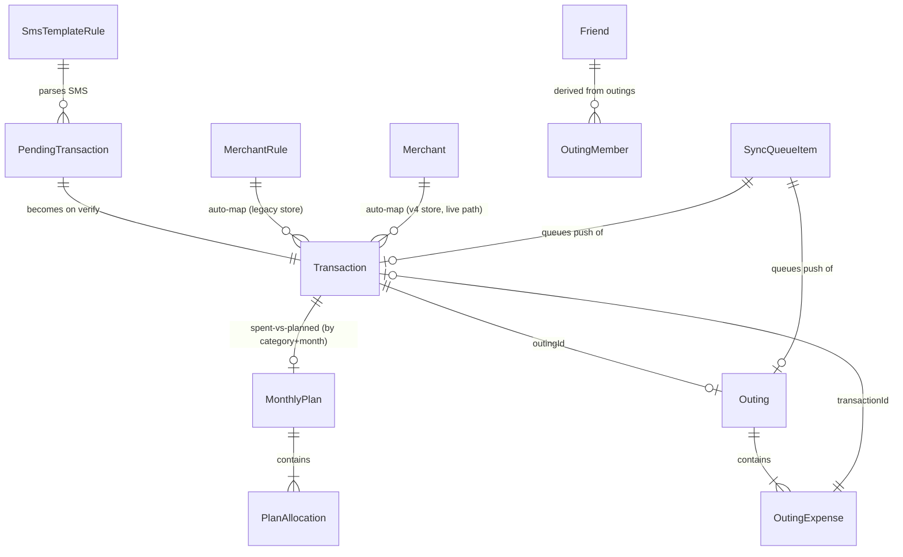

# SpentX Mobile — Local Database Reference (Hive)

> Source-verified against the actual Dart code (`lib/data/local/`, `lib/core/providers/*.dart`, `lib/models/*.dart`, `lib/core/models/*.dart`, every domain model under `lib/features/*/domain|data/*.dart`, and every `Hive.box(...)`/`Hive.openBox(...)` call site — ~230 call sites checked) as of 2026-07-20, superseding `Mobile app/SpentX/db.md` where they disagree (differences called out inline). See [FLUTTER_APP_DOCUMENTATION.md](./FLUTTER_APP_DOCUMENTATION.md) for the app overview and [SYNC.md](./SYNC.md) for how this local data reaches Supabase.

Everything renders from Hive — even after the Supabase sync layer was added (§ see SYNC.md), **the UI never reads Supabase directly**; Hive stays the single read layer, and Supabase is a durable store local writes eventually reach via a queue.

---

## 1. Box index

| Box | Encrypted | Key(s) | Purpose | Status |
|---|---|---|---|---|
| `settings` | No | many (§3) | App prefs, PIN, onboarding, profile, debug flags, plus newer per-feature keys | Active |
| `transactions` | No | `list` | Financial transaction ledger | Active |
| `outings` | No | `{outingId}` (preferred) + legacy `list` | Trips/group expenses | Active |
| `friends` | No | `list`, `recent`, `friend_upi_links` | Friend directory | Active |
| `categories` | No | `expense`, `income` | Custom category lists | Active |
| `budgets` | No | `list` | **Legacy** — superseded by `monthly_plans` (§2.1); kept as a one-time migration source | Legacy, still read |
| `monthly_plans` | No | `list` | **Missing from `db.md` entirely.** The real budget-planning feature behind `/plan` (see FEATURES.md) | Active, undocumented in old `db.md` |
| `investments` | No | `holdings` | Investment holdings | Active |
| `merchant_rules_box` | No | keyed by rule id | Legacy merchant auto-map (UPI/phone/account id → name/category) | Active (mirrored) |
| `merchants_box` | No | keyed by record id | V4 payee-based verified merchants — **the store the live auto-detect matcher actually consults** | Active |
| `merchant_aliases` | No | flat `{rawName: alias}` | Raw name → display alias map | Active |
| `pending_detections` | No | `queue` | Queue of pending SMS verification IDs | Active |
| `detected_sms_box` | No | keyed by pending id | Full pending SMS detection records | Active |
| `ignored_detections` | No | `history` | Ignored/deleted detection history | Active |
| `pending_verification_history` | No | `items` | Pending/verified/ignored audit log | Active |
| `notification_history` | No | `items` (max 200) | In-app notification feed | Active |
| `sms_template_rules_box` | No | keyed by rule id | User-trained SMS template rules | Active |
| `block_rules_box` | No | keyed by rule id | SMS block/ignore rules | Active |
| `detection_rules_box` | No | keyed by rule id | Regex/keyword SMS detection rules | Active |
| `ignored_sms_box` | No | append-only | Auto-ignored SMS log (OTP, ads, blocked) | Active |
| `processed_sms_box` | No | dual-use (§ SMS pipeline doc) | Dedupe by referenceId + parse audit log | Active |
| `master_debug_log_box` | No | `entries` | Developer debug log (lazy-open) | Active |
| **`sync_queue`** | No | `items` | **Missing from `db.md` entirely.** The offline-first write queue feeding Supabase sync | Active, undocumented in old `db.md` |
| `vault` | Yes (AES, `hive_encryption_key`) | — | Defined in `HiveService`; **confirmed dead** — `HiveService.init()`/`hiveServiceProvider` are never called or read anywhere; `main.dart` opens all boxes unencrypted and never touches this class | Dead code |
| `sms_block_rules_box`, `sms_rules_box`, `sms_template_box` | No | — | **Legacy**, migrated to `block_rules_box`/`detection_rules_box`/`sms_template_rules_box` on startup | Migrated away |
| `user`, `user_state` | No | — | Referenced only in reset logic, unused at runtime | Vestigial |

---

## 2. Box-by-box detail

### 2.1 `monthly_plans` — the Plan feature's storage (undocumented gap in `db.md`)

Opened in `main.dart:66`; lazily reopened in `plan_provider.dart`. Key `'list'` → `List<Map>` of `MonthlyPlan.toJson()`.

**`MonthlyPlan`** (`lib/core/providers/plan_provider.dart`):

| Field | Type | Notes |
|---|---|---|
| `id` | `String` | |
| `month` | `String` | `yyyy-MM` |
| `title` | `String?` | |
| `purposeName` | `String?` | Plans are keyed by month + purpose |
| `expectedIncome` | `double` | New concept vs. the old `budgets` box — no income tracking existed there |
| `allocations` | `List<PlanAllocation>` | |
| `remoteId` | `String?` | Set once pushed to Supabase `monthly_plans` |

**`PlanAllocation`:** `id String`, `category String`, `plannedAmount double`, `color String?`.

**Migration behavior:** on first load, if `monthly_plans` is empty, `PlanNotifier` migrates from the legacy `budgets` box (`list` key, `category`/`limit` fields) into a single current-month plan; `ensureDraft()` also seeds allocations from legacy budget limits when creating a new month's draft — so pre-existing category limits are carried forward automatically, not lost. Syncs to Supabase via `SyncService.queuePlanUpsert`/`queuePlanDelete` (see SYNC.md §1).

### 2.2 `sync_queue` — the offline write queue (undocumented gap in `db.md`)

`lib/core/sync/sync_queue.dart`, opened via `SyncQueue.ensureOpen()` in `main.dart:78`. Key `'items'` → `List<Map>`:

```json
{ "id": "string", "entity": "transaction|account|outing|friend|friend_delete|user_settings|user_merchant|contributor|category|monthly_plan", "op": "upsert|delete", "localId": "string", "payload": {}, "at": "ISO8601" }
```

This box is the concrete evidence that the app is **not local-only** despite an in-app "Master App Prompt" document (`spentx_master_app_prompt.dart:22`, reachable from Developer Options → "Full App Prompt/Specification") still claiming *"All data stays on-device… no cloud sync"* — that in-app spec text is itself stale, same category of drift as the old `db.md`/`hello.md`. Full push/pull semantics for this queue are documented in [SYNC.md](./SYNC.md).

### 2.3 `settings` box

Unencrypted general-purpose box; see §3 for the full key table, including several newer per-feature keys `db.md` didn't have.

### 2.4 `transactions`

| Key | Type |
|---|---|
| `list` | `List<Map>` — newest inserted at index 0 |

**`Transaction`** (`lib/models/transaction.dart`) — the primary ledger model. `db.md` was missing **three** fields, all confirmed present in `toJson`/`fromJson` and actively used:

| Field | Type | Required | Notes |
|---|---|---|---|
| `id` | `String` | auto UUID | |
| `merchant` | `String` | ✓ | |
| `category` | `String` | ✓ | |
| `account` | `String` | ✓ | Account name |
| `time` | `String` | ✓ | Display time string |
| `amount` | `double` | ✓ | |
| `isExpense` | `bool` | ✓ | |
| `isAutoDetected` | `bool` | | From SMS pipeline |
| `isGroup` | `bool` | | |
| `groupCount` | `int` | | |
| `paymentType` | `String` | | `Cash` \| `Online` |
| `date` | `String` (ISO8601) | ✓ | |
| `isTransfer` | `bool` | | |
| **`transferTo`** | `String?` | | **Missing from `db.md`.** Destination account name for a transfer's outgoing leg — added by the debug-fix pass so the Cash branch of balance calc only credits Cash when a transfer actually targets it |
| `outingId` | `String?` | | |
| `isAutoLinked` | `bool` | | |
| `rawIdentifier` | `String?` | | Merchant learning key |
| `purpose` | `String?` | | |
| `bankName` | `String` | | |
| `accountLast4` | `String` | | |
| `referenceId` | `String` | | SMS ref / UPI ref, dedupe key |
| `upiId` | `String` | | |
| `rawMessage` | `String` | | Original SMS — **never synced to Supabase** |
| `note` | `String` | | |
| `isPendingVerification` | `bool` | | |
| `isMerchantMapped` | `bool` | | |
| **`remoteId`** | `String?` | | **Missing from `db.md`.** Supabase row id once this transaction has been pushed/pulled |
| **`contributorSource`** | `String?` | | **Missing from `db.md`.** Income source person — maps to the web `transaction_splits.contributor_id` concept |

**Dead alternate model** (confirmed unused): `lib/features/transactions/domain/transaction_model.dart`, `@HiveType(typeId: 1)`, adapter not registered.

### 2.5 `outings`

| Key pattern | Type | Notes |
|---|---|---|
| `{outingId}` | `Map` | One Outing object per trip (preferred) |
| `list` | `List<Map>` | **Legacy** — array of outings, merged on load |

**`Outing`:** `id`, `title`, `category`, `location?`, `startDate`/`endDate` (ISO8601), `members: List<OutingMember>`, `expenses: List<OutingExpense>`, `isActive bool`, `isAutoMode bool`.

**`OutingMember`:** `id`, `name`.

**`OutingExpense`:** `id`, `title`, `amount`, `category`, `date` (ISO8601), `paymentMode`, `memberIds: List<String>` (split participants, `'you'` or member UUID), `settledMemberIds` (legacy), `splitType int` (0=solo, 1=equally), `transactionId?` (linked ledger tx), `accountId?`, `purpose`, `paidByMemberId?`, `settledModes: Map<String,String>` (legacy), `settlementPayments: Map<String, List<SettlementPayment>>` (partial repayments).

**`SettlementPayment`:** `amount`, `mode`, `date` (ISO8601).

The outing's **total spend is never stored as a field** — it's always computed from `expenses`, both locally and when pushed to Supabase (see SYNC.md §7).

### 2.6 `friends`

| Key | Type |
|---|---|
| `list` | `List<Map>` — manual friends: `name`, `phone?` |
| `recent` | `List<String>` — last 15 friend names used |
| `friend_upi_links` | `Map<String, List<String>>` — friend name (lowercase) → UPI handles |

Trip-derived friends are computed at runtime from `outings` — not stored here.

### 2.7 `categories`

| Key | Type | Default (current, web-aligned) |
|---|---|---|
| `expense` | `List<String>` | Food & Dining, Groceries, Transportation, Rent / Housing, Utilities, Healthcare, Entertainment, Shopping, Education, Travel, Bills & EMI, Personal Care, Gifts & Donations, Miscellaneous, Investment |
| `income` | `List<String>` | Salary, Freelance / Business, Investments, Rental Income, Bonus, Gifts Received, Interest, Other Income |

> **Correction to `db.md`:** it lists an older default set (`Food, Shopping, Transport, Entertainment, Bills, Health, Trip, Hotel Stay, Flight, Sightseeing, Other`). That set is now the **legacy** fallback — `category_provider.dart` has a `_looksLikeLegacyDefaults()` check that detects exactly that old list on load and overwrites it with the web-aligned set above, so any install still showing the old defaults gets silently migrated forward.

Also stores `pending_custom_expense`/`pending_custom_income` (in the `settings` box, not here — see §3) for custom categories awaiting server push.

### 2.8 `budgets` (legacy)

| Key | Type |
|---|---|
| `list` | `List<Map>` — `BudgetItem`: `id`, `category`, `limit`, `notifyAt80 bool` (default true), `notifyAt100 bool` (default true) |

Superseded by `monthly_plans` (§2.1) but still read once as a migration source for a user's first plan.

### 2.9 `investments`

| Key | Type |
|---|---|
| `holdings` | `List<Map>` — **confirmed key name, not `list`** |

**`InvestmentHolding`:** `id`, `name`, `type` (`liquid`/`mutualFund`/`fixedDeposit`/`stocks`/`bonds`/`crypto`/`gold`/`realEstate`/`other`), `amount`, `growthPercent`, `updatedAt` (ISO8601).

### 2.10 Account data — `settings.onboardingAccounts`

**`AccountModel`** (`lib/models/account_model.dart`): `id`, `name`, `type` (`Bank`|`Cash`), `last4Digits`, `openingBalance`, and **`isActive bool`** (default `true`) — **missing from `db.md`**; soft-delete flag, and net-worth calc only sums active accounts.

Dead alternate model: `lib/features/accounts/domain/account_model.dart`, `@HiveType(typeId: 0)`, adapter not registered — confirmed unused, matching `db.md`.

### 2.11 Merchant stores (dual-store system)

**`merchant_rules_box`** (legacy, keyed by rule id) — **`MerchantRule`:** `id`, `identifier` (UPI/phone/account id/ATM key), `normalizedIdentifierKey`, `displayName`, `defaultPurposeType`, `defaultCategory`, `transactionType` (`debit`/`credit`/`transfer`/`any`), `lastUsedAt`. Legacy field aliases on read: `normalizedMerchantKey`, `merchantName`, `accountType`, `category`.

**`merchants_box`** (v4, keyed by record id) — **`Merchant`/`MerchantRecord`:** `id`, `payee` (raw), `normalizedPayee`, `title`, `purpose`, `category` (default `Other`), `verifiedAt`, `isAutoApply` (default `true`). **This is the store the live auto-detect matcher actually consults first** — a known split-brain bug (editing Merchant Names screen only touched the legacy store while detection matched against this one) was fixed with a bidirectional mirror; see FEATURES.md § Merchant Names.

**`merchant_aliases`** — flat `{rawMerchantName: displayAlias}` map, no wrapper key.

### 2.12 SMS detection & rule boxes

| Box | Model | Key fields |
|---|---|---|
| `pending_detections` | — | `queue: List<String>` — pending ids, sorted by date from `detected_sms_box` |
| `detected_sms_box` | `PendingTransaction` | `id`, `amount`, `receiver`, `bank`, `date`, `rawMessage`, `isExpense`, `isTransfer`, `accountLast4`, `referenceId` (dedupe), `upiId`, `outingId?`, `isAutoLinked`, `notificationShown`, `popupOpened`, `savedTitle?`, `savedCategory?`, `savedPurpose?`, `deferAutoAdd` |
| `ignored_detections` | — | `history: List<Map>` of `PendingTransaction`-shaped records |
| `pending_verification_history` | `PendingVerificationRecord` | `transactionId`, `createdAt`, `notificationShown`, `status` (`pending`/`verified`/`ignored`), `amount`, `merchant`, `bank`, `type` |
| `notification_history` | `AppNotificationRecord` | `id` (epoch ms), `title`, `body`, `type` (`general`/`budget`/`sms_auto`/`sms_pending`/etc.), `createdAt`, `isRead`; capped at 200 entries |
| `sms_template_rules_box` | `SmsTemplateRule` | `id`, `bankName`, `bankNameExact`, `type` (debit/credit/transfer), `mode` (upi/atm/card/unknown), `sampleMessage`, `templatePattern`, `extractionMap`, `exactTaggedValues`, `keywords`, `similarityThreshold` (default 0.65), `structuralParts` |
| `block_rules_box` | `BlockRule` | `id`, `name?`, `keywords`, `pattern?`, `sampleMessage`, `similarityThreshold` (default 0.6), `createdAt` |
| `detection_rules_box` | `SmsRule` | `id`, `matchPattern`, `containsKeywords`, `excludeKeywords?`, `amountPattern`, `namePattern`, `datePattern`, `refPattern`, `type`, `mode`, `bankName`, `sampleMessage`, `accountPattern`, `upiPattern`, `isManual` |
| `ignored_sms_box` | — | append-only: `rawMessage`, `reason`, `time` |
| `processed_sms_box` | — | dual-use: dedupe (`{referenceId, at}`) + parse audit log (`{rawMessage, ruleId, bank, amount, type, referenceId, time, source?}`) |
| `master_debug_log_box` | debug entry | `id`, `timestamp`, `level` (info/success/warning/error), `module`, `title`, `message`, `dataJson?`, `functionName?`, `errorMessage?`, `stackTrace?` |

Template field types (`SmsTemplateRule.extractionMap` values): `amount`, `debitType`, `creditType`, `transferType`, `bankName`, `accountNumber`, `accountLast4`, `balance`, `upiId`, `referenceId`, `merchantName`, `title`, `date`, `time`, `atmWithdraw`, `cardPayment`, `ignoreText`.

Bundled seed assets (not Hive): `assets/sms/default_template_rules.json`, `assets/sms/bank_sms_templates_v4.json`, `assets/sms/bank_sms_templates_v4_report.json` (+ `bank_sms_templates_v4_full.json` extended catalog per `db.md`).

Full parsing algorithm using these boxes is documented in the SMS pipeline section of [WORKFLOWS.md](./WORKFLOWS.md).

---

## 3. `settings` box — key reference

### PIN / lock / biometrics

| Key | Type | Default | Description |
|---|---|---|---|
| `pin_hash` | `String` | — | `base64Url(salt::pin)` hashed 4-digit PIN |
| `pin_salt` | `String` | — | Salt (epoch ms string) |
| `has_pin` | `bool` | `false` | |
| `lock_screen_enabled` | `bool` | `true` | |
| `fingerprint_enabled` | `bool` | `false` | Now gated on real device support (`PinService.enableFingerprintIfSupported`) rather than force-enabled |

### Onboarding & profile

| Key | Type | Default | Description |
|---|---|---|---|
| `has_seen_onboarding` | `bool` | `false` | |
| `isFirstTimeUser` | `bool` | `true` | |
| `onboardingAccounts` | `List<Map>` | — | `AccountModel` list, see §2.10 |
| `purposeTypes` | `List<String>` | `['Personal','Family']` | |
| `profile_name` | `String` | — | |
| **`profile_name_user_set`** | `bool` | — | **Not in `db.md`.** Guards against Supabase pull overwriting a name the user explicitly set locally |
| **`account_has_data`** | `bool` | — | **Not in `db.md`.** Server-decided onboarding gate cache — see auth flow in FEATURES.md/WORKFLOWS.md |

### SMS / detection

| Key | Type | Default | Description |
|---|---|---|---|
| `auto_detection` | `bool` | `true` | |
| `pending_notification_tx_id` | `String` | — | Notification tap target, consumed on open |

### Privacy & UI

| Key | Type | Default | Description |
|---|---|---|---|
| `private_mode` | `bool` | `false` | |
| `outing_privacy_mode` | `bool` | `false` | |
| `disable_rotation` | `bool` | `false` | |
| `outing_categories` | `List<String>` | `['Trip','Restaurant','Temple','Family','Work']` | |

### Debug

| Key | Type | Default | Description |
|---|---|---|---|
| `master_debug_logging` | `bool` | `false` | |
| `debug_toast_messages` | `bool` | `false` | |
| `master_debug_retention` | `int` | `500` | |

### Budget alerts (dynamic keys)

| Key pattern | Type | Description |
|---|---|---|
| `budget_alert_{budgetId}_{year}_{month}` | `List<String>` | Fired thresholds: `'80'`, `'100'` |

### New keys found via this audit — missing from `db.md`

| Key | Type | Feature | Shape |
|---|---|---|---|
| `wealth_goals` | `List<Map>` | Wealth screen | `_WealthGoal { name String, target double, current double }` — **now persisted**, contradicting `hello.md`'s "in-memory only, resets on navigation" claim |
| `recurring_bills` | `List<Map>` | Recurring screen | manual bill: `id`, `name`, `amount`, `category`, `dayOfMonth int` |
| `contributors` | `List<Map>` | Contributors (household income attribution) | `Contributor { id, name, isDefault bool, canDelete bool, isActive bool }` — default "Me" always re-injected if missing |
| `pending_custom_expense` / `pending_custom_income` | `List<String>` | Categories | Custom categories awaiting server push |
| `sync_last_push_error` / `sync_last_push_at` / `sync_last_push_ok` | `String`/`bool` | Sync | Last push result, surfaced in Developer Options |
| `sms_rules_last_refresh_at` | `String` (ISO8601) | SMS rules pull | Gates the 24h admin-rules refresh |
| `tx_cache_extended_since` | `String` (ISO8601) | Sync | Remembers how far back "Load older transactions" has fetched, so the periodic 35-day reconcile doesn't prune that extended history |
| `app_pin_reset_at` (pulled) | `String?` | Sync | Mirrors the web `users.app_pin_reset_at` column — read-only signal consumed by `PinService.applyRemotePinResetIfNeeded` |

`_WealthGoal` and the manual-bill model are local classes private to their own screen files — no shared model, and **neither is queued to `sync_queue`** (both are local-only, not synced to Supabase).

---

## 4. SharedPreferences (native mirror / misc)

| Key | Type | Purpose |
|---|---|---|
| `auto_detection` | `bool` | Mirror of `settings.auto_detection` for native Android SMS/notification code |
| `known_merchants_json` | `String` (JSON array) | Mirror of `merchant_rules_box` for native lookup — shape: `{identifier, normalizedIdentifierKey, displayName, transactionType}` |
| `has_prompted_notification_permission` | `bool` | First-launch notification-listener permission prompt shown |
| `background_detection_enabled` | `bool` | Background notification detection toggle (default `true`) |
| **`app_theme_mode`** | `String` (`'light'`\|`'dark'`) | **Missing from `db.md`.** Dark-mode persistence, stored outside Hive entirely (`theme_mode_provider.dart`) — worth noting since the app is otherwise "always dark" per the UI (§ FEATURES.md), yet this preference exists and is read |
| `flutter.native_sms_queue` | `String` (JSON, Flutter's SharedPreferences prefix) | Native-side SMS broadcast queue, drained by the background isolate — see WORKFLOWS.md SMS pipeline section |
| `flutter.native_tx_queue` | `String` (JSON) | Native-side notification-listener queue, same drain path |

---

## 5. FlutterSecureStorage

| Key | Type | Purpose |
|---|---|---|
| `hive_encryption_key` | `base64Url` bytes | AES key for the encrypted `vault` box — **confirmed dead**, `FlutterSecureStorage` is imported only in the unused `HiveService`, genuinely unreachable at runtime |

PIN hash/salt are stored in the plain `settings` Hive box (§3), **not** in secure storage — worth flagging as a security-relevant fact for anyone auditing this.

---

## 6. Startup open order (`main.dart`, verified against source)

```
merchant_aliases → categories → outings → transactions → settings → friends →
pending_detections → detected_sms_box → ignored_detections →
[sms_template_rules_box, block_rules_box, detection_rules_box, ignored_sms_box, processed_sms_box] →
merchant_rules_box → merchants_box (lazy) →
budgets → monthly_plans → investments →
notification_history → pending_verification_history
```

Then, after `AuthService.init()`: `SyncQueue.ensureOpen()` (`sync_queue` box) and `MerchantLearningService.ensureOpen()` (`merchants_box`, if not already lazily opened).

> **Corrections to `db.md`'s documented open order:** it omits `monthly_plans` entirely, has `pending_verification_history`'s position slightly off, and misses the separate `sync_queue`/`merchants_box` opens that run after auth initialization rather than in the main box-opening loop.

Background worker (`SmsBackgroundInit`) opens a subset of these boxes independently plus runs the legacy-box migrations, since it runs in a headless WorkManager isolate with no access to the boxes the main-isolate `main.dart` already opened.

---

## 7. Reset behavior (`AppResetService.resetAll`)

Clears every box in §1 + SharedPreferences (§4) + PIN keys (`pin_hash`, `pin_salt`, `has_pin`). Re-seeds `settings`: `has_seen_onboarding=false`, `isFirstTimeUser=true`, `auto_detection=true`, `lock_screen_enabled=true`. Per the current auth-required flow (see FEATURES.md/WORKFLOWS.md), this now **also signs out of Supabase** — a fresh-install experience on next open lands at `/auth`, not just onboarding.

---

## 8. Entity relationships (simplified)


