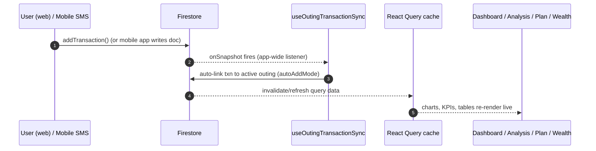
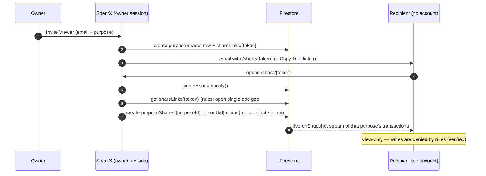

# SpentX Web — Complete Project Documentation, Technical Specification & Functional Audit

> **Document version:** 2.1 · **Last updated: 12 July 2026**
> **Project:** `spentx-web` · **Firebase project:** `spentx-cloud`
>
> This document is the single, exhaustive reference for the SpentX web
> application. It covers: the full system flow, the complete technology stack,
> the entire file-by-file project structure, the design system (every color
> token, font, radius, shadow and utility class), every data model field by
> field, the complete Firebase data-access API surface, the deployed security
> rules, every provider and hook, every page with its full UI element
> hierarchy, every API route, and — critically — a per-feature **functional
> audit**: what works properly, what works partially, and what does not work,
> including email invites, backups, sharing, AI, and Firebase infrastructure.
>
> **Status legend used throughout:**
>
> | Symbol | Meaning |
> |---|---|
> | ✅ | Working — explicitly verified on 11 Jul 2026 |
> | ⚠️ | Partially working, or working with important caveats |
> | ❌ | Not working / unreachable / inert |
> | 🔍 | Implemented and reachable, but not explicitly re-verified in this audit |

---

## Table of Contents

1. [Executive Overview & Full System Flow](#1-executive-overview--full-system-flow)
2. [Technology Stack & Dependencies](#2-technology-stack--dependencies)
3. [Complete Project Structure (file-by-file)](#3-complete-project-structure)
4. [Design System — Colors, Fonts, Shape, Utilities](#4-design-system)
5. [Data Models — every type, field by field](#5-data-models)
6. [Firebase Layer — config, API surface, security rules, indexes](#6-firebase-layer)
7. [Providers & Hooks Reference](#7-providers--hooks-reference)
8. [Pages — Complete UI Design & Functional Breakdown](#8-pages--complete-ui-design--functional-breakdown)
9. [Server API Routes](#9-server-api-routes)
10. [Feature Deep-Dives & Functional Audit](#10-feature-deep-dives--functional-audit)
11. [Master Status Table](#11-master-status-table)
12. [Environment, Deployment & Operations Runbook](#12-environment-deployment--operations-runbook)
13. [Manual QA Checklist](#13-manual-qa-checklist)
14. [Recommended Next Steps](#14-recommended-next-steps)

---

# 1. Executive Overview & Full System Flow

## 1.1 What SpentX is

SpentX is a **personal finance intelligence dashboard** for a household:
income and expense tracking, monthly budgeting with daily safe-spend limits,
wealth and investment tracking, group-trip expense splitting, journaling,
AI-powered coaching, and per-purpose sharing with read-only viewers.

Architecturally it is a **client-heavy Next.js App Router application** that
talks **directly to Firebase** from the browser:

- **Firebase Auth** — identity (email/password, Google popup, and anonymous
  sessions for no-login share links).
- **Cloud Firestore** — the only database. Every domain object is a Firestore
  document. Realtime listeners drive live UI updates. Offline persistence is
  enabled (`persistentLocalCache`).
- **Firebase Storage** — intended target for cloud backups (**currently not
  set up on the project** — see §10.2).
- **No Cloud Functions.** All business logic runs in the browser. The Next.js
  server exists only for four small API routes: three AI proxies (Gemini) and
  one email relay (Resend).

The design philosophy visible throughout the code:

1. **Client-owned logic** — analytics, budgeting math, alert generation, PDF
   building, and even data migration all happen in the browser.
2. **Defensive reads** — legacy data formats (from an earlier Flutter/Android
   app and older schema phases) are normalized on read
   (`normalizeTransactionFromStore`, `migrate-phase1.ts`), and every write
   deep-strips `undefined` values so Firestore never rejects a save.
3. **Soft deletes** — purposes, categories and accounts archive with
   `is_active: false` instead of hard deletion, so historical transactions
   never lose their labels.
4. **Deterministic document ids** — e.g. monthly plans are
   `{userId}_{month}_{purposeId}`, share claims are `{purposeId}_{viewerUid}`,
   viewer grants are `{viewerUid}__{ownerId}`. This gives O(1) lookups and
   makes security rules provable.

## 1.2 The full user flow, end to end

```
┌─────────────┐    ┌──────────────────┐    ┌───────────────────────────┐
│  /auth/*    │───▶│ ensureUser       │───▶│  AppShell (sidebar app)   │
│ sign-in/up  │    │ Workspace seed   │    │  all pages, live data     │
└─────────────┘    └──────────────────┘    └───────────────────────────┘
       │                                        │
       │  Google popup / email+password         │ TanStack Query + Firestore
       ▼                                        ▼ listeners (offline cache)
┌─────────────┐    ┌──────────────────┐    ┌───────────────────────────┐
│ Firebase    │    │ users/{uid} doc  │    │ transactions, accounts,   │
│ Auth        │    │ + defaults seeded│    │ plans, investments, …     │
└─────────────┘    └──────────────────┘    └───────────────────────────┘
```

**Step by step:**

1. **Sign in / sign up** (`/auth/sign-in`, `/auth/sign-up`,
   `/auth/forgot-password`). Methods: email+password and Google popup. A
   cached user snapshot in `localStorage` (`spentx_cached_user`,
   `spentx_has_session`) lets the shell paint instantly on revisit; hard
   timeouts (1.2 s auth-ready race, 2.5 s absolute) guarantee the app never
   hangs on a slow auth handshake.
2. **Workspace seeding** — on first login `ensureUserWorkspace(uid, profile)`
   creates `users/{uid}` (profile + default settings), seeds **default
   categories** (8 income + 12 expense), the **Cash** account, and the
   **Personal** purpose. Existing users get a cheap no-op check.
3. **The shell** — `AppShell` renders the sidebar (Dashboard, Transactions,
   Analysis, Plan, Wealth · Outings, Friends · Alerts, Settings), a sticky
   top bar (page title, Export, notification bell, profile avatar), and the
   routed page. Read-only viewers get a reduced nav; `/auth/*` and `/share/*`
   bypass the shell entirely.
4. **Recording money** — the *Add Transaction* slide-over (reachable from
   Dashboard quick actions and the Transactions page) writes a `transactions`
   doc with type, amount, merchant, category, account, **purpose**, date,
   optional payment metadata, tags, notes, investment linkage, and (for Home
   income) a contributor. Duplicate detection warns before saving a likely
   double entry.
5. **Derived views** — every other page is a pure function of that data:
   - **Dashboard**: configurable KPI cards, income-vs-expense trend, category
     pie, financial health score, recent transactions, AI coach drawer.
   - **Analysis**: hero stats, category/merchant intelligence, budget vs
     actual, monthly comparison, contributor breakdown, saved smart views.
   - **Plan**: per-month (and per-purpose) allocation sheet with expected
     income, savings target, utilization gauge and a computed **daily safe
     spending limit**.
   - **Wealth**: account balances (opening balance + transaction deltas +
     snapshots), investments with growth, net-worth history, future-self
     projection scenarios.
   - **Alerts**: smart alerts generated client-side from the same data.
6. **Group life** — **Outings** (trips with members, expense splits equally /
   solo / custom, settlements, bank-detected expense linking, and a rollup
   prompt that syncs your share into personal transactions) and **Friends**
   (the people directory with UPI/phone and cross-trip balances).
7. **Sharing** — Settings → Sharing invites a viewer per purpose. Since
   11 Jul 2026 this mints a **no-login share link** `/share/<token>`:
   the recipient clicks it and immediately sees that purpose's transactions
   (past + future, live) with zero sign-in. Email delivery of the invite is
   currently blocked by the Resend sandbox (§10.1) — the UI therefore also
   shows the link with a **Copy** button after every invite.
8. **Backups** — automatic weekly and on-change JSON snapshots (to Firebase
   Storage — currently failing silently because Storage is not set up, §10.2)
   plus manual *Backup now / Download latest / Restore* in Settings.
9. **AI** — Gemini 2.5 Flash behind three server routes powers the coach
   chat, monthly financial insights, and the weekly journal summary.

## 1.3 Data flow diagrams

**Transaction ingestion → UI:**



**No-login share link (new, verified):**



**Backup pipeline (current reality):**

```
gatherAllUserData(uid)            hashString(json)          uploadBackupToStorage
        │                               │                          │
        ▼                               ▼                          ▼
  reads 15+ collections ──▶ dedupe vs last hash ──▶ Firebase Storage  ❌ FAILS SILENTLY
                                                    (Storage never set up on project)
        │
        └────────────────────────────▶ local JSON download  ✅ works (manual)
```

---

# 2. Technology Stack & Dependencies

## 2.1 Core framework

| Package | Version | Role & notes |
|---|---|---|
| `next` | **16.2.10** | App Router. **Important:** this pinned version differs from public docs (per `AGENTS.md`, always read `node_modules/next/dist/docs/` before coding). Key confirmed behaviors: route `params` is a **Promise** (server pages `await params`; client pages unwrap with React's `use(params)`); `next dev` prints a managed dev-server banner with a kill PID and logs to `.next/dev/logs/next-development.log`. |
| `react`, `react-dom` | **19.2.4** | React 19 — `use()` API used by the share page; ref-as-prop patterns in ui components. |
| `typescript` | **^5** | Strict mode. `npx tsc --noEmit` passes cleanly as of 11 Jul 2026 ✅. |

## 2.2 UI & styling

| Package | Version | Role |
|---|---|---|
| `tailwindcss` + `@tailwindcss/postcss` | **v4** | CSS-first configuration — there is **no `tailwind.config.js`**; all theme tokens live in `globals.css` under `@theme inline` (§4). |
| `shadcn` | ^4.13.0 | Token conventions + `shadcn/tailwind.css` import; components are vendored into `src/components/ui/`. |
| `tw-animate-css` | ^1.4.0 | Animation utilities for slide-overs, dialogs, drawers. |
| `@radix-ui/react-*` | avatar 1.2.1, dialog 1.1.18, dropdown-menu 2.1.19, label 2.1.11, select 2.3.2, separator 1.1.11, slot 1.3.0, switch 1.3.2, tooltip 1.2.11 | Accessible headless primitives under the ui components. |
| `@base-ui/react` | ^1.6.0 | Additional headless primitives. |
| `lucide-react` | ^1.23.0 | Icon set used everywhere (nav, KPI tiles, buttons, alerts). |
| `class-variance-authority`, `clsx`, `tailwind-merge` | — | Variant-driven component APIs and safe class merging (`cn()` helper in `lib/utils.ts`). |

## 2.3 Data & state

| Package | Version | Role |
|---|---|---|
| `@tanstack/react-query` | ^5.101.2 | Server-state cache. Query keys centralized in `lib/query-keys.ts`; cache persistence helpers in `lib/query-cache.ts`. |
| `@tanstack/react-virtual` | ^3.14.5 | Virtualized transaction ledger rows (smooth with thousands of rows). |
| `react-hook-form` + `@hookform/resolvers` + `zod` | 7.80 / 5.4 / 4.4 | Form state + schema validation (auth forms, transaction forms, modals). |
| `date-fns` | ^4.4.0 | All date math and formatting (`formatDate`, week starts, month ranges). |

## 2.4 Visualization & documents

| Package | Version | Role |
|---|---|---|
| `recharts` | ^3.9.1 | Area/line trend charts, pies, bar charts, gauges across Dashboard, Analysis, Plan, Wealth, Outings. |
| `jspdf` + `jspdf-autotable` | 4.2 / 5.0 | Client-side PDF report generation (`lib/pdf.ts`, `components/reports/`). |

## 2.5 Backend SDK & services

| Package / service | Version | Role |
|---|---|---|
| `firebase` | **^12.15.0** | Auth (`firebase/auth`), Firestore (`firebase/firestore` with `initializeFirestore` + `persistentLocalCache`), Storage (`firebase/storage`). |
| **Resend** (HTTP API) | — | Outbound email via `POST https://api.resend.com/emails` from `/api/send-email`. ⚠️ Account in sandbox mode (§10.1). |
| **Google Gemini** (HTTP API) | model `gemini-2.5-flash` | Chat/insights/summary via `generativelanguage.googleapis.com` from the three `/api/ai*` routes. ✅ key configured. |

## 2.6 Firebase project facts (verified 11 Jul 2026)

| Item | Value |
|---|---|
| Project id | `spentx-cloud` (project number 60756342402) |
| Firestore | `(default)` database, type `FIRESTORE_NATIVE`, STANDARD edition |
| Auth providers enabled | Email/Password ✅ · Google ✅ · **Anonymous ✅ (enabled 11 Jul 2026 via Identity Toolkit admin API to power no-login share links)** |
| Storage | ❌ **Never initialized** — "Get Started" has not been clicked in the console; `firebase deploy --only storage` fails (§10.2) |
| Rules | `firestore.rules` deployed 11 Jul 2026 (includes `shareLinks` + token-claim rules) |
| Indexes | 5 composite indexes on `transactions` (§6.5) |

## 2.7 npm scripts

| Script | Command | Notes |
|---|---|---|
| `dev` | `next dev` | Serves on port 3000 (falls back to 3001 if 3000 is occupied — happened during this audit). |
| `build` | `next build` | Production build. |
| `start` | `next start` | Serve the production build. |
| `start:prod` | `npm run build && next start` | Convenience. |
| `lint` | `eslint` | Flat config, `eslint-config-next` 16.2.10. Pre-existing errors exist in `AppShell.tsx` and `firebase-provider.tsx` (`react-hooks/set-state-in-effect`) — not regressions. |

---

# 3. Complete Project Structure

229 files under `src/`. Every file is listed below with its purpose.

## 3.1 Root configuration files

| File | Purpose |
|---|---|
| `package.json` | Dependencies & scripts (§2). |
| `tsconfig.json` | TypeScript config, `@/*` path alias → `src/*`. |
| `next.config.ts` | Plain default — no custom config options set. |
| `eslint.config.mjs` | Flat ESLint config extending `eslint-config-next`. |
| `postcss.config.mjs` | Tailwind v4 PostCSS plugin. |
| `firebase.json` | Points deploys at `firestore.rules`, `firestore.indexes.json`, `storage.rules`. |
| `firestore.rules` | Deployed Firestore security rules (full text & walkthrough in §6.4). |
| `firestore.indexes.json` | 5 composite indexes for `transactions` (§6.5). |
| `storage.rules` | Storage rules for backups — **cannot deploy until Storage is initialized** (§10.2). |
| `.env.local` | Secrets: Firebase web config, `GEMINI_API_KEY`, `RESEND_API_KEY`, `RESEND_FROM_EMAIL` (values quoted). |
| `.env.example` | Documents required env keys for new environments. |
| `AGENTS.md` / `CLAUDE.md` | Instructions for AI coding agents: this Next.js version has breaking changes — read bundled docs first. |
| `test.md` | This document. |

## 3.2 `src/app` — routes (Next.js App Router)

| File | Route | Purpose | Status |
|---|---|---|---|
| `app/layout.tsx` | (root) | HTML skeleton: Inter font, `ThemeScript` (pre-hydration theme class), `AppProviders`, `GlobalFiltersProvider`, `AppShell`. Metadata: title "SpentX". | ✅ |
| `app/loading.tsx` | (root) | Route-level loading fallback. | ✅ |
| `app/globals.css` | — | Tailwind v4 theme: all design tokens, dark theme, component classes (§4). | ✅ |
| `app/page.tsx` | `/` | Renders `DashboardPage`. | 🔍 |
| `app/transactions/page.tsx` | `/transactions` | Full transactions ledger page (client). Holds page-level filter state, pagination, CSV export, add/edit/delete orchestration. | 🔍 |
| `app/analytics/page.tsx` | `/analytics` | Renders `AnalysisPage`. | 🔍 |
| `app/plan/page.tsx` | `/plan` | Renders `PlanPage`. | 🔍 |
| `app/wealth/page.tsx` | `/wealth` | Renders `WealthPage`. | 🔍 |
| `app/outings/page.tsx` | `/outings` | Renders `OutingsPage`. | 🔍 |
| `app/outings/[id]/page.tsx` | `/outings/:id` | Renders `TripDetailPage` for one outing. | 🔍 |
| `app/friends/page.tsx` | `/friends` | Renders `FriendsPage`. | 🔍 |
| `app/alerts/page.tsx` | `/alerts` | Smart Alerts feed (client page, uses `useSmartAlerts`). | 🔍 |
| `app/settings/page.tsx` | `/settings` | Renders `SettingsPage`. | 🔍 |
| `app/share/[token]/page.tsx` | `/share/:token` | **Public no-login shared view** (client; unwraps `params` with `use()`). | ✅ verified |
| `app/auth/layout.tsx` | `/auth/*` | Auth layout wrapper (centered card look). | 🔍 |
| `app/auth/sign-in/page.tsx` | `/auth/sign-in` | Sign-in form page. | ✅ |
| `app/auth/sign-up/page.tsx` | `/auth/sign-up` | Sign-up form page. | 🔍 |
| `app/auth/forgot-password/page.tsx` | `/auth/forgot-password` | Password-reset request page. | 🔍 |
| `app/growth/` | `/growth` | **EMPTY DIRECTORY — route 404s.** Components exist but are unreachable. | ❌ |
| `app/journal/` | `/journal` | **EMPTY DIRECTORY — route 404s.** Components exist but are unreachable. | ❌ |
| `app/api/ai/route.ts` | `POST /api/ai` | AI Coach chat proxy → Gemini 2.5 Flash. | ✅ configured |
| `app/api/ai/financial-insights/route.ts` | `POST /api/ai/financial-insights` | Monthly health-score insight generation. | ✅ configured |
| `app/api/ai/weekly-summary/route.ts` | `POST /api/ai/weekly-summary` | Weekly journal narrative. | ⚠️ works, but its UI (Journal) is unreachable |
| `app/api/send-email/route.ts` | `POST /api/send-email` | Resend relay `{to, subject, html, text}`. | ⚠️ works; delivery sandbox-limited (§10.1) |

## 3.3 `src/components` — feature components

### 3.3.1 `components/dashboard/`

| File | Purpose |
|---|---|
| `DashboardPage.tsx` | Page orchestrator (~500 lines): greeting, date filter, KPI row, charts, health card, recent transactions, quick actions, AI coach mount. |
| `DashboardKpiRow.tsx` | Renders the user-configured KPI cards with deltas + sparklines. |
| `KpiConfigModal.tsx` | Choose/order which KPI cards show (persisted to `users/{uid}.settings.dashboardKpiCards`). |
| `TrendChart.tsx` | Recharts income-vs-expense area/line chart (7-day and 30-day series). |
| `CategoryChart.tsx` | Top-categories pie/donut with legend. |
| `DashboardDateFilter.tsx` | Preset picker: last-7-days, this-month, last-month, specific-month, last-3/6/12-months, custom. |
| `DashboardRecentTransactions.tsx` | Latest 10 transactions with color-coded amounts and View-all link. |
| `QuickActionsMenu.tsx` | Dropdown: Add Expense, Add Income, Start Outing, Monthly Plan. |
| `AiCoachDrawer.tsx` | Slide-in chat drawer: history stream, quick-prompt pills, textarea composer, clear-history. |

### 3.3.2 `components/transactions/`

| File | Purpose |
|---|---|
| `TransactionFilters.tsx` | Filter bar: search, amount bounds, categories multi-select, account, source, type, purpose, date presets, reset. |
| `TransactionsLedgerTable.tsx` | Virtualized paginated ledger; row click opens detail panel. |
| `TransactionsPagination.tsx` | Page-size selector (30/50/100) + pager. Exports `TRANSACTION_PAGE_SIZES`. |

### 3.3.3 `components/analytics/`

| File | Purpose |
|---|---|
| `AnalysisPage.tsx` | Page orchestrator (~213 lines): filters, hero stats, panels grid. |
| `AnalysisDateFilter.tsx` | Analytics presets: this-month, last-month, last-3-months, this-year, custom. |
| `SmartViewsControl.tsx` | Save/apply named filter views (SavedAnalyticsFilterView). |
| `CategoryBreakdown.tsx` | Category spend chart + progress list. |
| `TopCategoriesTable.tsx` | Top categories/merchants ranking table. |
| `BudgetVsActualTable.tsx` | Joins monthly plan allocations to actuals: planned, actual, variance, status bar. |
| `MonthlyComparisonTimeline.tsx` | Month-over-month income/expense comparison. |
| `ContributorBreakdown.tsx` | Home-income contributor split visualization. |

### 3.3.4 `components/plan/`

| File | Purpose |
|---|---|
| `PlanPage.tsx` | Page orchestrator (~397 lines): month selector, income card, allocation sheet, overview column, daily limit, templates. |
| `PlanMonthSelector.tsx` | Month dropdown (navigable months). |
| `PlanAllocationSheet.tsx` | Category allocation rows: color dot, name, planned input, actual progress. |
| `AddCategoryModal.tsx` | Add a category allocation to the plan. |
| `PlanOverviewPanel.tsx` | Right column: totals, income vs planned bars, advice. |
| `PlanPieChart.tsx` | Allocation distribution pie. |
| `UtilizationGauge.tsx` | Budget utilization gauge (planned vs spent). |
| `FitsIncomeBanner.tsx` | Warning banner when allocations exceed expected income. |

### 3.3.5 `components/wealth/`

| File | Purpose |
|---|---|
| `WealthPage.tsx` | Page orchestrator (~197 lines). |
| `WealthNetWorthIndicator.tsx` | Big net-worth figure + monthly change. |
| `WealthSegmentCards.tsx` | Bank / Cash / Wallet / Credit / Investments filter cards. |
| `NetWorthHistoryChart.tsx` | 12-month net-worth area chart from snapshots. |
| `BalanceSnapshotPanel.tsx` | Snapshot list per account. |
| `LogSnapshotModal.tsx` | Record an account balance on a date. |
| `InvestmentSummaryCard.tsx` | Total invested / current value / overall return %. |
| `InvestmentsTable.tsx` | Investment rows with growth %, type badges, edit/delete. |
| `QuickAccountTransfer.tsx` | Transfer dialog — creates paired expense/income transactions between accounts. |
| `WealthFilteredTransactions.tsx` | Transactions filtered by the selected segment/account/investment. |

### 3.3.6 `components/outings/`

| File | Purpose |
|---|---|
| `OutingsPage.tsx` | Trip list page (~226 lines): status tabs, cards, create modal trigger. |
| `CreateOutingModal.tsx` | New trip: name, category (Trip/Temple/Restaurant/Movies/Other), location, budget, dates, auto-add switch, member picker from Friends. |
| `TripDetailPage.tsx` | Detail orchestrator: header, summary, charts, expense list, members, settlements. |
| `AddOutingExpenseDialog.tsx` | Expense form: description, amount, category, payer, split type (equally/solo/custom) with per-member amounts. |
| `OutingExpenseList.tsx` | Expense table with source badges (manual / bank-detected) and delete. |
| `OutingMembersPanel.tsx` | Per-member paid/share/net balance list. |
| `OutingAnalysisPanel.tsx` | Category and per-member spending charts. |
| `SettlementHistoryPanel.tsx` | Record + list settlements (from → to, amount, date, note). |
| `OutingRollupPromptDialog.tsx` | After completion: prompt to roll your share into personal transactions. |

### 3.3.7 `components/friends/`

| File | Purpose |
|---|---|
| `FriendsPage.tsx` | Directory: add form (name/UPI/phone), inline-editable table, detail side panel with cross-outing net balance. |

### 3.3.8 `components/settings/`

| File | Purpose |
|---|---|
| `SettingsPage.tsx` | The entire settings surface (~2,000 lines): left sub-nav (Profile, Preferences, Purposes, Sharing, Contributors, Categories, Accounts, Security, Data & Backups, + admin Global Settings, SMS Rules) and every section's UI. |
| `SharingTab.tsx` | Sharing section: invite modal, owned-shares table, revoke confirm, **view-link Copy dialog** (new). |
| `ContributorsTab.tsx` | Home-income contributor manager ("Me" is permanent). |
| `SmsRulesAdminPanel.tsx` | Admin editor for SMS template/detection/block rules (consumed by the mobile app). |

### 3.3.9 `components/auth/`

| File | Purpose |
|---|---|
| `AuthLayout.tsx` | Centered card layout with branding. |
| `SignInForm.tsx` / `SignUpForm.tsx` | Email+password forms (react-hook-form + zod) with Google button. |
| `ForgotPasswordForm.tsx` | Reset-email request form. |
| `GoogleAuthButton.tsx` | Google popup trigger button. |
| `AuthGate.tsx` | Client gate helper for authenticated content. |

### 3.3.10 `components/shared/` (cross-page building blocks)

| File | Purpose |
|---|---|
| `AppShell.tsx` | Sidebar + top bar + auth guard + viewer-mode nav restriction + `/share` & `/auth` bypass. |
| `AddTransactionSlideOver.tsx` | The add/edit transaction sheet (full form, duplicate warning, investment linkage, contributor picker). |
| `AddInvestmentSlideOver.tsx` | Add/edit investment sheet. |
| `TransactionDetailPanel.tsx` | Read view of one transaction + Edit/Delete actions. |
| `TransactionSummaryStrip.tsx` | Income/expense/net strip for the current filter. |
| `TransactionTable.tsx` | Generic transaction table used outside the ledger. |
| `GlobalFilters.tsx` / `PurposeFilterChips.tsx` / `FilterChips`(fintech) | Filter UI pieces. |
| `GlobalSearch.tsx` | Top-bar search overlay (merchants, amounts, categories). |
| `NotificationBell.tsx` | Unread-alert badge; links to `/alerts`. |
| `ProfileAvatar.tsx` | Avatar + dropdown (name, email, theme toggle, sign out). |
| `ExportButton.tsx` | Top-bar PDF report download (`downloadReportPdf`). |
| `KpiCard.tsx` / `MiniSparkline.tsx` / `AnimatedCurrency.tsx` | KPI presentation atoms. |
| `AlertItem.tsx` | One alert row (severity color, read state). |
| `EmptyState.tsx` / `FirebaseSetupScreen.tsx` | Empty and unconfigured states. |
| `PersonalizedSuggestion.tsx` | AI-flavored suggestion card. |
| `QuickActionButton.tsx` | Floating action button. |
| `ThemeScript.tsx` | Inline script — applies saved theme before hydration (no flash). |
| `DarkAmbientRays.tsx` | Decorative dark-mode background rays. |

### 3.3.11 `components/fintech/`

| File | Purpose |
|---|---|
| `StatCard.tsx` | Premium stat tile (used on Analysis hero row). |
| `PremiumTabs.tsx` | Underlined tab control (`premium-tab-trigger` class). |
| `FilterChips.tsx` | Chip-style filter selectors. |

### 3.3.12 `components/reports/`

| File | Purpose |
|---|---|
| `PDFReportGenerator.tsx` | Builds `FinancialReportData` and triggers jsPDF download. |
| `ReportPreview.tsx` | On-screen preview of the report content. |

### 3.3.13 `components/growth/` — ❌ orphaned (no route)

| File | Purpose |
|---|---|
| `GrowthPage.tsx` | Income growth planner page (unreachable). |
| `IncomeTargetCard.tsx` | 3/6/12-month target editor vs current average. |
| `IncomeTrendChart.tsx` | Historical inflow vs target milestones. |
| `IncomeStreamTable.tsx` | Income sources ledger (monthly vs one-time). |

### 3.3.14 `components/journal/` — ❌ orphaned (no route)

| File | Purpose |
|---|---|
| `JournalPage.tsx` | Weekly reflection page (unreachable). |
| `ReflectionForm.tsx` | Mood slider 1–5, wins, unnecessary spend, plan adherence, next-week goals. |
| `JournalHistory.tsx` | Past reflections list. |
| `AIWeeklySummary.tsx` | Renders the AI narrative from `/api/ai/weekly-summary`. |

### 3.3.15 `components/ui/` — shadcn primitives (17 files)

`avatar`, `badge`, `button` (variants: default/outline/ghost/destructive…,
sizes incl. `icon-sm`), `card` (Card/Header/Title/Description/Content),
`dialog` (Radix, with Footer/Header), `dropdown-menu`, `input`, `label`,
`progress`, `select`, `separator`, `sheet` (slide-over), `skeleton`,
`switch`, `table` (Table/Header/Body/Row/Head/Cell), `textarea`, `tooltip`.
All theme-token driven; all support dark mode automatically.

## 3.4 `src/hooks` — 38 hooks (full reference in §7)

## 3.5 `src/lib` — 40+ modules

| File | Purpose |
|---|---|
| `firebase.ts` | **4,157 lines.** Firebase init + the entire data-access API (§6.2–6.3): every fetch/save/delete/subscribe for every collection, sharing, share links, email, backups, migrations. |
| `firestore-helpers.ts` | Normalizers between store shape and app types (`normalizeTransactionFromStore/ForStore`, account/category/outing/investment normalizers, `stripUndefinedDeep`, `parseUserDocument`, monthly-plan doc-id builders). |
| `firestore-schema.ts` | `FIRESTORE_COLLECTIONS` name constants. |
| `migrate-phase1.ts` | Phase-1 schema migration helpers (purpose normalization, account fields, plan purposes). |
| `mock-data.ts` | Default/demo data: 10 sample transactions, default accounts (HDFC, ICICI, Amex, Cash, Paytm, PhonePe), **8 default income categories** (Salary, Freelance/Business, Investments, Rental Income, Bonus, Gifts Received, Interest, Other Income), **12 default expense categories** (Food & Dining, Groceries, Transportation, Rent/Housing, Utilities, Healthcare, Entertainment, Shopping, Education, …), default purposes (personal, home). |
| `purposes.ts` | Purpose helpers: `PERSONAL_PURPOSE_ID="personal"`, `HOME_PURPOSE_ID="home"`, normalization, `getPurposeLabel`, `isHomeFamilyPurpose`, `resolvePurposeId`, `transactionMatchesPurpose`, `openingBalanceForPurpose` (new 12 Jul 2026 — attributes account opening balances entirely to Personal so per-purpose net-worth splits don't double-count them). |
| `purpose-shares.ts` | Share doc-id builders (linked `{purposeId}_{uid}`, pending `{ownerId}_{purposeId}_pending_{emailSlug}`, legacy formats), email slugging, owned/viewer share selectors, `viewerGrantDocId`. |
| `plan.ts` | Plan month math (`getCurrentPlanMonth`, `formatPlanMonth`, `sumPlanned`), plan status/suggestions. |
| `calculators/dailyLimit.ts` | Daily safe-spend engine → `DailyLimitResult` (dailySafeLimit, remainingToday, overspend recovery days, month-end projection, status: no-plan/on-track/overspent/month-complete). |
| `calculators/projections.ts` | Future-self scenarios (current/disciplined/aggressive) with age milestones. |
| `financial-health.ts` | Health score: income/expense/bills/salary category heuristics → level excellent/attention/action. |
| `alerts/generateAlerts.ts` | Smart-alert generator: burn-rate, plan-deviation, daily-limit, budget-threshold, reflection-reminder, income alerts (INR formatting). |
| `dashboard.ts` / `dashboard-kpi-meta.ts` | Dashboard aggregation (`DashboardData`) + KPI icon/accent metadata (brand/positive/negative/neutral tones). **New (12 Jul 2026):** `buildMultiPurposeTrend` + `TrendSeries` type — builds one income/expense line pair per active purpose (colored via `getPurposeTrendColors`) for the date-range-scoped Cash Flow Trend chart; `computeNetWorthByPurpose` (dashboard-scoped variant) powers the Net Worth KPI card's combined/per-purpose toggle. |
| `kpi-delta.ts` | Period-over-period delta computation for KPI cards. |
| `analytics.ts`, `analytics-filters.ts`, `analytics-filter-config.ts` | Hero stats, filter application, saved-view config. |
| `transactions-query.ts` | Builds Firestore query constraints from filters; splits Firestore-side vs client-side filtering. |
| `transaction-summary.ts` | Totals + `findLikelyDuplicate` (duplicate-entry detection). |
| `transaction-ui.ts` | Display helpers (labels, colors, icons per category/source). |
| `date-filters.ts` / `filter-defaults.ts` | Date-preset ranges + `createDefaultGlobalFilters`. |
| `accounts.ts` | Account balance computation (opening balance + txn deltas + carryover). |
| `balance-carryover.ts` | Month-boundary balance carryover logic. |
| `wealth.ts` | Net-worth breakdown, segments, emergency-fund health, net-worth history assembly. **New (12 Jul 2026):** `computeNetWorthByPurpose` + `PurposeNetWorth` type — per-purpose net-worth split (opening balance attributed entirely to Personal via `openingBalanceForPurpose`), powers the Wealth page's Combined/By-purpose toggle. |
| `investments.ts` | `isSpendingExpense` (excludes investment expenses from spend math), investment aggregation. |
| `outings.ts` | `computeMemberBalances`, trip summary math. |
| `outing-sync.ts` / `outing-display.ts` | Auto-link bank transactions to outings; display helpers. |
| `journal.ts` | Week windows (`getWeekStart`, `filterTransactionsForWeek`, `isReflectionDue`). |
| `growth.ts` | Income-stream aggregation vs targets. |
| `ai-chat.ts` | Client caller for `/api/ai` chat. |
| `ai/financial-insights.ts` | Builds `FinancialInsightContext` and calls the insights route. |
| `ai/generateSummary.ts` | Weekly summary request builder. |
| `ai/personalizedSuggestions.ts` / `ai/growthSuggestions.ts` / `ai/wealthSuggestions.ts` | Local heuristic suggestion generators. |
| `pdf.ts` / `reports.ts` | `downloadReportPdf` (jsPDF) + report data assembly. |
| `greeting.ts` | Time-of-day greeting for the dashboard. |
| `theme.ts` | Theme persistence + system-preference resolution. |
| `auth.ts` | Auth helper wrappers. |
| `admin.ts` | Admin-role helpers. |
| `settings-data.ts` | Merges defaults with stored accounts/categories/purposes (`mergeCategories`, `resolveStoredAccounts`, `resolveStoredPurposes`). |
| `query-keys.ts` / `query-cache.ts` | Central query-key factory + cache persistence. |
| `utils.ts` | `cn()`, `formatCurrency` (currency + private-mode singleton), `formatDate/DateTime`, `toCsv`, `downloadCsv`, `filterTransactions`. |

## 3.6 `src/providers` — 7 providers (detail in §7.1)

`app-providers.tsx` (composition root) → `query-provider` → `firebase-provider`
→ `theme-provider` → `toast-provider` → `app-data-provider` → `viewer-provider`.

## 3.7 `src/types/index.ts`

833 lines — every shared model (§5).

---

# 4. Design System

The entire theme is defined in `src/app/globals.css` using Tailwind CSS v4's
CSS-first configuration (`@theme inline` + CSS custom properties). There is no
`tailwind.config.js`. Dark mode is class-based (`.dark` on `<html>`), declared
via `@custom-variant dark (&:is(.dark *))`.

## 4.1 Typography

| Aspect | Value |
|---|---|
| **Primary font family** | **Inter** — loaded via `next/font/google` in `app/layout.tsx` with `subsets: ["latin"]`, `display: "swap"`; applied as a className on `<html>`. |
| CSS sans stack | `--font-sans: Inter, ui-sans-serif, system-ui, sans-serif` |
| Mono stack | `--font-mono: "SFMono-Regular", Consolas, "Liberation Mono", monospace` |
| Heading stack | `--font-heading: var(--font-sans)` (same as body — no separate display face) |
| Base application | `html { @apply font-sans; }` |

**Type scale in practice (observed conventions):**

| Element | Classes |
|---|---|
| Page title | `text-2xl font-semibold tracking-normal` (often with a leading icon) |
| Page subtitle | `mt-1 text-sm text-muted-foreground` |
| Card title | `text-sm font-semibold` |
| Card description | `text-xs text-muted-foreground` |
| Section eyebrow | `text-xs font-bold uppercase tracking-wider text-muted-foreground` |
| KPI value | `text-lg`–`text-2xl font-bold` (with `AnimatedCurrency`) |
| Table text | `text-sm`; secondary cells `text-muted-foreground` |
| Micro copy / hints | `text-[10px] text-muted-foreground leading-relaxed` |
| Buttons | `font-bold` on primary CTAs; `text-[13px] font-medium` nav items |

## 4.2 Color tokens — Light theme (`:root`)

| Token | Value | Meaning / usage |
|---|---|---|
| `--background` | `#ffffff` | Base surface behind content |
| `--foreground` | `#18181b` | Primary text (zinc-900) |
| `--card` / `--card-foreground` | `#ffffff` / `#18181b` | Card surfaces |
| `--popover` / `--popover-foreground` | `#ffffff` / `#18181b` | Menus, popovers |
| `--primary` | **`#8b7ff0`** | Brand violet — primary buttons, active nav, focus rings, brand KPI accents |
| `--primary-foreground` | `#ffffff` | Text on primary |
| `--secondary` / `--secondary-foreground` | `#f4f4f5` / `#27272a` | Secondary buttons/fills |
| `--muted` / `--muted-foreground` | `#f4f4f5` / `#71717a` | Subtle fills / secondary text |
| `--accent` / `--accent-foreground` | `#edebfc` / `#514a9e` | Soft violet highlight + its text |
| `--destructive` | `#ef4444` | Danger buttons, delete icons |
| `--success` | `#22c55e` | Positive badges/pills |
| `--border` / `--input` | `#e4e4e7` | Hairline borders, input borders |
| `--ring` | `#8b7ff0` | Focus ring |
| `--page` | `#f4f4f5` | **App backdrop** behind white cards (the signature gray canvas) |
| `--chart-1…5` | `#8b7ff0`, `#f97316`, `#22c55e`, `#ef4444`, `#c7c1f5` | Recharts series palette |
| `--sidebar` | `#fafafa` | Nav rail background |
| `--sidebar-foreground` | `#52525b` | Nav item text |
| `--sidebar-primary` / `-foreground` | `#8b7ff0` / `#ffffff` | Active nav accent |
| `--sidebar-accent` / `-foreground` | `#f4f4f5` / `#18181b` | Nav hover |
| `--sidebar-border` / `--sidebar-ring` | `#e4e4e7` / `#8b7ff0` | Rail borders/focus |
| `--shadow-fintech` | `0 1px 2px rgb(24 24 27 / 4%), 0 4px 12px rgb(24 24 27 / 3%)` | Default card depth |
| `--shadow-fintech-hover` | `0 4px 16px rgb(24 24 27 / 7%), 0 8px 24px rgb(24 24 27 / 5%)` | Hover depth |

## 4.3 Color tokens — Dark theme (`.dark`, OKLCH-based)

| Token | Value | Notes |
|---|---|---|
| `--background` | `oklch(0.14 0.01 285)` | Near-black with a violet hue (285°) |
| `--foreground` | `oklch(0.98 0 0)` | Near-white text |
| `--card` | `oklch(0.18 0.012 285)` | Slightly lifted surface |
| `--popover` | `oklch(0.19 0.012 285)` | Menus |
| `--primary` / `-foreground` | `#a49af3` / `#1c1933` | Brand lightens; dark text on it |
| `--secondary` | `oklch(0.23 0.012 285)` | |
| `--muted` / `--muted-foreground` | `oklch(0.22 0.012 285)` / `oklch(0.66 0.01 285)` | |
| `--accent` / `--accent-foreground` | `oklch(0.28 0.04 285)` / `oklch(0.9 0.04 285)` | |
| `--destructive` | `#f87171` | Softened red |
| `--success` | `#4ade80` | Brighter green |
| `--border` | `oklch(0.62 0 0 / 18%)` | Low-alpha white hairlines |
| `--input` | `oklch(1 0 0 / 6%)` | Translucent input fill |
| `--ring` | `#a49af3` | |
| `--page` | `oklch(0.1 0.008 285)` | Deepest backdrop |
| `--chart-1…5` | `#a49af3`, `#fb923c`, `#4ade80`, `#f87171`, `#6d63c7` | Brightened series |
| `--sidebar` | `oklch(0.16 0.01 285)` | |
| `--sidebar-foreground` | `oklch(0.8 0.01 285)` | |
| `--sidebar-accent` / `-foreground` | `oklch(0.24 0.012 285)` / `oklch(0.96 0 0)` | |
| `--sidebar-border` | `oklch(0.72 0 0 / 14%)` | |
| `--shadow-fintech` | `0 1px 3px oklch(0 0 0 / 40%), 0 4px 12px oklch(0 0 0 / 25%)` | Heavier shadows for dark |
| `--shadow-fintech-hover` | `0 4px 16px oklch(0 0 0 / 45%), 0 8px 24px oklch(0 0 0 / 30%)` | |

Dark-mode extras in `@layer base`: `color-scheme: dark` on `html.dark`;
inputs/textareas/selects get explicit low-alpha border colors and brighter
focus borders (`oklch(1 0 0 / 28%)`).

## 4.4 Semantic accent conventions (hardcoded classes, not tokens)

| Meaning | Classes used |
|---|---|
| Income / positive money | `text-emerald-600 dark:text-emerald-400`, `bg-emerald-500/10` |
| Expense / negative money | `text-rose-500/600 dark:text-rose-400`, `bg-rose-500/10` |
| Investments / transfers | indigo text |
| Info banners (e.g. sharing viewer note) | `border-sky-500/20 bg-sky-500/5 text-sky-900 dark:text-sky-200` |
| Alert severity | high → red, medium → yellow/amber, low → gray |
| KPI icon tiles | brand `bg-primary/10 text-primary ring-primary/15`; positive emerald; negative rose; neutral `bg-muted text-muted-foreground ring-border/60` (defined in `dashboard-kpi-meta.ts`) |

## 4.5 Radius & spacing

| Token | Value |
|---|---|
| Base radius | `--radius: 0.75rem` |
| Derived scale | sm = ×0.6 (0.45rem) · md = ×0.8 · lg = ×1 · xl = ×1.4 · 2xl = ×1.8 · 3xl = ×2.2 · 4xl = ×2.6 |
| Cards | `rounded-3xl` (Settings/Sharing) or `rounded-2xl` (`fintech-card`) |
| Controls | `rounded-lg`–`rounded-xl`; pills/badges `rounded-full` |
| Card padding | headers `p-5`, content `p-5`/`p-6`; page grid gaps `gap-6` |

## 4.6 Custom component classes (`@layer components`)

| Class | What it renders |
|---|---|
| `.fintech-card` | `rounded-2xl border border-border/60 bg-card` + `--shadow-fintech` |
| `.fintech-card-hover` | Same + `hover:-translate-y-0.5` and hover shadow — the signature "lift" |
| `.premium-surface` | Overflow-hidden rounded-2xl card with layered violet-tinted shadows; dark variant adds inner top highlight (`inset 0 1px 0 oklch(1 0 0 / 4%)`) |
| `.premium-surface-hover` | Hover-elevating variant (300 ms ease-out) |
| `.premium-hero` | `rounded-3xl` hero card with the largest shadow spread |
| `.premium-mesh` | Decorative background: 3 radial violet/pink gradients (light & dark recipes) |
| `.premium-glass` | Glassmorphism: `bg-background/65 backdrop-blur-xl`; dark = 3% white fill + 10% white border |
| `.premium-sheen` | 1-px gradient highlight line across a card top |
| `.fintech-pill-owe` | Red pill (`bg-destructive/10 text-destructive`) — "you owe" |
| `.fintech-pill-owed` | Green pill (`bg-success/10 text-success`) — "owed to you" |
| `.fintech-pill-settled` | Muted pill — settled state |
| `.premium-tab-trigger` | Tab with animated 2-px primary underline via `data-[active=true]::after` |

Global base rules: every element gets `border-border outline-ring/50`; body
has `transition-colors duration-200` (smooth theme switch); `button {
cursor: pointer }` and `button:disabled { cursor: not-allowed }`.

## 4.7 Layout system

- **Shell**: `min-h-screen bg-page lg:p-3` — the app floats as a rounded
  window on the gray page background at desktop sizes.
- **Sidebar**: fixed rail on `lg+`; slide-over `<div>` with overlay below
  `lg`. Nav items: `h-9 rounded-lg px-3 text-[13px] font-medium` with active
  state `border-border bg-background font-semibold shadow-sm`.
- **Top bar**: page title left; Export, `NotificationBell`, `ProfileAvatar`
  right.
- **Content**: pages use `grid gap-6`; two-column workspaces on `lg+`
  (Plan, Trip detail), stat-card grids `sm:grid-cols-2 xl:grid-cols-4`.
- **Mobile**: everything single-column; tables become scrollable or
  card-ified; slide-overs become full-height sheets.

## 4.8 Motion & feedback

- `tw-animate-css` powers dialog/sheet enter-exit.
- Hover lifts: `-translate-y-0.5` on fintech cards.
- `AnimatedCurrency` tweens number changes on KPI cards.
- Skeletons (`components/ui/skeleton`) on every loading list.
- Toasts via `toast-provider` (`notify({ title, description, variant })`) for
  every mutation success/failure.
- `DarkAmbientRays` adds subtle animated rays behind dark-mode pages.

## 4.9 Iconography

lucide-react everywhere. Key mappings: Dashboard `BarChart3`, Transactions
`ReceiptText`, Analysis `LineChart`, Plan `CalendarRange`, Wealth `PiggyBank`,
Outings `MapPin`, Friends `Users`, Alerts `Bell`, Settings `Settings`;
KPI icons per key (net-worth `CircleDollarSign`, income `ArrowUpRight`,
expense `ArrowDownRight`, savings `PiggyBank`, cash `Banknote`, bank
`Landmark`, investments `LineChart`, monthly balance `Wallet`); share page
`Eye` badge; revoke `Trash2`; copy `Copy`/`Check`.

---

# 5. Data Models — every type, field by field

All shared models live in `src/types/index.ts` (833 lines). Below is the
complete catalogue. "Store" = Firestore document shape; app types are
normalized on read by `lib/firestore-helpers.ts`.

## 5.1 Money & ledger models

### `Transaction` (collection: `transactions`)

| Field | Type | Notes |
|---|---|---|
| `id` | string | Doc id |
| `userId?` | string | Owner uid (root-collection scoping) |
| `type` | `"income" \| "expense"` | Canonical direction |
| `amount` | number | Positive value |
| `merchant` | string | Payee/payer display name |
| `category` | string | Category **name** (not id) |
| `account` | string | Account **name** |
| `purpose` | string | Purpose id (`personal`, `home`, custom id) — drives sharing scope |
| `source` | `"manual" \| "mobile" \| "bank-sync" \| "import"` | Origin system |
| `entrySource?` | `"manual" \| "mobile-manual" \| "sms-auto-detected"` | Canonical entry channel (LLD §4.4) |
| `monthKey?` | string | Denormalized `YYYY-MM` for indexed month queries (LLD A6) |
| `date` | string | ISO date |
| `time?` | string | Optional clock time |
| `paymentType?` | string | UPI/card/cash… |
| `reference?` / `referenceId?` | string | Bank reference (cross-platform alias) |
| `upiId?` | string | Counterparty UPI |
| `note?` / `description?` | string | Free text |
| `outingId?` | string \| null | Link to an outing |
| `splitWith?` | string[] | Member ids the amount is split with |
| `isInvestment?` | boolean | Marks investment outflow |
| `investmentType?` | `InvestmentDetailType` | See §5.4 |
| `investmentDetails?` | `Record<string, string \| number>` | Type-specific fields |
| `linkedInvestmentId?` | string | Paired `investments` doc |
| `status?` | `"completed" \| "pending" \| "failed" \| "refunded"` | |
| `tags?` | string[] | |
| `isExpense?` | boolean | **Legacy Flutter/Android field** — mapped to `type` on read |
| `isAutoDetected?` | boolean | SMS-detected flag |
| `receiptImageUrl?` | string | |
| `createdAt?` / `updatedAt?` | string | ISO timestamps |
| `contributorSource?` | string | Who contributed income — Home/Family income only |

### `Account` (collection: `accounts`)

| Field | Type | Notes |
|---|---|---|
| `id`, `userId?` | string | |
| `name` | string | e.g. "HDFC Bank", "Cash" |
| `type` | `"bank" \| "cash" \| "wallet" \| "credit"` | Drives Wealth segments |
| `last4?` | string | Display suffix |
| `openingBalance` | number | Starting balance |
| `openingBalanceDate?` | string | `YYYY-MM-DD` — balance applies from this date |
| `createdAt?` | string | |
| `is_active?` | boolean | Soft delete |

### `Category` (collections: `categories`, `defaultCategories`)

| Field | Type | Notes |
|---|---|---|
| `id`, `userId?`, `name` | string | |
| `type` | TransactionType | income or expense category |
| `color` | string | Hex used in charts and pills |
| `icon?` | string | lucide icon name (e.g. "utensils") |
| `isDefault?` | boolean | Default categories are admin-managed, not deletable by users |
| `is_active?` | boolean | Soft delete |

**Default set (from `mock-data.ts`, seeded via `defaultCategories`):**
Income (8): Salary `#10b981`, Freelance/Business `#0ea5e9`, Investments
`#22c55e`, Rental Income `#6366f1`, Bonus `#f59e0b`, Gifts Received
`#ec4899`, Interest `#14b8a6`, Other Income `#94a3b8`.
Expense (12): Food & Dining `#f97316`, Groceries `#22c55e`, Transportation
`#3b82f6`, Rent/Housing `#6366f1`, Utilities `#eab308`, Healthcare
`#ef4444`, Entertainment `#a855f7`, Shopping `#ec4899`, Education `#06b6d4`,
plus Insurance, Subscriptions, Other.

### `Purpose` (collection: `purposes`)

| Field | Type | Notes |
|---|---|---|
| `id` | string | `personal` and `home` are built-in ids (`lib/purposes.ts`) |
| `userId?`, `name`, `color?` | | |
| `is_active?` / `isActive?` | boolean | Soft delete (both spellings read) |
| `createdAt?` | string | |

"Personal" is permanent (cannot be deleted); purpose count is limited by
`AppConfig.maxPurposesLimit`.

### `BalanceSnapshot` (collection: `snapshots`)

| Field | Type |
|---|---|
| `id`, `userId`, `accountId`, `date`, `note?`, `createdAt` | string |
| `balance` | number |

## 5.2 Identity, settings & config

### `User` (in-app session object)
`{ id, name, email, photoUrl? }` — assembled by `firebase-provider`.

### `UserProfile` / `UserDocument` (doc: `users/{uid}`)

| Field | Type | Notes |
|---|---|---|
| `uid`, `name`, `email` | string | |
| `photoURL?`, `phone?`, `joinedAt?` | string | |
| `role?` | `"user" \| "admin"` | Admin unlocks Global Settings + SMS Rules |
| `settings` | `UserSettings` | Embedded object |
| `updatedAt?` | string | |

### `UserSettings`

| Field | Type | Consumed by | Status |
|---|---|---|---|
| `theme` | `"light" \| "dark" \| "system"` | theme-provider | ✅ |
| `currency` | string | `formatCurrency` singleton | ✅ |
| `privateMode` | boolean | `formatCurrency` masks to `₹••••••` | ✅ |
| `defaultAccount` | string | Add-transaction default | 🔍 |
| `dashboardKpiCards?` | `DashboardKpiKey[]` | KPI row order (LLD §4.10) | 🔍 |
| `notifications` | boolean | **nothing** | ❌ inert |
| `monthlySafeSpendingAlert` | boolean | **nothing** | ❌ inert |
| `autoSync` (+ `autoDetection?` mobile alias) | boolean | **nothing on web** | ❌ inert |

### `DashboardKpiKey`
`"net-worth" | "total-income" | "total-expense" | "net-savings" |
"cash-in-hand" | "bank-balance" | "investment-value" | "monthly-balance"`.

### `AppConfig` (doc: `globalSettings/*`, admin-editable)

| Field | Type |
|---|---|
| `defaultSafeSpendingPercentage` | number |
| `maxCategoryLimit` | number |
| `appVersion` | string |
| `maintenanceMode` | boolean |
| `defaultMonthlyBudget` | number |
| `maxPurposesLimit?`, `maxAccountsLimit?` | number |

### `Preferences` (deprecated)
`Pick<UserSettings, "privateMode" | "autoSync" | "theme">` — kept only for
backward-compatible reads.

## 5.3 Planning models

### `MonthlyPlan` (collection: `monthlyPlans`, id `{userId}_{month}[_{purposeId}]`)

| Field | Type | Notes |
|---|---|---|
| `id`, `userId?` | string | |
| `month` | string | `YYYY-MM` |
| `purposeId?` | string | Per-purpose plans (Personal vs Home) |
| `expectedIncome` | number | |
| `allocations` | `PlanAllocation[]` | The budget sheet |
| `budgetSetAt?`, `isBudgetLocked?` | | Budget lock workflow |
| `dailySafeLimit?` | number | Computed daily limit |
| `totalPlanned?`, `savingsTarget?`, `monthlyBudget?`, `safeSpendingLimit?` | number | |
| `totalIncome?`, `totalExpense?`, `remainingBudget?`, `savingsRate?` | number | Cached aggregates |
| `changeHistory?` | `PlanChangeHistoryEntry[]` | Audit trail: `budget_updated \| safe_limit_changed \| income_updated \| allocation_changed` with old/new values |
| `templateName?`, `isTemplate?` | — | **@deprecated** (templates moved to `planTemplates`) |
| `lastModifiedBy?`, `createdAt?`, `updatedAt?` | string | |

### `PlanAllocation`
`{ id, category, plannedAmount, color, notes?, rollover? }` — `rollover`
(spec A3) carries unused budget into next month.

### `PlanTemplate` (collection: `planTemplates`)
`{ id, userId?, name, description?, expectedIncome, allocations[],
createdAt?, updatedAt? }`.

### Derived plan types
- `PlanComparisonSummary` — `{ plannedTotal, actualTotal, variancePercent,
  status: "under" | "over" | "on-track", message }`.
- `PlanSuggestion` — `{ category, currentAmount, suggestedAmount, savings }`.
- `PlanBudgetStatus` — `"within" | "slight-over" | "over"`.
- `DailyLimitResult` (from `calculators/dailyLimit.ts`) — `{ hasPlan, month,
  dailySafeLimit, remainingBudget, daysLeft, todaySpent, remainingToday,
  todayProgress, status: "no-plan" | "on-track" | "overspent" |
  "month-complete", message, overspentAmount, suggestedDailyReduction,
  recoveryDays, monthSpent, monthEndProjection, monthEndLabel }`.

## 5.4 Wealth models

### `Investment` (collection: `investments`)

| Field | Type | Notes |
|---|---|---|
| `id`, `userId?`, `name` | string | |
| `type` | `"mutual-fund" \| "stocks" \| "gold-etf" \| "physical-gold" \| "fd" \| "ppf-epf" \| "crypto" \| "other"` | |
| `investedAmount`, `currentValue` | number | |
| `amount?` | number | Cross-platform single-value field |
| `growthPercent?` | number | |
| `details?` | Record | Type-specific metadata |
| `transactionId?` | string | Paired outflow transaction |
| `account?`, `date?`, `note?`, `createdAt?`, `updatedAt?` | string | |

### Other wealth types
- `SavingsGoal` — `{ id, userId?, name, targetAmount, savedAmount,
  monthlyContribution?, … }` (collection exists; UI minimal).
- `NetWorthBreakdown` — `{ total, bankAccounts, cash, wallet, investments,
  monthlyChange }`.
- `WealthFilter` — discriminated union: all · segment(bank/cash/wallet/
  investments) · account(name) · investment(id+name).
- `NetWorthHistoryPoint` — `{ month, label, netWorth }`.
- `EmergencyFundHealth` — `{ liquidBalance, monthlyExpenses, monthsCovered,
  status: "healthy" | "moderate" | "low", message }`.
- `InvestmentSummary` — `{ totalInvested, totalCurrentValue,
  overallReturnPercent }`.
- `PurposeNetWorth` (new 12 Jul 2026, `lib/wealth.ts`) — `{ purposeId,
  purposeName, color, total, monthlyChange }`; one entry per active purpose,
  feeds the Wealth page's "By purpose" net-worth cards.
- `FutureSelfInputs` — `{ currentAge, monthlySavings, incomeGrowthRate,
  investmentReturnRate }`.
- `ProjectionScenario` — `{ id: "current" | "disciplined" | "aggressive",
  label, milestones: {age, netWorth}[], chartData }`.

## 5.5 Outings & social models

### `Outing` (collection: `outings`)

| Field | Type | Notes |
|---|---|---|
| `id`, `userId?`, `name` | string | |
| `category?` | string | One of `OUTING_CATEGORIES`: Trip, Temple, Restaurant, Movies, Other |
| `location?`, `budget?` | | |
| `startDate`, `endDate?` | string | |
| `status` | `"active" \| "completed" \| "cancelled"` | |
| `members` | `TripMember[]` | `{ id, name, upiId?, friendId?, isCurrentUser? }` |
| `autoAddMode` | boolean | Auto-link matching bank transactions |
| `createdBy?` | string | Creator uid (rules owner) |
| `participants?` | string[] | Uids with read access (rules) |
| `title?`, `description?`, `totalSpent?`, `summary?` | | `summary` = `{ totalIncome, totalExpense }` |

### `OutingExpense` (collection: `outingExpenses`)
`{ id, userId?, outingId, description, amount, category, date,
paidByMemberId, splitType: "equally" | "solo" | "custom",
splits: {memberId, amount}[], source: "manual" | "bank-detected",
linkedTransactionId?, createdAt?, updatedAt? }`.

### `OutingSettlement` (collection: `outingSettlements`)
`{ id, userId?, outingId, fromMemberId, toMemberId, amount, date, note?,
createdAt? }`.

### `Friend` (collection: `friends`)
`{ id, userId?, name, upiId?, upiIds?, phone?, email?, createdAt?,
updatedAt? }`.

### `Friendship` (future)
`{ id, userId1, userId2, status: "pending" | "accepted" | "blocked" }` —
reserved for a social graph; **no `friendships` collection exists yet**.

### `TripSummary`
`{ totalSpent, yourShare, pendingSettlements }`.

### `Contributor` (collection: `contributors`)
`{ id, userId?, name, color?, isDefault?, createdAt? }` — "Me" is the
permanent non-deletable default; contributor names are free-form.

## 5.6 Sharing models

### `PurposeShare` (collection: `purposeShares`)

| Field | Type | Notes |
|---|---|---|
| `id` | string | Linked: `{purposeId}_{viewerUid}` · Pending: `{ownerId}_{purposeId}_pending_{emailSlug}` (legacy `__` variants still read) |
| `ownerId` | string | Data owner |
| `viewerEmail` | string | Normalized lowercase |
| `viewerUid?` | string | Set once the viewer has a session (incl. anonymous) |
| `purposeId` | string | The shared purpose |
| `role` | `"viewer"` | Only role |
| `linkToken?` | string | **Set on claims minted from a no-login share link** |
| `createdAt` | string | |

### `ViewerGrant` (collection: `viewerGrants`, id `{viewerUid}__{ownerId}`)
`{ id, ownerId, viewerUid, purposeIds[], updatedAt }` — unlocks
accounts/categories reads for signed-in viewers.

### `shareLinks/{token}` (NEW — no explicit TS type; shape in `firebase.ts`)
`{ ownerId, purposeId, purposeName, viewerEmail, createdAt }` — **the doc id
IS the secret token** (40-hex chars, `crypto.getRandomValues`).
`ClaimedShareLink` return type: `{ ownerId, purposeId, purposeName }`.

## 5.7 Alerts, journal & AI models

### `SmartAlert` (collection: `alerts`)
`{ id, userId?, type: "burn-rate" | "plan-deviation" | "daily-limit" |
"budget-threshold" | "reflection-reminder" | "income", title, message,
severity: "low" | "medium" | "high", read, createdAt }`.

### `Reflection` (user-scoped journal)
`{ id, userId?, weekStart, mood (1–5), wins, unnecessarySpend,
planAdherence, planAdherenceNote?, differentNextWeek,
standoutTransactions?, aiSummary?, createdAt?, updatedAt? }`.

### AI types
- `AiInsight` (collection `aiInsights`) — `{ id, userId, month,
  type: "financial_health", healthScore, summary, tips[], generatedAt }`.
- `FinancialInsightContext` — the rich payload sent to Gemini: month,
  totals, savingsRate, budgetUtilization, daysUnderSafeLimit/daysTracked,
  topCategories `{name, amount, percentage}[]`, dailyAverageSpend,
  safeSpendingLimit, daysOverSafeLimit, burnRate, baseHealthScore,
  healthScore, weekendSpendRatio?.
- `AiChatMessage` — `{ id, userId?, role: "user" | "assistant", content,
  timestamp }` (subcollection under the user).
- `AIWeeklySummary` — `{ patterns[], suggestions[], encouragement,
  narrative }`.
- `PersonalizedSuggestion` — `{ id, title, message, tone: "success" |
  "warning" | "info", category? }`.

### Growth types (feature currently unreachable)
- `IncomeStream` — `{ id, userId?, source, amount, frequency: "monthly" |
  "one-time", lastReceived?, … }`.
- `IncomeTargets` — `{ target3Months, target6Months, target12Months,
  activeHorizon: 3 | 6 | 12 }`.

## 5.8 Dashboard/analytics view models

- `KpiDelta` — `{ label, percent, amount }` (nullable values).
- `KpiData` — netWorth, income, expense, invested, savings, savingsRate,
  change strings, four `KpiDelta`s, four sparkline arrays.
- `DashboardInsights` — topCategory(+amount), transactionCount,
  expenseRatio, savingsRate, averageDailySpend, highlights
  `{label, tone: success|warning|danger, timestamp?}[]`.
- `DashboardData` — `{ kpis, insights, recentTransactions,
  incomeExpenseTrend (7d), incomeExpenseTrend30 (30d), topCategories
  {name, value, color}[] }`.
- `TrendSeries` (new 12 Jul 2026, `lib/dashboard.ts`) — `{ key, label, color,
  type: "income" | "expense" }`; `buildMultiPurposeTrend` returns
  `{ data, series: TrendSeries[] }` with one income+expense pair per active
  purpose, replacing the fixed single income/expense pair on the Dashboard's
  Cash Flow Trend chart.
- `GlobalFilters` — dateFrom/dateTo, categories[], account, source, search,
  minAmount/maxAmount, transactionType, dashboardMonth,
  dashboardDatePreset (8 presets), purposeId, contributorSource,
  specificMonth.
- `AnalyticsFilters` — GlobalFilters **plus** purpose, merchant,
  transactionStatus, tags[], categoryGroup, sortBy (6 sorts), outingType,
  outingWithWhom, outingStatus, trendGranularity (daily/weekly),
  datePreset, compareMode (previous-month / avg-3 / avg-6).
- `SavedAnalyticsFilterView` — `{ id, name, filters }`.
- `AnalyticsHeroStats` — totalIncome, totalExpense, netSavings,
  savingsRate, investmentTotal, investmentRate, transactionCount.
- `FinancialReportData` (PDF) — title, periodLabel, generatedAt, totals,
  savingsRate, categories `{name, amount, percent}[]`, topMerchants,
  planSummary?, narrative.
- `ReportType` — `"monthly" | "custom" | "plan-vs-actual"`.

## 5.9 SMS rule models (admin; consumed by the mobile app)

- `SmsTemplateRule` — `{ id, bankName, type: "debit" | "credit" |
  "transfer", mode: "upi" | "atm" | "card", templatePattern,
  extractionMap?, keywords[], isActive, createdBy?, … }`.
- `SmsDetectionRule` — `{ id, matchPattern, containsKeywords[],
  excludeKeywords[], amountPattern?, type, mode, bankName, isActive, … }`.
- `SmsBlockRule` — `{ id, name, keywords[], pattern?,
  similarityThreshold, isActive, … }`.

---

# 6. Firebase Layer

## 6.1 Initialization (`src/lib/firebase.ts`, lines 1–230)

- Config is read from `NEXT_PUBLIC_FIREBASE_*` env vars;
  `isFirebaseConfigured` is exported so the app can render a
  `FirebaseSetupScreen` when unconfigured (and several helpers fall back to
  **localStorage-only mode** when `db` is null — e.g. purpose shares).
- `auth = getAuth(app)`; `db = initializeFirestore(app, {
  localCache: persistentLocalCache(...) })` — **offline persistence on**;
  `storage = getStorage(app)`.
- **Undefined-stripping writers**: module-local `setDoc` / `addDoc` /
  `updateDoc` wrap the Firestore originals and deep-strip `undefined` from
  every payload ("Unsupported field value: undefined" can never crash a
  save).
- `setProfileSavedListener(cb)` — lets Settings notify the auth provider to
  re-sync the display name after a profile save.

## 6.2 Complete exported API surface (~140 exports)

Grouped by domain. All functions are async unless noted; all are called from
hooks/components in the browser.

### Auth & session
| Export | Purpose |
|---|---|
| `signInWithEmail(email, password)` | Email sign-in |
| `signInWithGoogle()` | Google popup |
| `signUpWithEmail(email, password, name)` | Registration + profile + share-linking on signup |
| `sendPasswordReset(email)` | Firebase reset email (not Resend) |
| `completeAuthSession(userId, profile)` | Post-auth: links pending purpose shares for the new viewer |
| `signOutUser()` | Sign out |
| `ensureUserWorkspace(uid, seed)` → `UserWorkspaceInitResult` | First-login seeding: users doc + defaults (idempotent) |
| `ensureUserProfile(uid, seed)` | Profile-only variant |
| `fetchUserDocument` / `fetchUserProfile` / `saveUserProfile` | users/{uid} CRUD |
| `fetchUserSettings` / `saveUserSettings` | Embedded settings CRUD |
| `fetchPreferences` / `savePreferences` | Deprecated prefs shim |
| `fetchAppConfig` / `saveAppConfig` | globalSettings (admin) |

### Transactions
| Export | Purpose |
|---|---|
| `fetchTransactions(userId)` | Resilient multi-source read: root query (indexed) ∥ unindexed fallback ∥ legacy per-user subcollection, merged + deduped + sorted; auto-migrates legacy docs to root |
| `fetchFilteredTransactions(userId, filters)` | Server-side constraints from `transactions-query.ts` + client-side refinement |
| `fetchTransactionsPage(userId, pageSize, cursor)` | Cursor pagination (`startAfter`) |
| `fetchTransaction(userId, id)` | Single read |
| `subscribeToTransactions(userId, cb)` | Live root-collection listener (drives most pages) |
| `subscribeToFilteredTransactions(...)` | Live filtered listener |
| `addTransaction` / `updateTransaction` / `deleteTransaction` | CRUD (normalize → store shape; sets `monthKey`, `entrySource`) |

### Accounts, categories, purposes
| Export | Purpose |
|---|---|
| `fetchAccounts` / `saveAccount` / `deleteAccount` / `archiveAccount` | Account CRUD (delete guards: default Cash undeletable, keep ≥1 bank — enforced in Settings UI) |
| `fetchCategories(userId)` | defaults ∪ custom merged (`mergeCategories`) |
| `fetchDefaultCategories` / `seedDefaultCategories` / `saveDefaultCategory` / `deleteDefaultCategory` | Admin default-set management |
| `fetchCustomCategories` / `saveCustomCategory` / `deleteCustomCategory` / `saveCategory` / `deleteCategory` | User categories |
| `fetchPurposes` / `savePurpose` / `archivePurpose` / `deletePurpose` | Purpose CRUD (auto-migrates legacy purposes to root) |

### Sharing & share links
| Export | Purpose | Status |
|---|---|---|
| `fetchPurposeShares(userId, viewerEmail?)` | Owned ∪ viewer-email ∪ viewer-uid shares, merged | ✅ |
| `createPurposeShare(ownerId, viewerEmail, purposeId)` | Idempotent pending-share creation (checks linked, legacy, pending, query dupes) | ✅ |
| `revokePurposeShare(ownerId, shareId)` | Deletes share + linked/legacy docs + viewer-grant entry + **cascade: shareLinks + all anonymous claims minted from them** | ✅ |
| `linkPurposeSharesForViewer(uid, email)` | Legacy flow: on sign-in, converts email-matched shares to linked docs + grants | ⚠️ its pending-doc delete likely violates rules (silent) |
| `getOrCreateShareLink({ownerId, purposeId, purposeName, viewerEmail})` | Reuses or mints `shareLinks/{token}` (40-hex token) | ✅ NEW |
| `claimShareLink(token)` → `ClaimedShareLink` | Anonymous sign-in (if needed) + rules-validated viewer claim | ✅ NEW, verified |
| `subscribeToSharedTransactions(ownerId, purposeId, onChange, onError)` | Live viewer stream (userId+purpose equality query) | ✅ NEW, verified |
| `sendEmail({to, subject, html, text?})` | POST `/api/send-email` | ✅ (relay works) |
| `sendPurposeShareInviteEmail({viewerEmail, purposeName, inviterName?, inviterEmail?, shareUrl?})` | Builds branded invite HTML; with `shareUrl` the CTA is "View <purpose> on SpentX" and copy explains **no sign-in needed** | ⚠️ delivery sandbox-limited |

### Plans & templates
`fetchMonthlyPlan(userId, month, purposeId?)` (tries `{uid}_{month}_{purpose}`
then legacy `{uid}_{month}`), `saveMonthlyPlan`, `fetchPlanTemplates`,
`savePlanTemplate`, `deletePlanTemplate`.

### Wealth
`fetchBalanceSnapshots(userId, accountId?)`, `saveBalanceSnapshot`,
`deleteBalanceSnapshot`, `fetchInvestments`, `saveInvestment`,
`deleteInvestment`, `fetchSavingsGoals`, `saveSavingsGoal`,
`deleteSavingsGoal`, `fetchProjectorSettings`, `saveProjectorSettings`.

### Outings & friends
`fetchOutings`, `saveOuting`, `deleteOuting` (cascades expenses/settlements),
`subscribeToOutings`, `fetchOutingExpenses(userId, outingId?)`,
`saveOutingExpense`, `deleteOutingExpense`, `fetchOutingSettlements`,
`saveOutingSettlement`, `fetchFriends`, `saveFriend`, `deleteFriend`.

### Contributors
`fetchContributors` (ensures permanent "Me"), `defaultContributorDocId(uid)`
(sync), `saveContributor`, `deleteContributor`.

### Alerts, journal, AI
`fetchAlerts`, `upsertAlerts` (batch write of newly generated alerts),
`markAlertRead`, `markAllAlertsRead`, `subscribeToAlerts`,
`fetchReflections`, `fetchReflection(userId, weekStart)`, `saveReflection`,
`fetchAiChatHistory`, `subscribeToAiChatHistory`, `saveAiChatMessage`,
`clearAiChatHistory`, `fetchAiInsight(userId, month)`, `saveAiInsight`.

### Income (growth feature)
`fetchIncomeStreams`, `saveIncomeStream`, `deleteIncomeStream`,
`fetchIncomeTargets`, `saveIncomeTargets` — ⚠️ callers unreachable (no
/growth route).

### SMS rules (admin)
`fetchSmsTemplateRules`, `saveSmsTemplateRule`, `deleteSmsTemplateRule`,
`fetchSmsDetectionRules`, `saveSmsDetectionRule`, `deleteSmsDetectionRule`,
`fetchSmsBlockRules`, `saveSmsBlockRule`, `deleteSmsBlockRule`.

### Backups
| Export | Purpose | Status |
|---|---|---|
| `BACKUP_VERSION = "1.0"` / `SpentXBackup` type | Backup envelope: version, exportDate, userId + arrays for transactions, accounts, categories, purposes, plans, templates, investments, snapshots, goals, outings, outingExpenses, settlements, friends, contributors, reflections, settings | — |
| `isValidBackupFile(data)` | Type guard for restores | 🔍 |
| `gatherAllUserData(userId)` | Reads all collections into a `SpentXBackup` | 🔍 |
| `uploadBackupToStorage(userId, backup)` | Writes JSON to Storage `backups/{uid}/...` | ❌ Storage not set up (§10.2) |
| `restoreBackupData(userId, backup)` | Writes arrays back (current data backed up first by caller) | 🔍 |

### Migration
`runPhase1Migration(userId)` — one-time legacy→root migration
(transactions, purposes, accounts, plan purposes).
`firestoreSecurityRules` — a string copy of the rules embedded for the
setup screen (informational; the deployed source of truth is
`firestore.rules`).

## 6.3 Read-resilience pattern (important)

`fetchTransactions` runs **three reads in parallel** (`Promise.allSettled`):
legacy subcollection, indexed root query, unindexed root query — merges by
id, sorts by date, and if all fail with permissions, falls back further.
Index errors (`isFirestoreIndexError`) downgrade to unindexed reads instead
of crashing. This is why the app tolerates half-deployed indexes and old
data layouts.

## 6.4 Security rules (`firestore.rules`) — deployed 11 Jul 2026

### Helper functions
```
isAdmin()                      users/{uid}.role == 'admin'
isOwner(userId)                request.auth.uid == userId
purposeShareDocId(p, v)        p + '_' + v
isSharedViewer(owner, purpose) auth != null && uid != owner
                               && exists(purposeShares/{purpose}_{uid})
                               && that doc.ownerId == owner
hasViewerGrant(owner)          exists(viewerGrants/{uid}__{owner})
```

### Per-collection matrix

| Collection | read | create | update | delete |
|---|---|---|---|---|
| `users/{uid}` + subdocs | owner | owner | owner | owner |
| `purposes` | owner ∨ sharedViewer(purposeId) ∨ `resource == null` | owner | owner | owner |
| `accounts`, `categories` | owner ∨ viewerGrant ∨ null-doc | owner | owner | owner |
| `transactions` | owner ∨ sharedViewer(resource.purpose) ∨ null-doc | owner | owner | owner |
| `snapshots`, `planTemplates`, `investments`, `outingExpenses`, `outingSettlements`, `friends`, `contributors`, `aiInsights` | owner ∨ null-doc | owner | owner | owner |
| `monthlyPlans` | owner ∨ sharedViewer(resource.purposeId) ∨ null-doc | owner | owner | owner |
| `purposeShares` | owner ∨ viewerUid ∨ email-match | **owner** ∨ **token claim** (see below) | owner ∨ email-viewer (only `viewerUid` key) | owner |
| `shareLinks/{token}` | **get: anyone** · **list: owner only** | owner | — (denied) | owner |
| `viewerGrants` | viewer ∨ owner | any auth where `viewerUid == uid` ⚠️ | same ⚠️ | owner ∨ viewer |
| `outings` | creator ∨ participant | creator | creator | creator |
| `mail` | ❌ dead block (extension removed) | auth (unused) | — | — |
| `defaultCategories`, `globalSettings`, `smsTemplateRules`, `smsDetectionRules`, `smsBlockRules` | any auth | admin | admin | admin |

### The share-link claim rule (NEW — the heart of no-login viewing)

```
allow create: if request.auth != null && (
  (request.resource.data.ownerId == request.auth.uid
    && request.resource.data.role == 'viewer')
  || (
    // Share-link claim: possession of a valid (unguessable) link token
    // grants this uid a viewer claim for exactly the owner + purpose
    // named on the link. Used by anonymous no-login viewers.
    request.resource.data.viewerUid == request.auth.uid
    && request.resource.data.role == 'viewer'
    && shareId == purposeShareDocId(request.resource.data.purposeId, request.auth.uid)
    && request.resource.data.linkToken is string
    && exists(/databases/$(database)/documents/shareLinks/$(request.resource.data.linkToken))
    && get(...shareLinks/$(...linkToken)).data.ownerId == request.resource.data.ownerId
    && get(...shareLinks/$(...linkToken)).data.purposeId == request.resource.data.purposeId
  )
);
```

Security properties (all **verified live** on 11 Jul 2026 with a real
anonymous session):
1. Anonymous visitor **can** `get` a link doc by exact token ✅ (token = 160
   bits of `crypto.getRandomValues` entropy, hex).
2. Anonymous visitor **cannot** `list`/enumerate `shareLinks` ✅ (denied).
3. Claim creation is only possible for the exact owner+purpose on the link,
   at the deterministic doc id ✅.
4. Viewer **cannot write** anything (`transactions` create denied ✅).
5. Revoke cascade removes the link and every claim → viewer stream dies with
   permission-denied → share page shows "Link unavailable" ✅.

### `resource == null` pattern
Every owner-scoped read allows `resource == null` first: the app does
`getDoc()` probes by deterministic id and expects clean "not found" instead
of `permission-denied` (Firestore evaluates rules even for absent docs).

### Known rule issues
1. ⚠️ `viewerGrants` create/update only checks `viewerUid == uid` — any
   authenticated user can self-mint a grant for an arbitrary `ownerId`,
   exposing that owner's **account/category names** (not amounts, not
   transactions). Recommended fix: require a matching `purposeShares` doc.
2. ⚠️ `mail` collection block is dead (extension removed) — delete it.
3. ⚠️ Legacy `linkPurposeSharesForViewer` tries viewer-side deletes of
   pending docs which the rules deny (owner-only delete) — silent failure,
   duplicate rows possible.

## 6.5 Composite indexes (`firestore.indexes.json`)

| # | Collection | Fields |
|---|---|---|
| 1 | transactions | userId ASC, date DESC |
| 2 | transactions | userId ASC, type ASC, date DESC |
| 3 | transactions | userId ASC, account ASC, date DESC |
| 4 | transactions | userId ASC, source ASC, date DESC |
| 5 | transactions | userId ASC, date ASC |

The share-page query (`userId ==` ∧ `purpose ==`, no orderBy) needs **no**
composite index (equality-only queries use index merging); results are
sorted client-side by `sortTransactionsByDate`.

## 6.6 Firestore data state (live, 11 Jul 2026)

Root collections present: `accounts`, `aiInsights`, `categories`,
`contributors`, `investments`, `monthlyPlans`, `outings`, `planTemplates`,
`purposeShares`, `transactions`, `users`, `viewerGrants` (+ `shareLinks`
created on first invite). On owner request, **all share/invite data was
wiped** on 11 Jul 2026 (`purposeShares`, `viewerGrants` emptied via
`firebase firestore:delete -r`). The old Trigger-Email `mail` collection no
longer exists.

---

# 7. Providers & Hooks Reference

## 7.1 Provider tree (mounted in `app/layout.tsx`)

```
<AppProviders>                        src/providers/app-providers.tsx
  <QueryProvider>                     TanStack QueryClient (+ cache persistence)
    <FirebaseProvider>                auth state → { user, firebaseUser, isConfigured, isLoading }
      <ThemeProvider>                 light/dark/system; syncs .dark class
        <ToastProvider>               notify({title, description, variant})
          <AppDataProvider>           app-wide data mounts (auto-backup, preferences)
            <ViewerProvider>          read-only viewer detection
              <GlobalFiltersProvider> shared dashboard filter state
                <AppShell>…</AppShell>
```

### `firebase-provider.tsx` — session brain
- Boot: reads `spentx_cached_user` from localStorage for an instant paint;
  `spentx_has_session` flag avoids a loading flash for signed-out visits.
- Subscribes `onAuthStateChanged`; races `auth.authStateReady()` against a
  1.2 s timer; absolute 2.5 s hard timeout → `isLoading` can never hang.
- On login: builds the `User`, persists the cache, fire-and-forgets
  `ensureUserWorkspace` and re-reads the profile name.
- **Anonymous sessions are treated as signed out** (`nextUser.isAnonymous →
  null`) — added 11 Jul 2026 so `/share` viewers never trigger workspace
  seeding or appear logged-in in the main app. ✅
- `setProfileSavedListener` hook lets Settings push name changes back.

### `viewer-provider.tsx` — read-only mode
Computes `getViewerShares(shares, uid, email)`; if the signed-in user is a
viewer (and not an owner), exposes `{ isReadOnlyViewer: true,
sharedPurposeIds }`. AppShell then restricts nav to Dashboard / Transactions
/ Analysis and redirects other routes to `/`; edit affordances hide.

### `app-data-provider.tsx`
Mounts app-wide behaviors once: `useAutoBackup(user.id)` (skipped for
read-only viewers), `useApplyUserPreferences` (currency + private mode into
the `formatCurrency` singleton), preference-driven side effects. Also owns
the live `transactions`/`outings` subscriptions (query-cache hydration →
`onSnapshot` → React Query) and, for read-only viewers, filters every
transaction batch down to `sharedPurposeIds` before it ever reaches state
(`filterViewerTransactions`) — the actual data-isolation enforcement point,
downstream of `viewer-provider`'s share lookup. Prefetches accounts/
categories/purposes for viewers, plus friends/investments/plans/reflections/
income streams/etc. for full owners.

### `theme-provider.tsx` + `ThemeScript`
Theme preference persisted per user; `ThemeScript` runs before hydration to
apply `.dark` with zero flash; "system" tracks `prefers-color-scheme`.

### `toast-provider.tsx`
Small custom toast stack; every mutation in the app calls
`notify({ title, description, variant? })`.

### `query-provider.tsx`
QueryClient with sensible defaults; central keys in `lib/query-keys.ts`
(`queryKeys.transactions(uid)`, `.purposeShares(uid)`, `.alerts(uid)`, …).

## 7.2 All 38 hooks

| Hook | Returns / behavior | Consumers |
|---|---|---|
| `useAuthReady` | `{ user, firebaseUser, isConfigured, isReady }` — gate for queries | everywhere |
| `useTransactions` | Live transactions list (subscription-backed query) + CRUD helpers | most pages |
| `useFilteredTransactions` | Transactions filtered by GlobalFilters (server+client filtering) | transactions/analytics |
| `useAccounts` | Accounts + computed balances (`lib/accounts.ts`) + CRUD | wealth, settings, forms |
| `useCategories` | Merged default+custom categories + CRUD | forms, settings, charts |
| `usePurposes` | Purposes (normalized, active) + CRUD | filters, settings, sharing |
| `usePurposeShares` | Shares (owner+viewer merged), `inviteViewer`, `removeShare`, `refresh` | SharingTab, viewer-provider |
| `useContributors` | Contributor list (permanent "Me") + CRUD | settings, income form |
| `useUserSettings` | users/{uid}.settings read/write | settings, providers |
| `useApplyUserPreferences` | Pushes currency/privateMode into `formatCurrency` singleton | app-data-provider |
| `useDashboardData` | Builds `DashboardData` (KPIs, trends, insights) from live data | DashboardPage |
| `useDashboardKpiConfig` | KPI card selection/order (settings-backed) | KPI row + modal |
| `useDailySafeSpending` | `DailyLimitResult` from plan+transactions | dashboard, plan, alerts |
| `useGlobalFilters` | Context: `GlobalFilters` state + setters | dashboard/transactions |
| `useAnalyticsData` | Hero stats + panel datasets from filtered transactions | AnalysisPage |
| `useAnalyticsFilters` | `AnalyticsFilters` state + saved views (localStorage) | AnalysisPage |
| `useAnalyticsOutingContext` | Include/exclude outing spending toggle | AnalysisPage |
| `useMonthlyPlanQuery` | Plan for a month (query) | plan, alerts, analytics |
| `useMonthlyPlan` | Plan + mutations (save allocations, income, lock) | PlanPage |
| `useBalanceSnapshots` | Snapshots per account + CRUD | wealth |
| `useInvestments` | Investments + CRUD | wealth |
| `useInvestmentEntry` | Add-investment form workflow (creates txn + investment) | slide-over |
| `useProjectorSettings` | Future-self inputs persistence | wealth projector |
| `useOutings` | Outings list + CRUD + status changes | outings, friends |
| `useOutingExpenses` | Expenses for one outing + CRUD | trip detail |
| `useAllOutingExpenses` | Expenses across all outings | friends balances, analytics |
| `useOutingSettlements` | Settlements + record | trip detail |
| `useOutingTransactionSync` | **App-wide listener**: auto-links bank transactions to active outings (autoAddMode), powers rollup prompt | AppShell |
| `useFriends` | Friends + CRUD | friends, outing modal |
| `useSmartAlerts` | Generates alerts from live data, upserts new ones, streams list, `readAlert`/`readAllAlerts`/`unreadCount` | alerts page, bell |
| `useReflections` | All reflections | journal*, alerts |
| `useWeeklyReflection` | Current-week reflection + save | journal* |
| `useIncomeStreams` | Income streams + CRUD | growth* |
| `useIncomeTargets` | Targets + save | growth* |
| `useAiChatHistory` | Chat stream (subscription) + append + clear | AI coach drawer |
| `useAiFinancialInsights` | Cached-or-generate monthly insight (calls API route) | dashboard health card |
| `useAutoBackup` | Weekly + on-change cloud backups (§10.2) | app-data-provider |
| `useSyncStatus` | Online/offline + pending-writes indicator | shell/status UI |

\* = consumer pages currently unreachable (§8.12–8.13).

---

# 8. Pages — Complete UI Design & Functional Breakdown

Every route, its complete element hierarchy, interactions, data sources, and
functional status. (Layout conventions from §4.7 apply everywhere: white
`rounded-3xl`/`rounded-2xl` cards on the gray `--page` canvas, `gap-6` grids.)

---

## 8.1 Dashboard — `/` (component `DashboardPage`, ~500 lines) 🔍

**Purpose:** the daily command center — "how am I doing this period?"

### Element hierarchy

1. **Greeting header row**
   - Left: time-of-day greeting (`lib/greeting.ts`) + user first name;
     subtitle line with a real-time overview blurb.
   - Right: **DashboardDateFilter** — preset pills/dropdown:
     `last-7-days · this-month · last-month · specific-month ·
     last-3-months · last-6-months · last-12-months · custom`
     (custom exposes from/to date inputs; specific-month a month picker).
   - Right: **QuickActionsMenu** (dropdown):
     | Item | Action |
     |---|---|
     | Add Expense | opens `AddTransactionSlideOver` type=expense |
     | Add Income | opens `AddTransactionSlideOver` type=income |
     | Start Outing | routes to `/outings` (create modal) |
     | Monthly Plan | routes to `/plan` |
2. **KPI row** (`DashboardKpiRow`) — renders the user's chosen subset/order
   of the 8 KPI cards (§5.2 `DashboardKpiKey`). Each `KpiCard`:
   - icon tile (accent per `kpi-meta`: brand/emerald/rose/neutral),
   - label, `AnimatedCurrency` value,
   - **delta chip** vs previous equivalent period (green ▲ / red ▼ with
     percent + absolute), and a `MiniSparkline` of the recent series.
   - A **gear button** opens `KpiConfigModal`: checkbox list + ordering of
     the 8 KPIs; persists to `users/{uid}.settings.dashboardKpiCards`.
   - **Net Worth card only (new 12 Jul 2026):** a small Combined/Per-purpose
     segmented toggle (`netWorthView` state) — per-purpose figures come from
     `computeNetWorthByPurpose` (`lib/dashboard.ts`).
3. **Charts row**
   - **Cash Flow Trend card** (renamed from the old fixed 7/30-day trend,
     new 12 Jul 2026) — headline net-flow figure + savings-rate pill, then
     **TrendChart** rendering `buildMultiPurposeTrend`'s output: Recharts
     area/line scoped to the *currently selected date-filter range*
     (`filters.dateFrom/dateTo`), with **one income+expense line pair per
     active purpose** (each purpose gets its own color via
     `getPurposeTrendColors`; Personal keeps the classic emerald/red pair).
     Selecting a single purpose in the global filter narrows the chart to
     just that purpose's pair. Tooltip shows formatted currency per series.
   - **CategoryChart** — top-categories donut with color dots + amounts
     (colors come from category definitions).
4. **Financial health card** — score (0–100) computed in
   `lib/financial-health.ts` (income vs expense ratio, bill categories,
   salary presence, safe-limit adherence), level badge
   (excellent/attention/action), progress bar, **AI advisory paragraph**
   (`useAiFinancialInsights` → cached per month in `aiInsights`) and a
   *Refresh score* button that regenerates via `/api/ai/financial-insights`.
5. **DashboardRecentTransactions** — last 10: date (`8 Jul`),
   merchant/description, category pill, signed amount (emerald `+` /
   rose `−` / indigo for investment or transfer), *View all* →
   `/transactions`.
6. **AI Coach** — floating bottom-right button (sparkles) →
   `AiCoachDrawer` (right sheet):
   - header: coach identity + *Clear history*;
   - scrollable message stream (user bubbles right/emerald, assistant
     left/slate) from `useAiChatHistory` (Firestore-persisted);
   - quick-prompt pills (e.g. "Where can I save ₹5,000 this month?");
   - composer textarea + send → `lib/ai-chat.ts` → `POST /api/ai`.

### Data & status
`useDashboardData` (aggregates live transactions/accounts/investments) +
`useDailySafeSpending` + `useAiFinancialInsights`. **Status: 🔍 fully
implemented; AI backend ✅ key configured.**

---

## 8.2 Transactions — `/transactions` (client page, ~360 lines) 🔍

**Purpose:** the ledger — search, filter, page, inspect, edit, export.

### Element hierarchy

1. **Header row** — title + live-sync hint; buttons: **Export CSV**
   (`toCsv` + `downloadCsv` of the filtered set), **Add Expense** (rose),
   **Add Income** (emerald).
2. **TransactionSummaryStrip** — three tiles (Income / Expense / Net) for
   the current filter window (defaults to *this month*).
3. **TransactionFilters** — controls bound to page-local `GlobalFilters`:
   text search; min/max amount; category multi-select; account select;
   source select (manual/mobile/bank-sync/import); type toggle
   (income/expense/all); purpose chips; date preset (defaults
   `this-month`); reset.
4. **TransactionsLedgerTable** — virtualized rows
   (`@tanstack/react-virtual`), newest-first:
   | Column | Content |
   |---|---|
   | Date | `dd MMM` + optional time |
   | Details | merchant/description; transfer markers ("Transfer: HDFC → Cash"); tags |
   | Category | colored pill |
   | Account | name |
   | Amount | signed, colored (emerald/rose/indigo) |
   Row click → **TransactionDetailPanel** (sheet): every stored field
   (reference, UPI, payment type, entry source, month key, contributor,
   investment link, receipt URL…), **Edit** (reopens slide-over prefilled)
   and **Delete** (confirm + toast).
5. **TransactionsPagination** — page size 30/50/100 (`DEFAULT_PAGE_SIZE
   30`), Previous/Next, page indicator.
6. **AddTransactionSlideOver** — the shared add/edit sheet:
   - type switch (income/expense), amount, merchant;
   - category (typed list per type), account, **purpose** selector;
   - date + time, payment type, reference, UPI id, tags, note;
   - **investment section** (when marked investment): type + details,
     creates/links `investments` doc via `useInvestmentEntry`;
   - **contributor** dropdown when purpose = Home/Family income;
   - **duplicate warning** (`findLikelyDuplicate`: same amount ±, same
     day, similar merchant) with explicit override;
   - viewer mode: hidden entirely.

**Status: 🔍** full CRUD verified through code paths; legacy-data
migration on read; live updates via subscription.

---

## 8.3 Analysis — `/analytics` (component `AnalysisPage`, ~213 lines) 🔍

**Purpose:** deep intelligence — where the money went and how it compares.

1. **Header** — title + **AnalysisDateFilter** (`this-month · last-month ·
   last-3-months · this-year · custom`) + compare mode
   (`previous-month / avg-3-months / avg-6-months`).
2. **SmartViewsControl** — save the current `AnalyticsFilters` as a named
   view; apply/delete saved views (persisted locally).
3. **Hero stat row** (fintech `StatCard`s) — Total Inflow, Total Outflow,
   Net Savings, Savings Rate %, Investment Total, Investment Rate %,
   Transaction Count; cards are clickable → drill-down transaction list.
4. **Panels grid**
   - **CategoryBreakdown** — per-category totals with progress bars +
     percent of spend (top-N + "other").
   - **TopCategoriesTable** — ranked categories & merchants tables.
   - **BudgetVsActualTable** — joins the month's plan: Planned, Actual,
     Variance (₹ and %), status bar (under/over/on-track) per category.
   - **MonthlyComparisonTimeline** — month-over-month bars for the chosen
     window; granularity daily/weekly for trends.
   - **ContributorBreakdown** — Home-income sources split (who funded).
   - Outing context toggle (`useAnalyticsOutingContext`) — include or
     exclude outing-linked spending from every panel.
5. **Export** — CSV of filtered rows; **PDFReportGenerator** builds a
   `FinancialReportData` (totals, categories, top merchants, plan summary,
   narrative) → jsPDF download; `ReportPreview` shows it on screen.

**Status: 🔍** — all client-side computation over fetched data.

---

## 8.4 Plan — `/plan` (component `PlanPage`, ~397 lines) 🔍

**Purpose:** intentional monthly budgeting with a daily safe-spend engine.

1. **Header** — title; **PlanMonthSelector** (navigate months); purpose
   scope (Personal / Home) where applicable.
2. **Empty/onboarding state** — when the month has no plan: seed options
   *from last 30 days actuals* or *start blank*, plus template apply.
3. **Expected income card** — editable number; helper suggests the
   historical average.
4. **Two-column workspace**
   - **Left — PlanAllocationSheet**: one row per category allocation:
     color dot, category name, planned amount input (inline edit), actual
     spent progress bar (turns rose when over), optional note, remove;
     **AddCategoryModal** appends more categories; sticky footer bar:
     Total planned vs expected income;
     **FitsIncomeBanner** warns when totals exceed income.
   - **Right — PlanOverviewPanel**: **PlanPieChart** (allocation
     distribution), income-vs-planned bars, **UtilizationGauge**
     (planned vs actual utilization), heuristic advice lines
     (`lib/ai/personalizedSuggestions` style).
5. **Daily safe spending** — from `calculators/dailyLimit.ts`:
   daily limit, remaining today, days left, overspend recovery
   (suggested daily reduction + recovery days), month-end projection,
   status message (`no-plan / on-track / overspent / month-complete`).
6. **Templates** — name input + *Save as template*; template cards apply
   allocations+income to the current month (`planTemplates` CRUD).
7. **Change history** — plan doc accumulates `changeHistory[]` entries
   (budget_updated / income_updated / allocation_changed /
   safe_limit_changed) with old→new values.

**Status: 🔍** — deterministic plan ids verified in code
(`{uid}_{month}_{purposeId}` with legacy fallback).

---

## 8.5 Wealth — `/wealth` (component `WealthPage`, ~197 lines) 🔍

**Purpose:** balances, investments, net-worth history, projections.

1. **Header** — title + **QuickAccountTransfer** button → dialog (from
   account, to account, amount, date, note) that writes paired
   transactions (expense in source, income in target, indigo-marked).
2. **WealthNetWorthIndicator** — headline net worth
   (`lib/wealth.ts` breakdown: bank + cash + wallet + investments −
   credit) + monthly change. **New (12 Jul 2026):** a Combined/By-purpose
   segmented toggle; "By purpose" reveals a card grid (`PurposeNetWorth[]`
   from `computeNetWorthByPurpose`) — one tile per active purpose with its
   color dot, total, and monthly-change pill.
3. **WealthSegmentCards** — Bank / Cash / Wallets / Credit / Investments
   cards (each shows subtotal); clicking sets the `WealthFilter` for the
   lists below.
4. **NetWorthHistoryChart** — 12-month area chart assembled from balance
   snapshots + current computed balances.
5. **BalanceSnapshotPanel** + **LogSnapshotModal** — list snapshots per
   account; record a dated balance (keeps history honest even without
   bank sync).
6. **InvestmentSummaryCard** — total invested, current value, overall
   return %; **InvestmentsTable** — rows with type badge
   (MF/stocks/gold-ETF/physical-gold/FD/PPF-EPF/crypto/other), invested,
   current, growth% (green/red), edit/delete;
   **AddInvestmentSlideOver** creates/edits (optionally linked to a
   transaction).
7. **Future-Self projector** — inputs (current age, monthly savings,
   income growth %, return %; persisted via `useProjectorSettings`) →
   `calculators/projections.ts` builds three **ProjectionScenarios**
   (current / disciplined / aggressive) charted with age milestones.
8. **WealthFilteredTransactions** — transactions scoped by the selected
   segment/account/investment.

**Status: 🔍** — heavy client math (`accounts.ts`, `balance-carryover.ts`,
`wealth.ts`, `investments.ts`).

---

## 8.6 Outings list — `/outings` (component `OutingsPage`, ~226 lines) 🔍

1. **Header** — title + **New Trip** → `CreateOutingModal`:
   name, category (Trip/Temple/Restaurant/Movies/Other), location, budget,
   start/end dates, **auto-add switch** (bank-transaction linking),
   member picker (checkbox list from Friends + yourself).
2. **Status tabs** — All / Active / Completed.
3. **Trip cards/table** — name (→ detail), date range, member avatars/count,
   status badge, total spent.

## 8.7 Trip detail — `/outings/[id]` (component `TripDetailPage`) 🔍

1. **Header** — back arrow, trip name + category/location, dates, member
   count, status badge, **End Trip** (status → completed; triggers rollup
   prompt).
2. **Summary tiles** — Total spent · Your share · Pending settlements
   (`TripSummary`).
3. **OutingAnalysisPanel** — bar charts: spend by category, spend by
   member.
4. **AddOutingExpenseDialog** — description, amount, category, date,
   *paid by* member, split type:
   - equally (auto-divide), solo (payer only), custom (per-member inputs
     that must sum to the amount).
5. **Bank-detected card** — transactions inside the trip window that look
   trip-related; one-click link creates a `bank-detected` outing expense
   tied to `linkedTransactionId`.
6. **OutingExpenseList** — table: description, amount, paid by, split
   badge, source badge, delete.
7. **OutingMembersPanel** — per member: paid, share, net (owe/owed pills —
   `fintech-pill-owe`/`-owed`/`-settled`).
8. **SettlementHistoryPanel** — record settlement (from → to, amount,
   date, note) + history list; settlements adjust net balances.
9. **OutingRollupPromptDialog** — on completion: "add your share to
   personal transactions?" → writes a summarized personal transaction
   (via `outing-sync.ts`), preventing double-counting with linked bank
   expenses.

**Status: 🔍** — plus the app-wide `useOutingTransactionSync` keeps
auto-add outings in sync with new bank transactions.

---

## 8.8 Friends — `/friends` (component `FriendsPage`) 🔍

1. **Add form** — Name (required), UPI ID, Phone → `addFriend`.
2. **Directory table** — inline-editable name/UPI/phone cells (transparent
   inputs that get borders on hover/focus), delete with confirm toast.
3. **Detail side panel** (on row select) — initials avatar, contact info,
   **net balance across all outings** (computed from every outing's
   `computeMemberBalances` where this friend participates), list of shared
   trips with per-trip status, deep links into the trip for settling.

---

## 8.9 Smart Alerts — `/alerts` (client page) 🔍

1. **Header** — Bell icon + title; subtitle "Context-aware alerts…";
   *Mark all as read* (visible only when unread > 0).
2. **Feed** — `AlertItem` cards: severity accent (high rose / medium amber
   / low gray), type icon, title, message, relative time, unread dot;
   click → mark read.
3. **States** — 5 skeletons while loading; friendly empty state.

**Generation logic** (`lib/alerts/generateAlerts.ts`, runs in
`useSmartAlerts` whenever data changes):
| Alert type | Trigger |
|---|---|
| `burn-rate` | Month spend pace projects over plan/income |
| `plan-deviation` | Actuals diverging from allocations |
| `daily-limit` | Today's spend vs `calculateDailySafeSpending` |
| `budget-threshold` | Category/total budget % thresholds crossed |
| `reflection-reminder` | `isReflectionDue` (weekly journal not filled) |
| `income` | Income received/expected notices |
New alerts are deduped (`mergeAlerts`) and batch-upserted; the bell badge
and this feed share one live subscription. ⚠️ Runs only while the app is
open — there is no server-side scheduler.

---

## 8.10 Settings — `/settings` (component `SettingsPage`, ~2,000 lines)

Left sub-nav (icon + label, admin items gated by `users.role`):
Profile · Preferences · Purposes · Sharing · Contributors · Categories ·
Accounts · Security · Data & Backups · *Global Settings* (admin) ·
*SMS Rules* (admin).

### 8.10.1 Profile 🔍
Card "Profile Settings": avatar (photo or initials), name input, phone,
email (read-only), joined date; *Save profile* → `saveUserProfile` + toast
+ auth-provider re-sync.

### 8.10.2 Preferences — the truth table

| Control | UI | Wired to | Status |
|---|---|---|---|
| Theme | 3 cards (Light/Dark/System) with icons | theme-provider | ✅ |
| Currency | select (INR default) | `formatCurrency` singleton | ✅ |
| Dark Mode Aspect Override | toggle row | theme details | 🔍 |
| **Notifications** | toggle | **nothing** | ❌ inert |
| **Monthly safe spending alert** | toggle | **nothing** | ❌ inert |
| **Private Hiding Mode** | toggle | masks all amounts `₹••••••` | ✅ |
| **Auto Sync Mobile Detection** | toggle | **nothing on web** (mobile reads `autoDetection`) | ❌ inert on web |

### 8.10.3 Purposes 🔍
Card "Purposes": list with color dot, name, archive; add form (name/color);
guards: **"Personal" cannot be deleted**, `maxPurposesLimit` enforced with a
"Limit reached" toast; archived purposes hidden from pickers but labels
persist on old transactions.

### 8.10.4 Sharing ✅ (see §10.1 for the full audit)
Card "Sharing" + *Invite Viewer* button; sky info banner ("Viewers can see
transactions and reports for the shared purpose only…"); owned-shares table
(Email · Purpose · Invited date · revoke trash icon — anonymous link-claim
rows are filtered out); **Invite dialog** (viewer email + purpose select) →
creates share + link + sends email → **"View-only link ready" dialog**:
monospace truncated URL, **Copy** button (flips to ✓ Copied), explanation
text, Done. **Revoke dialog** confirms, then cascades (share + link + all
claims).

### 8.10.5 Contributors 🔍
List of income contributors with colors; "Me" permanent; add/rename/delete;
used by Home-income transactions and the ContributorBreakdown panel.

### 8.10.6 Categories 🔍
Two managers (Income / Expense): default categories shown as
non-deletable, custom ones editable (name, color, icon); archive instead of
delete; `maxCategoryLimit` enforced.

### 8.10.7 Accounts 🔍
"Accounts Registry": rows with type icon, name, last4, opening balance
(+date); add account (type select); guards: default **Cash** undeletable,
must keep at least one bank account, `maxAccountsLimit` enforced.

### 8.10.8 Security 🔍
Single action: *Send password reset email* → `sendPasswordReset(user.email)`
— **Firebase Auth's own email pipeline** (works regardless of the Resend
sandbox).

### 8.10.9 Data & Backups ⚠️ (full audit §10.2)
Status box: "Auto backup: Enabled", "Last backup: <date | Never — runs
automatically once a week from the Dashboard>", "Backups kept: last 4
weekly snapshots". Buttons: **Backup now** (JSON download + cloud upload
attempt), **Download latest**, **Restore** (hidden file input; JSON only;
current data backed up first; irreversible warning).

### 8.10.10 Global Settings (admin) 🔍
Editable `AppConfig`: default safe-spending %, max category/purpose/account
limits, default monthly budget, app version, **Maintenance mode** toggle.

### 8.10.11 SMS Rules (admin) 🔍
`SmsRulesAdminPanel`: three tabs (Template / Detection / Block rules) with
CRUD forms matching §5.9 — powers the companion mobile app's SMS parsing;
the web app itself never parses SMS.

---

## 8.11 Shared view — `/share/[token]` ✅ NEW (verified end-to-end)

**Public page, zero login.** Rendered outside AppShell (bare layout).

| State | UI |
|---|---|
| Loading | centered spinner + "Opening shared view…" |
| Error | `ShieldX` icon, "Link unavailable", reason text (invalid/revoked) |
| Ready | full page below |

1. **Header band** (white/card, bottom border): eyebrow "SPENTX · SHARED
   WITH YOU", purpose name as H1; right: sky **View only** badge (eye
   icon).
2. **Stat cards ×3** — Income (emerald), Expenses (rose), Net — computed
   live from the streamed transactions.
3. **Transactions card** — header "Transactions · N total · updates live";
   list rows: direction icon in tinted circle (income ↙ emerald / expense
   ↗ rose), merchant/description/note fallback chain, `formatDate(date)` ·
   category, signed amount; empty state "No transactions yet. New ones
   will appear here automatically."
4. **Footer** — "Read-only shared view · Powered by SpentX".

**Mechanics:** `use(params)` → `claimShareLink(token)` (anonymous sign-in →
link lookup → claim doc if not owner) → `subscribeToSharedTransactions`
(live `userId==owner && purpose==purposeId` query). Revocation kills the
stream → error state. **Verified 11 Jul 2026** (§6.4 security properties).

---

## 8.12 Auth — `/auth/*` ✅/🔍

- **Sign-in** — email + password fields (zod validation), submit,
  **Google** button, links to sign-up/forgot-password; errors surfaced
  inline + toast.
- **Sign-up** — name, email, password (+ confirm); creates profile,
  seeds workspace, links any pending purpose shares for that email.
- **Forgot password** — email input → Firebase reset mail → confirmation
  state.
- All render inside `AuthLayout` (centered card, brand header), bypassing
  the shell. Signed-in users hitting the app are guarded by AppShell
  (redirect to `/auth/sign-in` when signed out; loading spinner ≤ 2.5 s).

---

## 8.13 Journal — `/journal` ❌ UNREACHABLE

`src/app/journal/` contains **no page.tsx** → the URL 404s and no nav item
points at it. The complete feature exists in code:
`JournalPage` (week selector + layout), `ReflectionForm` (mood slider 1–5,
wins, unnecessary spend, plan-adherence 1–5 + note, "different next week",
standout transactions), `JournalHistory` (past weeks), `AIWeeklySummary`
(patterns / suggestions / encouragement / narrative via
`/api/ai/weekly-summary`), hooks `useReflections`/`useWeeklyReflection`,
lib `journal.ts`, type `Reflection`. Reflections still power the
`reflection-reminder` smart alert. **Decision needed:** restore
`page.tsx` + nav, or delete the feature code.

## 8.14 Growth — `/growth` ❌ UNREACHABLE

Same: empty route dir. Existing code: `GrowthPage`, `IncomeTargetCard`
(3/6/12-month targets vs current average, active horizon),
`IncomeTrendChart` (history vs milestones), `IncomeStreamTable`
(source/amount/frequency/last-received CRUD), `lib/growth.ts`,
`lib/ai/growthSuggestions.ts`, hooks `useIncomeStreams`/`useIncomeTargets`,
Firestore functions and types — all dead weight until routed.

---

# 9. Server API Routes

The only server-side code in the project. All are `POST` route handlers under
`src/app/api/`, all plain `fetch` calls to provider REST APIs (no SDKs), all
keyed by server-side env vars (never exposed to the client).

## 9.1 `POST /api/ai` — AI Coach chat ✅

| Aspect | Detail |
|---|---|
| Input | `{ messages: [{role/sender, content}...], context? }` |
| Upstream | `https://generativelanguage.googleapis.com/v1beta/models/gemini-2.5-flash:generateContent?key=$GEMINI_API_KEY` |
| Mapping | app roles → Gemini `user`/`model` turns |
| Output | assistant text for the drawer |
| Failure modes | 500 with clear message when `GEMINI_API_KEY` missing; upstream errors relayed |
| Status | ✅ key present; used by `AiCoachDrawer` via `lib/ai-chat.ts` |

## 9.2 `POST /api/ai/financial-insights` — monthly health insight ✅

Takes a `FinancialInsightContext` (month totals, budget utilization, safe-
limit adherence, top categories, burn rate, base score — §5.7), asks Gemini
for a structured summary + tips + adjusted health score; client caches the
result per month in `aiInsights` so the dashboard doesn't re-pay for every
view. Refresh button forces regeneration.

## 9.3 `POST /api/ai/weekly-summary` — journal narrative ⚠️

Builds an `AIWeeklySummary` (patterns, suggestions, encouragement,
narrative) from a week's reflection + transactions. **Route works; its only
UI (Journal page) is unreachable** (§8.13), so this endpoint is currently
dead traffic-wise.

## 9.4 `POST /api/send-email` — Resend relay ⚠️

| Aspect | Detail |
|---|---|
| Input | `{ to: string \| string[], subject, html, text? }` — 400 if `to`/`subject`/`html` missing |
| Upstream | `POST https://api.resend.com/emails`, `Authorization: Bearer $RESEND_API_KEY` |
| From | `$RESEND_FROM_EMAIL` fallback `"SpentX <onboarding@resend.dev>"` |
| Output | `{ ok: true, id }` on success; upstream error text relayed with original status |
| Config check | 500 with an instructive message when `RESEND_API_KEY` unset |
| Status | ✅ relay verified working (returns real Resend ids) — ❌ **deliverability** limited by the Resend account's sandbox (§10.1) |

---

# 10. Feature Deep-Dives & Functional Audit

The sections you specifically asked about, with everything known as of
11 July 2026 — nothing omitted.

## 10.1 Email invites & Sharing — ⚠️ works, delivery blocked externally

### The current invite pipeline (after the 11 Jul 2026 rework)

```
Invite Viewer (email + purpose)
  1. createPurposeShare()        → purposeShares pending row  ✅
  2. getOrCreateShareLink()      → shareLinks/{token} (reused per owner+purpose+email) ✅
  3. sendPurposeShareInviteEmail({... shareUrl: origin + /share/ + token})  ⚠️
  4. "View-only link ready" dialog with Copy button           ✅ (always)
```

- The email HTML: heading "You've been invited to SpentX", inviter bold
  line, access explanation ("no sign-in or account needed… every new
  transaction as it's added, view-only"), emerald CTA button
  "View <purpose> on SpentX" pointing at the share URL, plain-URL fallback
  line, and an ignore-if-unexpected footer. Plain-text alternative included.
- **Email delivery — ❌ NOT WORKING for arbitrary recipients, and this is
  external, not a code bug.** Verified live on 11 Jul 2026:
  - the Resend account belongs to `karthicoc9@gmail.com`;
  - no domain is verified; sender is the sandbox `onboarding@resend.dev`;
  - Resend responds **403 validation_error**: *"You can only send testing
    emails to your own email address (karthicoc9@gmail.com). To send emails
    to other recipients, please verify a domain at resend.com/domains, and
    change the `from` address to an email using this domain."*
  - The configured API key is also **send-only restricted** (cannot even
    list domains via API).
  - **Owner decision on 11 Jul 2026: defer the fix** ("not need now").
  - **The fix when wanted (no code changes):** verify a domain at
    resend.com/domains → set `RESEND_FROM_EMAIL="SpentX <invites@your-domain>"`
    in `.env.local` → restart.
- **UI resilience:** invite success toast adapts ("Invite email with the
  view link sent" vs "…email couldn't be sent — copy and share it
  yourself"), and the Copy-link dialog appears in **both** cases, so the
  feature is fully usable today via manual link sharing.
- **Password-reset emails are unaffected** — they go through Firebase
  Auth's own mailer, not Resend.

### Revocation & lifecycle ✅
Revoke (trash icon → confirm dialog) calls `revokePurposeShare` which now:
deletes the share row → deletes linked/legacy viewer docs → removes the
purpose from the viewer grant → **finds every `shareLinks` doc for that
owner+purpose+email and deletes it plus every `purposeShares` claim carrying
its `linkToken`**. Verified: an open share page dies to "Link unavailable"
after revoke.

### Legacy email-matched flow ⚠️ (pre-existing, kept for compatibility)
If the invited person instead signs **in** to SpentX with the invited email,
`linkPurposeSharesForViewer` converts email-matched share docs into linked
docs (`{purposeId}_{uid}`) and syncs a viewer grant. **Suspected defect:**
its cleanup step deletes the old pending doc *as the viewer*, but rules
allow only the **owner** to delete `purposeShares` — so that delete very
likely fails silently (harmless duplicates can accumulate). The new link
flow does not depend on this path.

### Sharing data wipe (historical note)
On 11 Jul 2026 the owner requested and confirmed deletion of **all** stored
share/invite data: `purposeShares` and `viewerGrants` collections were
emptied (verified 0 docs). They repopulate naturally with new invites.

## 10.2 Backups — ⚠️ local path fine, cloud path ❌ dead on arrival

### What's implemented (`useAutoBackup` + Settings → Data & Backups)

| Mechanism | Trigger | Behavior |
|---|---|---|
| Weekly auto-backup | app open on Sunday, or ≥7 days since last | `gatherAllUserData` → `uploadBackupToStorage` → update `LAST_BACKUP_KEY`/`LAST_HASH_KEY` in localStorage; silent-fail **by design** |
| On-change auto-backup | debounced after any data edit settles | same, but skipped when offline and **deduped by djb2 content hash** so identical data never re-uploads |
| Backup now (manual) | button | JSON download to device + cloud upload attempt; toast "Backup created — Saved to your device." |
| Download latest | button | re-downloads the current data as JSON |
| Restore | button + hidden file input | accepts JSON, validates with `isValidBackupFile`, **backs up current data first**, then `restoreBackupData` writes every array back; "cannot be undone" warning |

Backup envelope (`SpentXBackup`, version "1.0"): transactions, accounts,
categories, purposes, monthly plans, plan templates, investments, snapshots,
savings goals, outings, outing expenses, settlements, friends, contributors,
reflections, settings + exportDate/userId.

### The blocker — ❌ Firebase Storage is not set up

Verified 11 Jul 2026:
```
$ firebase deploy --only storage --project spentx-cloud
Error: Firebase Storage has not been set up on project 'spentx-cloud'.
Go to https://console.firebase.google.com/project/spentx-cloud/storage
and click 'Get Started' to set up Firebase Storage.
```
Consequences: **every** cloud upload fails silently (the hook swallows
errors per spec); Settings shows "Last backup: Never"; the "last 4 weekly
snapshots" retention has never had anything to retain. A `storage.rules`
file already exists in the repo, ready to deploy.

**Fix (2 steps, no code):** ① Firebase Console → Storage → *Get Started*
(choose location) → ② `firebase deploy --only storage`.

## 10.3 Firebase infrastructure — current truth

| Item | State |
|---|---|
| Auth: Email/Password | ✅ enabled |
| Auth: Google | ✅ enabled |
| Auth: Anonymous | ✅ enabled **11 Jul 2026** (required by share links) |
| Firestore rules | ✅ deployed 11 Jul 2026 (share links + claims) |
| Firestore indexes | ✅ 5 transaction composites defined |
| Offline persistence | ✅ `persistentLocalCache` |
| Storage | ❌ never initialized (§10.2) |
| Cloud Functions | — none, by design |
| Data hygiene | share/invite collections wiped clean 11 Jul 2026; legacy `mail` collection gone; legacy per-user subcollections auto-migrate on read |
| Rules debt | dead `mail` block; permissive `viewerGrants` create (§6.4) |

## 10.4 AI features — ✅ configured end to end

- `GEMINI_API_KEY` present; model **gemini-2.5-flash** everywhere.
- **AI Coach** (dashboard drawer): persisted chat history per user
  (`aiChat` subcollection), clear-history, quick prompts. ✅ reachable.
- **Financial insights** (dashboard health card): context-rich generation,
  cached per month in `aiInsights`, manual refresh. ✅ reachable.
- **Weekly summary**: ⚠️ endpoint fine, UI orphaned with Journal.
- Local heuristic generators (no API cost):
  `personalizedSuggestions`, `wealthSuggestions`, `growthSuggestions`.

## 10.5 Share links (no-login viewing) — ✅ shipped & verified 11 Jul 2026

Complete inventory of what was added:
| Piece | File | Note |
|---|---|---|
| Rules: `shareLinks` block + claim branch | `firestore.rules` | deployed |
| Token mint/reuse | `getOrCreateShareLink` (firebase.ts) | 40-hex crypto token |
| Claim + anonymous session | `claimShareLink` | owner opening own link ≠ claim |
| Live viewer stream | `subscribeToSharedTransactions` | equality-only query |
| Revoke cascade | inside `revokePurposeShare` | link + all claims |
| Public page | `app/share/[token]/page.tsx` | §8.11 |
| Shell bypass | `AppShell` (`isShareRoute`) | no auth redirect |
| Anonymous≠user | `firebase-provider` | main app unaffected |
| Email CTA → link | `sendPurposeShareInviteEmail` | "no sign-in needed" copy |
| Copy dialog | `SharingTab` | works even when email fails |
| Type | `PurposeShare.linkToken?` | claim marker |

Verification artifacts (executed against **production** rules):
anonymous uid obtained; link doc read by token ✅; `list` denied ✅; claim
created at `personal_<anonUid>` ✅; live snapshot delivered the owner's
transaction ✅; write attempt → `PERMISSION_DENIED` ✅; test docs and test
anonymous user deleted afterward ✅.

**Security note (by design):** the token is the credential — anyone holding
the URL can view that one purpose's transactions until revoked. Treat links
like passwords; revoke regenerates nothing (a re-invite mints a fresh
token).

## 10.6 Exports — 🔍
- **CSV**: `toCsv` headers Date, Merchant, Category, Account, … over the
  filtered set; `downloadCsv` browser download. (Transactions + Analytics.)
- **PDF**: `downloadReportPdf` (jsPDF + autotable): title block, period,
  totals, category table with percents, top merchants, optional
  plan-vs-actual summary, narrative paragraph. Preview component included.

## 10.7 Read-only viewer mode (signed-in flavor) — 🔍
For viewers who *do* sign in (legacy flow): `ViewerProvider` flags
`isReadOnlyViewer`, AppShell swaps the nav to Dashboard/Transactions/
Analysis, redirects everything else to `/`, edit controls hide, and
`useAutoBackup` is skipped. Rules independently enforce read-only.

## 10.8 Mobile-app touchpoints — 🔍
The web app reads/writes structures consumed by a companion mobile app:
`source: "mobile"`, `entrySource: "sms-auto-detected"`, `isAutoDetected`,
`autoDetection` settings alias, and the three admin-managed SMS rule
collections. The web never parses SMS itself; the admin panel is the
management console for the mobile parser.

---

# 11. Master Status Table

The complete function-by-function verdict. Nothing is omitted; anything not
explicitly re-tested in this audit is marked 🔍 rather than assumed ✅.

| # | Area | Feature | Status | Blocker / note |
|---|---|---|---|---|
| 1 | Auth | Email + password sign-in | ✅ | |
| 2 | Auth | Sign-up + workspace seeding | 🔍 | defaults: 8+12 categories, Cash, Personal |
| 3 | Auth | Google popup sign-in | 🔍 | provider enabled |
| 4 | Auth | Forgot password (reset email) | 🔍 | Firebase mailer — NOT Resend |
| 5 | Auth | Session cache + no-hang timeouts | ✅ | localStorage snapshot |
| 6 | Auth | Route guarding + /auth & /share bypass | ✅ | |
| 7 | Auth | Anonymous sessions (share links only) | ✅ | enabled 11 Jul 2026 |
| 8 | Dashboard | Configurable KPI row + deltas + sparklines | 🔍 | 8 KPI types |
| 9 | Dashboard | Trend & category charts | 🔍 | Recharts |
| 10 | Dashboard | Financial health score + AI insight | ✅ config | cached per month |
| 11 | Dashboard | Quick actions + recent transactions | 🔍 | |
| 12 | Dashboard | AI Coach chat drawer | ✅ config | history persisted |
| 13 | Transactions | CRUD + slide-over form | 🔍 | duplicate warning included |
| 14 | Transactions | Filters, pagination (30/50/100), virtualization | 🔍 | |
| 15 | Transactions | Detail panel + edit/delete | 🔍 | |
| 16 | Transactions | CSV export | 🔍 | |
| 17 | Analysis | Hero stats + drill-down | 🔍 | |
| 18 | Analysis | Category/merchant/budget-vs-actual/timeline/contributors | 🔍 | |
| 19 | Analysis | Smart views (saved filters) | 🔍 | |
| 20 | Analysis | Outing include/exclude context | 🔍 | |
| 21 | Analysis | PDF report | 🔍 | jsPDF |
| 22 | Plan | Allocations + expected income + lock + history | 🔍 | |
| 23 | Plan | Daily safe-spend engine | 🔍 | incl. overspend recovery |
| 24 | Plan | Templates | 🔍 | |
| 25 | Plan | Fits-income warning + gauge + pie | 🔍 | |
| 26 | Wealth | Net worth + segments + history chart | 🔍 | |
| 27 | Wealth | Balance snapshots | 🔍 | |
| 28 | Wealth | Investments CRUD + summary | 🔍 | |
| 29 | Wealth | Quick account transfer | 🔍 | paired transactions |
| 30 | Wealth | Future-self projector | 🔍 | 3 scenarios |
| 31 | Outings | Trips CRUD + status + budget | 🔍 | |
| 32 | Outings | Expense splits (equally/solo/custom) | 🔍 | |
| 33 | Outings | Bank-detected linking + auto-add sync | 🔍 | app-wide hook |
| 34 | Outings | Member balances + settlements | 🔍 | |
| 35 | Outings | Rollup into personal transactions | 🔍 | |
| 36 | Friends | Directory + inline edit + balances | 🔍 | |
| 37 | Alerts | Client-side generation (6 types) + feed + bell | 🔍 | ⚠️ only while app open |
| 38 | Settings | Profile save | 🔍 | |
| 39 | Settings | Theme light/dark/system | ✅ | |
| 40 | Settings | Currency | ✅ | formatCurrency singleton |
| 41 | Settings | Private Hiding Mode | ✅ | masks amounts |
| 42 | Settings | Notifications toggle | ❌ inert | persisted, zero consumers |
| 43 | Settings | Monthly safe-spending alert toggle | ❌ inert | persisted, zero consumers |
| 44 | Settings | Auto Sync Mobile Detection toggle | ❌ inert (web) | mobile alias only |
| 45 | Settings | Purposes manager | 🔍 | Personal permanent |
| 46 | Settings | Categories manager | 🔍 | defaults locked |
| 47 | Settings | Accounts registry | 🔍 | Cash locked, ≥1 bank |
| 48 | Settings | Contributors | 🔍 | "Me" permanent |
| 49 | Settings | Security (password reset) | 🔍 | Firebase mailer |
| 50 | Settings | Global Settings (admin) | 🔍 | maintenance mode etc. |
| 51 | Settings | SMS Rules (admin) | 🔍 | mobile-app consumer |
| 52 | Sharing | Invite + pending share | ✅ | |
| 53 | Sharing | **No-login share links** | ✅ | verified vs prod rules |
| 54 | Sharing | Copy-link dialog | ✅ | |
| 55 | Sharing | Revoke cascade | ✅ | link + claims |
| 56 | Sharing | **Invite email delivery** | ❌ | Resend sandbox; fix = domain verify (deferred) |
| 57 | Sharing | Legacy signed-in viewer flow | ⚠️ | silent pending-delete failure |
| 58 | Sharing | Read-only viewer mode (signed-in) | 🔍 | nav restricted |
| 59 | Backups | Weekly + on-change auto backup | ⚠️ | logic fine, target missing |
| 60 | Backups | **Cloud upload to Storage** | ❌ | Storage never set up |
| 61 | Backups | Manual download / latest | 🔍 | |
| 62 | Backups | Restore from JSON | 🔍 | pre-restore backup taken |
| 63 | AI | /api/ai chat route | ✅ | key present |
| 64 | AI | /api/ai/financial-insights | ✅ | cached |
| 65 | AI | /api/ai/weekly-summary | ⚠️ | UI orphaned |
| 66 | Email | /api/send-email relay | ✅ | relay works |
| 67 | Routes | Journal page | ❌ | empty dir — 404 |
| 68 | Routes | Growth page | ❌ | empty dir — 404 |
| 69 | Rules | shareLinks + claim rules | ✅ | deployed + verified |
| 70 | Rules | viewerGrants create laxity | ⚠️ | metadata exposure |
| 71 | Rules | dead `mail` block | ⚠️ | delete it |
| 72 | Infra | Firestore offline persistence | ✅ | |
| 73 | Infra | Legacy-data auto-migration | 🔍 | multi-source reads |
| 74 | Infra | TypeScript build | ✅ | tsc clean 11 Jul 2026 |
| 75 | Infra | ESLint | ⚠️ | pre-existing set-state-in-effect errors in AppShell/firebase-provider |

---

# 12. Environment, Deployment & Operations Runbook

## 12.1 Environment variables (`.env.local` — values are double-quoted)

| Key | Required by | Present | Notes |
|---|---|---|---|
| `NEXT_PUBLIC_FIREBASE_API_KEY` | client SDK | ✅ | |
| `NEXT_PUBLIC_FIREBASE_AUTH_DOMAIN` | client SDK | ✅ | |
| `NEXT_PUBLIC_FIREBASE_PROJECT_ID` | client SDK | ✅ | `spentx-cloud` |
| `NEXT_PUBLIC_FIREBASE_STORAGE_BUCKET` | client SDK | ✅ | bucket exists in config; **service not initialized** |
| `NEXT_PUBLIC_FIREBASE_MESSAGING_SENDER_ID` | client SDK | ✅ | |
| `NEXT_PUBLIC_FIREBASE_APP_ID` | client SDK | ✅ | |
| `GEMINI_API_KEY` | /api/ai* | ✅ | server-only |
| `RESEND_API_KEY` | /api/send-email | ✅ | server-only; **send-only restricted key** |
| `RESEND_FROM_EMAIL` | /api/send-email | ⚠️ | `onboarding@resend.dev` = sandbox sender (§10.1) |

`.env.example` documents the required keys for new machines.

## 12.2 Local development

```bash
npm install
npm run dev            # http://localhost:3000 (3001 if 3000 busy)
npx tsc --noEmit       # typecheck (clean)
npx eslint src/...     # lint (2 pre-existing errors, see §11 #75)
```
Next 16 dev server prints a PID banner ("Run kill <pid> to stop it") and
logs to `.next/dev/logs/next-development.log`. **New route directories may
require a dev-server restart** (observed 11 Jul 2026 with `/share`).

## 12.3 Firebase operations

```bash
firebase projects:list                         # CLI is authed
firebase deploy --only firestore:rules         # rules (last: 11 Jul 2026)
firebase deploy --only firestore:indexes       # composite indexes
firebase deploy --only storage                 # ❌ until Storage initialized
firebase firestore:delete <path> -r --force    # careful: recursive delete
```
Console links: Firestore → https://console.firebase.google.com/project/spentx-cloud/firestore ·
Auth providers → …/authentication/providers · Storage setup → …/storage.

## 12.4 Production build

```bash
npm run build && npm run start   # or npm run start:prod
```
No custom `next.config.ts` options — defaults apply. The app is **not** a
static export (route handlers require a server runtime).

## 12.5 Operational gotchas

1. **Silent backup failures** are by design — check Settings → Data &
   Backups "Last backup" to detect Storage problems.
2. **Resend sandbox** returns 403 per recipient — surface is the toast
   "invite email couldn't be sent"; root cause is account-level (§10.1).
3. **localStorage keys** used by the app:
   `spentx_cached_user`, `spentx_has_session`, `spentx_purpose_shares`
   (only in unconfigured/local mode), theme preference, backup
   bookkeeping (`LAST_BACKUP_KEY`, `LAST_HASH_KEY`), analytics saved views.
4. **Anonymous sessions** from `/share` may exist in the browser; the main
   app intentionally treats them as signed out — signing in normally
   replaces them.
5. **Admin access** = `users/{uid}.role == "admin"` set manually in
   Firestore; unlocks Global Settings + SMS Rules and default-category
   writes.

---

# 13. Manual QA Checklist

Step-by-step scripts to verify every feature by hand. Expected results state
current reality (including known-broken outcomes, marked ❌ so testers don't
chase ghosts).

## 13.1 Authentication

| # | Steps | Expected |
|---|---|---|
| A1 | Visit `/` signed out | Redirect to `/auth/sign-in` ≤ 2.5 s |
| A2 | Sign in with valid email/password | Land on Dashboard; name in avatar menu |
| A3 | Sign in with wrong password | Inline error + toast; no redirect |
| A4 | Sign up new account | Workspace seeded: default categories in Settings→Categories, Cash account, Personal purpose |
| A5 | Google button | Popup → account → Dashboard |
| A6 | Forgot password | Confirmation state; email arrives (Firebase mailer) |
| A7 | Refresh while signed in | Instant paint from cache; no login flash |
| A8 | Sign out from avatar menu | Back to sign-in; cache cleared |

## 13.2 Transactions

| # | Steps | Expected |
|---|---|---|
| T1 | Add expense (all basic fields) | Toast; appears top of ledger; summary strip updates |
| T2 | Add income with purpose = Home + contributor | Contributor saved; shows in Analysis→Contributors |
| T3 | Add near-duplicate (same amount/day/merchant) | Duplicate warning appears; can override |
| T4 | Edit from detail panel | Values persist; updatedAt changes |
| T5 | Delete from detail panel | Row gone; totals update |
| T6 | Filter by category + date preset + search | Ledger + strip reflect filter |
| T7 | Page size 30→100 | Repaginates |
| T8 | Export CSV | File downloads with filtered rows |
| T9 | Mark transaction as investment | Paired investment appears in Wealth |

## 13.3 Plan

| # | Steps | Expected |
|---|---|---|
| P1 | Open `/plan` on a fresh month | Onboarding banner with seed options |
| P2 | Set expected income + add 3 allocations | Totals bar updates; pie renders |
| P3 | Allocate more than income | FitsIncomeBanner warning |
| P4 | Save as template; apply to next month | Allocations copied |
| P5 | Spend against a category | Progress bar fills; Budget-vs-Actual (Analysis) matches |
| P6 | Check daily safe limit box | Numbers consistent with income − savings − fixed ÷ days |
| P7 | Overspend today | Status flips to overspent with recovery suggestion |

## 13.4 Wealth

| # | Steps | Expected |
|---|---|---|
| W1 | Add account with opening balance (+date) | Net worth updates; segment card total correct |
| W2 | Quick transfer bank→cash | Two paired transactions; balances move correctly |
| W3 | Log balance snapshot | Appears in panel; history chart point updates |
| W4 | Add investment (any type) | Summary + table update; growth % correct sign/color |
| W5 | Set projector inputs | 3 scenario curves + milestones render; inputs persist |
| W6 | Click a segment card | Transaction list below filters accordingly |

## 13.5 Outings & Friends

| # | Steps | Expected |
|---|---|---|
| O1 | Add 2 friends | Directory rows; inline edit works |
| O2 | Create trip with both + auto-add on | Trip card active |
| O3 | Add expense paid by you, split equally | Member balances: they owe you |
| O4 | Add custom split not summing to amount | Validation blocks save |
| O5 | Record settlement friend→you | Net balances move toward zero; pill states change |
| O6 | Matching bank transaction during trip window | Appears in bank-detected panel; link creates bank-detected expense |
| O7 | End trip | Rollup prompt; accept → personal transaction created once |
| O8 | Friends page after trips | Cross-trip net balance per friend correct |

## 13.6 Alerts

| # | Steps | Expected |
|---|---|---|
| AL1 | Overspend vs plan then reload | plan-deviation / budget-threshold alert appears; bell badge increments |
| AL2 | Exceed daily limit | daily-limit alert same day |
| AL3 | Mark one read / all read | Dot clears; badge decrements/zeros |
| AL4 | Keep app closed a week | ❌ expected gap: no alerts generated while closed (client-only engine) |

## 13.7 Sharing & share links (crown-jewel flow)

| # | Steps | Expected |
|---|---|---|
| S1 | Settings→Sharing→Invite (email + purpose) | Toast; **link dialog with Copy**; row in table |
| S2 | Email inbox (arbitrary address) | ❌ nothing arrives (Resend sandbox) — expected until domain verified |
| S3 | Email inbox (karthicoc9@gmail.com) | ✅ invite arrives with working button |
| S4 | Open copied link in private/incognito window | Share page loads **without login**: purpose name, View-only badge, stats, transactions |
| S5 | Owner adds a new transaction in that purpose | Appears on the open share page within seconds (live) |
| S6 | Viewer attempts writes (dev tools) | PERMISSION_DENIED (rules) |
| S7 | Re-invite same email+purpose | Same token reused (no link proliferation) |
| S8 | Revoke from table | Confirm dialog; open share page flips to "Link unavailable" |
| S9 | Guess another token | "Link unavailable" (cannot enumerate) |
| S10 | Owner opens own link while signed in | Page renders; owner session intact (no anonymous downgrade) |

## 13.8 Backups

| # | Steps | Expected |
|---|---|---|
| B1 | Backup now | JSON downloads; toast |
| B2 | "Last backup" readout | ❌ stays "Never" (cloud upload silently failing — Storage not set up) |
| B3 | Download latest | Fresh JSON of current data |
| B4 | Restore the downloaded file | Confirmation; data identical after; pre-restore backup exists |
| B5 | Restore malformed JSON | Validation error toast; nothing written |
| B6 | After enabling Storage (fix) | Re-test B1/B2: "Last backup" gets a date; object appears under backups/{uid}/ |

## 13.9 Preferences & theme

| # | Steps | Expected |
|---|---|---|
| PR1 | Switch Light/Dark/System | Instant re-skin; persists across reload; system follows OS |
| PR2 | Change currency | All amounts re-format app-wide |
| PR3 | Private Hiding Mode on | Every amount shows `₹••••••` (dashboard, tables, share page excluded — viewer page always shows real values) |
| PR4 | Toggle Notifications / Monthly alert / Auto Sync | ❌ persisted but no behavior change anywhere (inert) |

## 13.10 AI

| # | Steps | Expected |
|---|---|---|
| AI1 | Open coach, ask a question | Streamed/completed reply; history persists across reloads |
| AI2 | Clear history | Empty drawer |
| AI3 | Health card refresh | New summary/tips; cached for the month |
| AI4 | Remove GEMINI_API_KEY (dev test) | Route returns clear 500 message |

## 13.11 Admin

| # | Steps | Expected |
|---|---|---|
| AD1 | Set role:"admin" on your users doc | Global Settings + SMS Rules appear in Settings nav |
| AD2 | Toggle maintenance mode | Persisted to globalSettings |
| AD3 | CRUD an SMS template rule | Row saves; mobile app is the consumer |

## 13.12 Broken-route regression guards

| # | Steps | Expected (current) |
|---|---|---|
| R1 | Visit `/journal` | ❌ 404 — known orphan |
| R2 | Visit `/growth` | ❌ 404 — known orphan |
| R3 | Visit `/share/anything-wrong` | Friendly "Link unavailable" (NOT a 404) |

---

# 14. Recommended Next Steps (prioritized)

1. **Enable Firebase Storage** on `spentx-cloud` (Console → Storage → Get
   Started) then `firebase deploy --only storage` → the entire backup
   subsystem starts working with **zero code changes**. (Fixes §10.2,
   QA B2/B6.)
2. **Verify a sending domain in Resend** and set `RESEND_FROM_EMAIL` →
   invite emails deliver to anyone. (Fixes §10.1, QA S2.) Until then the
   Copy-link dialog is the official path.
3. **Decide Journal & Growth**: either add the two `page.tsx` files + nav
   items (features are otherwise complete, including an already-working AI
   endpoint), or delete ~12 components, 4 hooks, 2 lib modules and their
   Firestore functions.
4. **Wire or remove the three inert Preference toggles** (Notifications,
   Monthly safe-spending alert, Auto Sync) — currently user-visible
   promises with no behavior.
5. **Tighten `viewerGrants` create rule** (require matching purposeShares
   doc) and **delete the dead `mail` rules block**.
6. **Fix the legacy share-linking cleanup** (owner-side cleanup job or a
   rules-compatible delete path) to stop silent permission failures.
7. Consider a **server-side scheduler** (Cloud Functions or cron) if alerts
   and weekly backups should fire without the app being open.

---

## Appendix A — Glossary

| Term | Meaning |
|---|---|
| **Purpose** | A ledger scope (Personal, Home, custom) every transaction belongs to; the unit of sharing. |
| **Share link** | Secret-token URL granting no-login, view-only access to one purpose. |
| **Viewer claim** | `purposeShares` doc `{purposeId}_{viewerUid}` minted from a link token (or legacy email link). |
| **Viewer grant** | `viewerGrants` doc unlocking account/category name reads for a viewer. |
| **Safe spending limit** | Daily budget = (income − savings target − fixed) ÷ days remaining. |
| **Rollup** | Converting your share of a finished outing into a personal transaction. |
| **Snapshot** | A dated, manually-logged account balance anchoring net-worth history. |
| **Smart view** | A saved analytics filter combination. |
| **Sandbox (Resend)** | Email account state where only the owner's address is deliverable. |

## Appendix B — Key document-id formats

| Collection | Id format |
|---|---|
| monthlyPlans | `{userId}_{month}` (legacy) · `{userId}_{month}_{purposeId}` |
| purposeShares (linked) | `{purposeId}_{viewerUid}` |
| purposeShares (pending) | `{ownerId}_{purposeId}_pending_{emailSlug}` |
| purposeShares (legacy) | `{ownerId}__{purposeId}__{viewerUid}` / `…__pending__…` |
| viewerGrants | `{viewerUid}__{ownerId}` |
| shareLinks | `{40-hex-random-token}` (the secret itself) |
| contributors (default) | `defaultContributorDocId(userId)` — the permanent "Me" |

## Appendix C — Audit trail of changes made on 11 July 2026

1. Diagnosed invite-email failure to the **Resend sandbox** (live 403
   reproduced); owner chose to defer domain verification.
2. On owner request, **deleted all share/invite data** (`purposeShares`,
   `viewerGrants`) after explicit confirmation; verified 0 docs.
3. Built the **no-login share-link feature** end to end (rules, lib, UI,
   public page, email CTA, revoke cascade) and **deployed rules**.
4. **Enabled Anonymous auth** on the Firebase project.
5. Verified the viewer flow against production rules with a scripted
   anonymous session (read ✅ / enumerate ❌ / write ❌ / live ✅); cleaned
   up all test artifacts.
6. Discovered & documented: Firebase **Storage never initialized** (cloud
   backups dead), Journal/Growth **routes empty**, three **inert**
   preference toggles, `viewerGrants` rule laxity, dead `mail` rules block,
   legacy share-link cleanup defect.
7. Wrote this document.

## Appendix C.1 — Changes made on 12 July 2026

1. Shipped **per-purpose net-worth views**: `lib/wealth.ts` gained
   `computeNetWorthByPurpose` + `PurposeNetWorth`, wired into
   `WealthNetWorthIndicator`'s new Combined/By-purpose toggle (§8.5).
2. Shipped **per-purpose dashboard views**: `lib/dashboard.ts` gained a
   second `computeNetWorthByPurpose` (dashboard-scoped) feeding a
   Combined/Per-purpose toggle on the Net Worth KPI card, and
   `buildMultiPurposeTrend` + `TrendSeries` feeding a multi-line Cash Flow
   Trend chart (one income/expense pair per active purpose) that replaces
   the old fixed 7-day/30-day toggle (§8.1).
3. Added `openingBalanceForPurpose` to `lib/purposes.ts` so opening balances
   are attributed to Personal only, keeping the new per-purpose splits from
   double-counting them.
4. Updated this document to reflect the above (§3.5, §5.4, §5.8, §7.1, §8.1,
   §8.5).

## Appendix D — Data lifecycle walkthroughs

Precise write-path narratives for the most important operations, so testers
and future developers know exactly which documents change.

### D.1 Adding an expense (happy path)

1. User opens the slide-over (Dashboard quick action or Transactions page)
   and submits the form.
2. `addTransaction(userId, txn)` in `firebase.ts`:
   - `normalizeTransactionForStore` canonicalizes fields — computes
     `monthKey` (`YYYY-MM`), sets `entrySource: "manual"`, maps app fields
     to store names;
   - the undefined-stripping `addDoc` writes to root `transactions`.
3. The app-wide `subscribeToTransactions` listener fires → React Query cache
   updates → every open page re-renders (ledger, KPI row, charts, plan
   progress, wealth balances).
4. `useOutingTransactionSync` inspects the new transaction: if an **active
   outing with `autoAddMode`** matches (date window/category heuristics), it
   creates a `bank-detected` outing expense linked by
   `linkedTransactionId`.
5. `useSmartAlerts` regenerates: if today's spend now exceeds the daily safe
   limit or a budget threshold, new `alerts` docs are batch-upserted → bell
   badge increments live.
6. Debounced `useAutoBackup` change-trigger fires ~after edits settle:
   gathers all data, hashes it, and attempts a Storage upload
   (❌ currently failing silently — §10.2).

### D.2 Deleting / archiving reference data (why nothing breaks)

| Action | What actually happens | Historical transactions |
|---|---|---|
| Delete custom category | doc archived (`is_active:false`) or removed; default categories refuse deletion | keep their `category` string label |
| Delete purpose | `archivePurpose` sets `is_active:false`; "Personal" refuses | keep purpose id; filters show label via `getPurposeLabel` |
| Delete account | archived; "Cash" refuses; last bank refuses | keep `account` name |
| Delete friend | friend doc removed | outings keep the member snapshot (`TripMember` is embedded, not a reference) |
| Delete outing | `deleteOuting` cascades its `outingExpenses` and `outingSettlements` | linked personal transactions remain (they're yours) |
| Delete investment | investment doc removed | paired transaction remains unless separately deleted |

### D.3 First login (workspace seeding, idempotent)

```
ensureUserWorkspace(uid, {name, email, photoURL})
 ├─ users/{uid} exists?  → yes: return existing profile/settings
 └─ no:
     ├─ create users/{uid}: profile + default settings
     │    theme:"system", currency:"INR", notifications:true,
     │    privateMode:false, autoSync:true, defaultAccount:"Cash", …
     ├─ seedDefaultCategories() → defaultCategories (admin-owned, global)
     ├─ create accounts: default Cash (openingBalance 0)
     └─ purposes: personal (permanent) [+ home]
```
Then `completeAuthSession` → `linkPurposeSharesForViewer(uid, email)` scans
for shares that were waiting on this email (legacy viewer flow).

### D.4 Invite → view → revoke (the new share-link lifecycle)

```
OWNER                                   FIRESTORE                       VIEWER
Invite Viewer ────────────────▶ purposeShares (pending row)
                               shareLinks/{token} {owner, purpose,
                                                   purposeName, email}
        ◀──────────────────────  email attempt (Resend) + Copy dialog
                                                              opens /share/{token}
                                                    ◀──────── signInAnonymously()
                                        get shareLinks/{token}  ✅ (token = credential)
                               purposeShares/{purposeId}_{anonUid}
                               {…, linkToken: token}  ✅ rules-validated
                                                    ◀──────── onSnapshot(transactions
                                                              where userId==owner
                                                              && purpose==purposeId)
Owner adds txn ───────────────▶ transactions/…  ────────────▶ appears live
Revoke ───────────────────────▶ delete share row
                               delete claims where linkToken==token
                               delete shareLinks/{token}
                                                    ◀──────── stream → permission-denied
                                                              page shows "Link unavailable"
```

### D.5 Restore from backup

1. User picks a JSON file → `isValidBackupFile` checks the envelope
   (version, arrays present).
2. The app first calls `gatherAllUserData` and downloads a **pre-restore
   backup** locally (safety net).
3. `restoreBackupData(userId, backup)` iterates every array and `setDoc`s
   each record back under the user's id (idempotent by doc id).
4. React Query invalidates; UI reflects restored state. There is no partial
   rollback — the warning in the UI says exactly that.

## Appendix E — Troubleshooting guide (symptom → cause → fix)

| Symptom | Root cause | Fix |
|---|---|---|
| Invite email never arrives (any address except karthicoc9@gmail.com) | Resend sandbox — no verified domain; 403 per recipient | Verify domain at resend.com/domains; set `RESEND_FROM_EMAIL` to that domain; restart. Until then use the Copy-link dialog |
| "Last backup: Never" forever | Firebase Storage never initialized on `spentx-cloud`; uploads fail silently by design | Console → Storage → Get Started, then `firebase deploy --only storage` |
| `/journal` or `/growth` gives 404 | Route directories are empty (no `page.tsx`) | Add page.tsx + nav item, or delete the orphaned feature code |
| Toggling Notifications / Monthly alert / Auto Sync does nothing | Toggles are persisted but have zero consumers in the web app | Implement consumers or remove the toggles |
| Share page says "Link unavailable" | Token wrong OR link revoked OR claim blocked | Re-copy the link; check the share still exists in Settings→Sharing; re-invite to mint a fresh token |
| Share page stuck on "Opening shared view…" | Anonymous auth disabled, or rules not deployed | Verify Anonymous provider is ON; `firebase deploy --only firestore:rules` |
| New route 404s in dev | Long-running `next dev` didn't pick up a new route dir (observed with `/share`) | Restart the dev server |
| Dev server on port 3001 | 3000 wasn't free when it started | Free 3000 and restart |
| "Missing or insufficient permissions" on a probe read | A rule dereferences `resource.data` without the `resource == null` guard | Keep the null-guard pattern (§6.4) when adding rules |
| Amounts show `₹••••••` | Private Hiding Mode is ON | Settings → Preferences → toggle off |
| AI coach errors instantly | `GEMINI_API_KEY` missing/invalid | Set the key in `.env.local`; restart |
| Email route 500 "RESEND_API_KEY … not configured" | Env var missing in this environment | Add to `.env.local` |
| Viewer sees accounts/categories they shouldn't | `viewerGrants` create-rule laxity (§6.4) | Tighten the rule (require matching purposeShares) |
| Duplicate share rows for one invited email | Legacy `linkPurposeSharesForViewer` cleanup silently denied by rules | Owner-side cleanup; fix per §14.6 |
| Old Android-era transaction shows wrong type | Legacy `isExpense` field | Already handled on read by `normalizeTransactionFromStore`; report if a case slips through |
| Charts empty but table has data | Filters exclude everything (date preset vs data dates) | Reset filters; check purpose chip |

## Appendix F — Screen-state matrix

Every page × its loading / empty / error / populated states.

| Page | Loading | Empty | Error | Populated |
|---|---|---|---|---|
| Dashboard | skeleton cards | zero-value KPIs + empty-chart hints | toast on fetch errors | full §8.1 |
| Transactions | skeleton rows | "No transactions" + CTA | toast | ledger + strip |
| Analysis | skeletons per panel | zeroed hero stats | toast | panels grid |
| Plan | spinner | onboarding banner (seed options) | toast | workspace |
| Wealth | skeletons | zero net worth; empty tables | toast | full |
| Outings | skeletons | "No outings yet" + New Trip | toast | cards |
| Trip detail | spinner | no-expenses hint | back-nav fallback | full |
| Friends | skeletons | empty directory + add form | toast | table + panel |
| Alerts | 5 skeleton bars | bell-with-no-alerts state | toast | feed |
| Settings | per-section spinners | n/a | toasts per action | sections |
| Share page | "Opening shared view…" spinner | "No transactions yet. New ones will appear here automatically." | "Link unavailable" + reason | header + stats + live list |
| Auth pages | button spinners | n/a | inline + toast | forms |

## Appendix G — Deployed `firestore.rules` (verbatim copy, 11 Jul 2026)

```javascript
rules_version = '2';

service cloud.firestore {
  match /databases/{database}/documents {
    function isAdmin() {
      return request.auth != null
        && exists(/databases/$(database)/documents/users/$(request.auth.uid))
        && get(/databases/$(database)/documents/users/$(request.auth.uid)).data.role == 'admin';
    }

    function isOwner(userId) {
      return request.auth != null && request.auth.uid == userId;
    }

    /** LLD §6 — viewer share doc id: {purposeId}_{viewerUid} */
    function purposeShareDocId(purposeId, viewerUid) {
      return purposeId + '_' + viewerUid;
    }

    function isSharedViewer(ownerId, purposeId) {
      return request.auth != null
        && request.auth.uid != ownerId
        && exists(/databases/$(database)/documents/purposeShares/$(purposeShareDocId(purposeId, request.auth.uid)))
        && get(/databases/$(database)/documents/purposeShares/$(purposeShareDocId(purposeId, request.auth.uid))).data.ownerId == ownerId;
    }

    function hasViewerGrant(ownerId) {
      return request.auth != null
        && request.auth.uid != ownerId
        && exists(/databases/$(database)/documents/viewerGrants/$(request.auth.uid + '__' + ownerId));
    }

    // --- User profile (settings, KPI config) ---
    match /users/{userId} {
      allow read, write: if isOwner(userId);

      match /{document=**} {
        allow read, write: if isOwner(userId);
      }
    }

    // --- Core financial collections (top-level, userId-scoped) ---
    //
    // NOTE on `resource == null ||`: the app does plain getDoc() lookups by a
    // deterministic/candidate document id (e.g. "does a plan already exist
    // for this month?") and expects a clean "not found" when it doesn't.
    // Firestore evaluates security rules on `get` even when the document is
    // absent — and if a rule dereferences `resource.data` while `resource`
    // is null, the SDK surfaces that as `permission-denied` ("Missing or
    // insufficient permissions"), not as "not found". Checking
    // `resource == null` first is the documented Firestore pattern to allow
    // reads of not-yet-created documents without exposing any real data
    // (there's nothing to read when the doc doesn't exist).

    match /purposes/{purposeId} {
      allow read: if resource == null
                   || isOwner(resource.data.userId)
                   || isSharedViewer(resource.data.userId, purposeId);
      allow create: if isOwner(request.resource.data.userId);
      allow update, delete: if isOwner(resource.data.userId);
    }

    match /accounts/{accountId} {
      allow read: if resource == null
                   || isOwner(resource.data.userId)
                   || hasViewerGrant(resource.data.userId);
      allow create: if isOwner(request.resource.data.userId);
      allow update, delete: if isOwner(resource.data.userId);
    }

    match /categories/{categoryId} {
      allow read: if resource == null
                   || isOwner(resource.data.userId)
                   || hasViewerGrant(resource.data.userId);
      allow create: if isOwner(request.resource.data.userId);
      allow update, delete: if isOwner(resource.data.userId);
    }

    match /transactions/{transactionId} {
      allow read: if resource == null
                   || isOwner(resource.data.userId)
                   || isSharedViewer(resource.data.userId, resource.data.purpose);
      allow create: if isOwner(request.resource.data.userId);
      allow update, delete: if isOwner(resource.data.userId);
    }

    match /snapshots/{snapshotId} {
      allow read: if resource == null || isOwner(resource.data.userId);
      allow update, delete: if isOwner(resource.data.userId);
      allow create: if isOwner(request.resource.data.userId);
    }

    match /monthlyPlans/{planId} {
      allow read: if resource == null
                   || isOwner(resource.data.userId)
                   || isSharedViewer(resource.data.userId, resource.data.purposeId);
      allow update, delete: if isOwner(resource.data.userId);
      allow create: if isOwner(request.resource.data.userId);
    }

    match /planTemplates/{templateId} {
      allow read: if resource == null || isOwner(resource.data.userId);
      allow update, delete: if isOwner(resource.data.userId);
      allow create: if isOwner(request.resource.data.userId);
    }

    match /investments/{investmentId} {
      allow read: if resource == null || isOwner(resource.data.userId);
      allow update, delete: if isOwner(resource.data.userId);
      allow create: if isOwner(request.resource.data.userId);
    }

    // --- Sharing ---

    match /viewerGrants/{grantId} {
      allow read: if request.auth != null && (resource == null || (
        resource.data.viewerUid == request.auth.uid
        || resource.data.ownerId == request.auth.uid
      ));
      allow create, update: if request.auth != null
        && request.resource.data.viewerUid == request.auth.uid;
      allow delete: if request.auth != null && (
        resource.data.ownerId == request.auth.uid
        || resource.data.viewerUid == request.auth.uid
      );
    }

    match /purposeShares/{shareId} {
      allow read: if request.auth != null && (resource == null || (
        resource.data.ownerId == request.auth.uid
        || resource.data.viewerUid == request.auth.uid
        || (
          request.auth.token.email != null
          && resource.data.viewerEmail == request.auth.token.email
        )
      ));
      allow create: if request.auth != null && (
        (
          request.resource.data.ownerId == request.auth.uid
          && request.resource.data.role == 'viewer'
        )
        || (
          // Share-link claim: possession of a valid (unguessable) link token
          // grants this uid a viewer claim for exactly the owner + purpose
          // named on the link. Used by anonymous no-login viewers.
          request.resource.data.viewerUid == request.auth.uid
          && request.resource.data.role == 'viewer'
          && shareId == purposeShareDocId(request.resource.data.purposeId, request.auth.uid)
          && request.resource.data.linkToken is string
          && exists(/databases/$(database)/documents/shareLinks/$(request.resource.data.linkToken))
          && get(/databases/$(database)/documents/shareLinks/$(request.resource.data.linkToken)).data.ownerId == request.resource.data.ownerId
          && get(/databases/$(database)/documents/shareLinks/$(request.resource.data.linkToken)).data.purposeId == request.resource.data.purposeId
        )
      );
      allow update: if request.auth != null && (
        resource.data.ownerId == request.auth.uid
        || (
          request.auth.token.email != null
          && resource.data.viewerEmail == request.auth.token.email
          && request.resource.data.diff(resource.data).affectedKeys().hasOnly(['viewerUid'])
        )
      );
      allow delete: if request.auth != null
        && resource.data.ownerId == request.auth.uid;
    }

    // View-only share links. The doc id is a long random token; possession
    // of the token IS the credential, so single-doc `get` is open (the id
    // cannot be enumerated because `list` is owner-only).
    match /shareLinks/{token} {
      allow get: if true;
      allow list: if request.auth != null
        && resource.data.ownerId == request.auth.uid;
      allow create: if request.auth != null
        && request.resource.data.ownerId == request.auth.uid;
      allow delete: if request.auth != null
        && resource.data.ownerId == request.auth.uid;
      allow update: if false;
    }

    // --- Outings ---

    match /outings/{outingId} {
      allow read: if request.auth != null && (resource == null || (
        resource.data.createdBy == request.auth.uid
        || (resource.data.participants != null
          && request.auth.uid in resource.data.participants)
      ));
      allow create: if request.auth != null
        && request.resource.data.createdBy == request.auth.uid;
      allow update, delete: if request.auth != null
        && resource.data.createdBy == request.auth.uid;
    }

    match /outingExpenses/{expenseId} {
      allow read: if resource == null || isOwner(resource.data.userId);
      allow update, delete: if isOwner(resource.data.userId);
      allow create: if isOwner(request.resource.data.userId);
    }

    match /outingSettlements/{settlementId} {
      allow read: if resource == null || isOwner(resource.data.userId);
      allow update, delete: if isOwner(resource.data.userId);
      allow create: if isOwner(request.resource.data.userId);
    }

    match /friends/{friendId} {
      allow read: if resource == null || isOwner(resource.data.userId);
      allow update, delete: if isOwner(resource.data.userId);
      allow create: if isOwner(request.resource.data.userId);
    }

    match /contributors/{contributorId} {
      allow read: if resource == null || isOwner(resource.data.userId);
      allow update, delete: if isOwner(resource.data.userId);
      allow create: if isOwner(request.resource.data.userId);
    }

    // --- Outgoing email queue (Firebase "Trigger Email" extension) ---
    // The client may only enqueue a message; it can't read, edit, or delete
    // the queue. The extension processes docs server-side with admin
    // privileges (which bypass these rules) and writes back delivery state.
    match /mail/{mailId} {
      allow create: if request.auth != null;
      allow read, update, delete: if false;
    }

    // --- Admin / system collections ---

    match /defaultCategories/{categoryId} {
      allow read: if request.auth != null;
      allow write: if request.auth != null && isAdmin();
    }

    match /globalSettings/{docId} {
      allow read: if request.auth != null;
      allow write: if request.auth != null && isAdmin();
    }

    match /aiInsights/{insightId} {
      allow read: if resource == null || isOwner(resource.data.userId);
      allow update, delete: if isOwner(resource.data.userId);
      allow create: if isOwner(request.resource.data.userId);
    }

    match /smsTemplateRules/{ruleId} {
      allow read: if request.auth != null;
      allow write: if request.auth != null && isAdmin();
    }

    match /smsDetectionRules/{ruleId} {
      allow read: if request.auth != null;
      allow write: if request.auth != null && isAdmin();
    }

    match /smsBlockRules/{ruleId} {
      allow read: if request.auth != null;
      allow write: if request.auth != null && isAdmin();
    }
  }
}```

## Appendix H — `storage.rules` (in repo, awaiting Storage initialization)

```javascript
rules_version = '2';

// LLD Addendum A5.3 — required for the weekly auto-backup and manual
// "Backup Now" in Settings > Data & Backups to succeed. Deploy with:
//   firebase deploy --only storage
service firebase.storage {
  match /b/{bucket}/o {
    match /backups/{userId}/{fileName} {
      allow read, write: if request.auth != null
                          && request.auth.uid == userId;
    }
  }
}
```

## Appendix I — `firestore.indexes.json` (verbatim)

```json
{
  "indexes": [
    {
      "collectionGroup": "transactions",
      "queryScope": "COLLECTION",
      "fields": [
        { "fieldPath": "userId", "order": "ASCENDING" },
        { "fieldPath": "date", "order": "DESCENDING" }
      ]
    },
    {
      "collectionGroup": "transactions",
      "queryScope": "COLLECTION",
      "fields": [
        { "fieldPath": "userId", "order": "ASCENDING" },
        { "fieldPath": "purpose", "order": "ASCENDING" },
        { "fieldPath": "date", "order": "DESCENDING" }
      ]
    },
    {
      "collectionGroup": "transactions",
      "queryScope": "COLLECTION",
      "fields": [
        { "fieldPath": "userId", "order": "ASCENDING" },
        { "fieldPath": "type", "order": "ASCENDING" },
        { "fieldPath": "date", "order": "DESCENDING" }
      ]
    },
    {
      "collectionGroup": "transactions",
      "queryScope": "COLLECTION",
      "fields": [
        { "fieldPath": "userId", "order": "ASCENDING" },
        { "fieldPath": "category", "order": "ASCENDING" },
        { "fieldPath": "date", "order": "DESCENDING" }
      ]
    },
    {
      "collectionGroup": "transactions",
      "queryScope": "COLLECTION",
      "fields": [
        { "fieldPath": "userId", "order": "ASCENDING" },
        { "fieldPath": "account", "order": "ASCENDING" },
        { "fieldPath": "date", "order": "DESCENDING" }
      ]
    },
    {
      "collectionGroup": "transactions",
      "queryScope": "COLLECTION",
      "fields": [
        { "fieldPath": "userId", "order": "ASCENDING" },
        { "fieldPath": "purpose", "order": "ASCENDING" },
        { "fieldPath": "category", "order": "ASCENDING" },
        { "fieldPath": "date", "order": "DESCENDING" }
      ]
    },
    {
      "collectionGroup": "transactions",
      "queryScope": "COLLECTION",
      "fields": [
        { "fieldPath": "userId", "order": "ASCENDING" },
        { "fieldPath": "monthKey", "order": "ASCENDING" },
        { "fieldPath": "date", "order": "DESCENDING" }
      ]
    },
    {
      "collectionGroup": "transactions",
      "queryScope": "COLLECTION",
      "fields": [
        { "fieldPath": "userId", "order": "ASCENDING" },
        { "fieldPath": "monthKey", "order": "ASCENDING" },
        { "fieldPath": "purpose", "order": "ASCENDING" },
        { "fieldPath": "date", "order": "DESCENDING" }
      ]
    },
    {
      "collectionGroup": "transactions",
      "queryScope": "COLLECTION",
      "fields": [
        { "fieldPath": "userId", "order": "ASCENDING" },
        { "fieldPath": "entrySource", "order": "ASCENDING" },
        { "fieldPath": "date", "order": "DESCENDING" }
      ]
    },
    {
      "collectionGroup": "snapshots",
      "queryScope": "COLLECTION",
      "fields": [
        { "fieldPath": "userId", "order": "ASCENDING" },
        { "fieldPath": "accountId", "order": "ASCENDING" },
        { "fieldPath": "date", "order": "DESCENDING" }
      ]
    },
    {
      "collectionGroup": "monthlyPlans",
      "queryScope": "COLLECTION",
      "fields": [
        { "fieldPath": "userId", "order": "ASCENDING" },
        { "fieldPath": "purposeId", "order": "ASCENDING" },
        { "fieldPath": "month", "order": "DESCENDING" }
      ]
    },
    {
      "collectionGroup": "outingExpenses",
      "queryScope": "COLLECTION",
      "fields": [
        { "fieldPath": "outingId", "order": "ASCENDING" },
        { "fieldPath": "date", "order": "DESCENDING" }
      ]
    },
    {
      "collectionGroup": "outingExpenses",
      "queryScope": "COLLECTION",
      "fields": [
        { "fieldPath": "userId", "order": "ASCENDING" },
        { "fieldPath": "outingId", "order": "ASCENDING" },
        { "fieldPath": "date", "order": "DESCENDING" }
      ]
    },
    {
      "collectionGroup": "outingSettlements",
      "queryScope": "COLLECTION",
      "fields": [
        { "fieldPath": "outingId", "order": "ASCENDING" },
        { "fieldPath": "date", "order": "DESCENDING" }
      ]
    },
    {
      "collectionGroup": "accounts",
      "queryScope": "COLLECTION",
      "fields": [
        { "fieldPath": "userId", "order": "ASCENDING" },
        { "fieldPath": "name", "order": "ASCENDING" }
      ]
    },
    {
      "collectionGroup": "purposes",
      "queryScope": "COLLECTION",
      "fields": [
        { "fieldPath": "userId", "order": "ASCENDING" },
        { "fieldPath": "name", "order": "ASCENDING" }
      ]
    },
    {
      "collectionGroup": "categories",
      "queryScope": "COLLECTION",
      "fields": [
        { "fieldPath": "userId", "order": "ASCENDING" },
        { "fieldPath": "type", "order": "ASCENDING" }
      ]
    },
    {
      "collectionGroup": "purposeShares",
      "queryScope": "COLLECTION",
      "fields": [
        { "fieldPath": "ownerId", "order": "ASCENDING" },
        { "fieldPath": "viewerEmail", "order": "ASCENDING" },
        { "fieldPath": "purposeId", "order": "ASCENDING" }
      ]
    },
    {
      "collectionGroup": "purposeShares",
      "queryScope": "COLLECTION",
      "fields": [
        { "fieldPath": "viewerUid", "order": "ASCENDING" },
        { "fieldPath": "ownerId", "order": "ASCENDING" }
      ]
    }
  ],
  "fieldOverrides": []
}```

*— End of document —*
